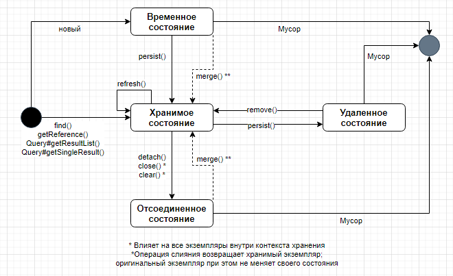

## Hibernate

[1. Что такое ORM?](#1-Что-такое-orm)

[2. Опиши, как конфигурируется Hibernate. Рассказать про hibernate.cfg.xml и про mapping.](#2-Опишите-как-конфигурируется-hibernate-Рассказать-про-hibernatecfgxml-и-про-mapping)

[3. Жизненный цикл Entity.](#3-Жизненный-цикл-entiity)

[4. Зачем нужен класс SessionFactory? Является ли он потокобезопасным?](#4-Зачем-нужен-класс-sessionfactory-Является-ли-он-потокобезопасным)

[5. Зачем нужен класс Session? Является ли он потокобезопасным?](#5-Зачем-нужен-класс-session-Является-ли-он-потокобезопасным)

[6. В чем отличие методов Session.get Session.load?](#6-В-чем-отличие-методов-sessionget-sessionload)

[7. Расскажите про методы flush close.](#7-Расскажите-про-методы-flush-close)

[8. В чем отличие методы save от saveOrUpdate и merge?](#8-В-чем-отличие-методы-save-от-saveorupdate-и-merge)

[9. Расскажите процесс создания, редактирования, чтения и удаления данных через Hibernate.](#9-Расскажите-процесс-создания-редоктирования-чтения-и-удаления-данных-через-hibernate)

[10. Как осуществляется иерархия наследования в Hibernate? Рассказать про три стратегии наследования.](#10-Как-осуществляется-иерархия-наследования-в-hibernate-Рассказать-про-три-стратегии-наследования)

[11. Можно ли создать собственный тип данных?](#11-Можно-ли-создать-собственный-тип-данных)

[12. Какие коллекции поддерживаются на уровне mapping?](#12-Какие-коллекции-поддерживаются-на-уровне-mapping)

[13. Зачем нужен класс Transactional?](#13-Зачем-нужен-класс-transactional)

[14. Расскажите про уровни изоляции? Какие уровни поддерживаются в hibernate? Как их устанавливать?](#14-Расскажите-про-уровни-изоляции-Какие-уровни-поддерживаются-в-hibernate-Как-их-устанавливать)

[15. Что такое OplimisticLock? Расскажите стратегии создания через version, timestamp.](#15-Что-такое-oplimisticlock-Расскажите-стратегии-создания-через-version-timestamp)

[16. Расскажите про стратегии извлечения данных urgy, lazy?](#16-Расскажите-про-стратегии-извлечения-данных-urgy-lazy)

[17. Что такое объект Proxy? С чем связана ошибка LazyInitializationException? Как ее избежать?](#17-Что-такое-объект-proxy-С-чем-связана-ошибка-lazyinitializationexception-Как-её-избежать)

[18. HQL. Расскажи основные элементы синтаксиса HQL? Простой запрос, запрос join? Создания объекта через конструктор.](#18-hql-Расскажите-основные-элементы-синтаксиса-hql-Простой-запрос-запрос-join-Создания-объекта-через-конструктор)

[19. Расскажите про уровни кешей в Hibernate?](#19-Расскажите-про-уровни-кешей-в-hibernate)

[20. Что такое StatelessSessionFactory? Зачем он нужен, где он используется?](#20-Что-такое-statelesssessionfactory-Зачем-он-нужен-где-он-используется)

[21. Зачем нужен режим read-only?](#21-Зачем-нужен-режим-read-only)

## 1. Что такое ORM?

**Объектно-реляционное отображение (Object-relational mapping)** - это автоматическое (и прозрачное) сохранение объекта 
из Java-приложения в таблицах базы данных SQL с использованием метаданных, описывающих отображение между классами 
приложения и схемой базы данных SQL. По сути, ORM работает за счет преобразования (двустороннего) данных из одного 
представления в другое.

Объектно-реляционное отображение не является идеальным решением для всех задач хранения; его цель - избавить 
разработчиков от 95% работы, связанной с хранением, например от написания сложных выражений SQL с большим количеством
соединений таблиц и копирования полученных значений в объекты или графы объектов.

Полноценное промежуточное программное обеспечение (middleware) для ORM может предоставить переносимость между базами 
данных, некоторые методы оптимизации, такие как кеширование, и некоторые другие практические аспекты, которые трудно
реализовать вручную с помощью SQL и JDBC, имея при этом ограниченный запас времени.

[к оглавлению](#hibernate)

## 2. Опиши, как конфигурируется Hibernate. Рассказать про hibernate.cfg.xml и про mapping.

Существует четыре способа конфигурации для работы с Hibernate:

+ Используя аннотации;
+ `hibernate.cfg.xml`;
+ `hibernate.properties`;
+ `persistence.xml`.

Самый частый способ конфигурации: через аннотации и файл persistence.xml, что касается файлов `hibernate.properties` и 
`hibernate.cfg.xml`, то `hibernate.cfg.xml` главнее (если в приложение есть оба файла, то принимаются настройки из файла 
`hibernate.cfg.xml`). Конфигурация аннотациями, хоть и удобна, но не всегда возможна, к примеру, если для разных баз 
данных или для разных ситуаций вы хотите иметь разные конфигурацию сущностей, то следует использовать xml файлы 
конфигураций.

Файл конфигурации Hibernate содержит в себе данные о базе данных и необходим для инициализации `SessionFactory`. В .xml 
файле необходимо указать вендора базы данных или JNDI ресурсы, а так же информацию об используемом диалекте, что поможет 
hibernate выбрать режим работы с конкретной базой данных.

Файл отображения (mapping file) используется для связи entity бинов и колонок в таблице базы данных. В случаях, когда не
используются аннотации JPA, файл отображения .xml может быть полезен (например при использовании сторонних библиотек).

Свойства и описание *hibernate.dialect - Это свойство заставляет Hibernate генерировать соответствующий SQL для 
выбранной базы данных.

+ **hibernate.connection.driver_class** - Класс драйвера JDBC.
+ **hibernate.connection.url** - URL JDBC для экземпляра базы данных.
+ **hibernate.connection.username** - Имя пользователя базы данных.
+ **hibernate.connection.password** - Пароль базы данных.
+ **hibernate.hbm2ddl.auto** - это свойство отвечает за генерацию структуры таблиц в БД
+ **show_sql**, **format_sql**, **use_sql_comments** - данные свойства позволяют увидеть те запросы к базе данных которые 
выполняет Hibernate
+ **hibernate.jdbc.time_zone** - Свойство определения часового пояса

[к оглавлению](#hibernate)

## 3. Жизненный цикл Entity.

JPA определяют четыре состояния, скрывая сложность внутренней реализации Hibernate от клиентского кода. Эти состояния и
переходы между ними показаны на рисунке:



Кроме объектно-реляционного маппирования, одной из проблем, для решения которой был предназначен Hibernate, является 
проблема управления объектами во время выполнения. Идея «persistence context (контекста постоянства)» - решение этой 
проблемы в Hibernate. Persistence context можно рассматривать как контейнер или кеш первого уровня для всех объектов, 
которые вы загрузили или сохранили в базе данных во время сессии.

Сессия - это логическая транзакция, начало и конец которой определяются бизнес-логикой приложения. Когда вы работаете с 
базой данных через persistence context, и все ваши экземпляры сущности присоединены к этому контексту, у вас всегда 
должен быть один экземпляр сущности для каждой записи базы данных, с которой вы взаимодействовали во время сеанса.

Интерфейс сессии имеет несколько методов, которые в конечном итоге приводят к сохранению данных в базе данных: persist, 
save, update, merge, saveOrUpdate. Чтобы понять разницу между этими методами, мы должны сначала обсудить цель сессии и 
разницу между состояниями экземпляров сущностей во время существования в сессии.

Любой экземпляр сущности в вашем приложении существует в одном из трех основных состояний по отношению к session 
persistence context:
* transient - это просто объект сущности, который не имеет представления в постоянном хранилище и не управляется никаким 
  сеансом. У этого экземпляра нет соответствующих строк в базе данных. Обычно это просто новый объект, который вы 
  создали для сохранения в базе данных.
* persistent - этот экземпляр связан с уникальным объектом Session; после сброса (flushing) данных сессии в кэш первого 
  уровня, этот объект гарантированно будет иметь соответствующую запись в базе данных.
* detached - это экземпляр сущности, который когда-то был связан с какой-то сессией (в persistent state). Просто обычный 
  объект POJO, ID которого соответствует строке базы данных. Отличие от управляемого объекта в том, что он больше не 
  привязан к какому-то persistence context.

[к оглавлению](#hibernate)

## 4. Зачем нужен класс SessionFactory? Является ли он потокобезопасным?

**SessionFactory** является фабрикой классов и используется для получения объектов `Session`. `SessionFactory` отвечает 
за считывание параметров конфигурации Hibernate и подключение к базе данных. Обычно в приложении имеется только один 
экземпляр `SessionFactory` и потоки, обслуживающие клиентские запросы, получают экземпляры `Session` с помощью объекта 
`SessionFactory`. Внутреннее состояние `SessionFactory` неизменно (immutable). Internal state (внутреннее состояние) 
включает в себя все метаданные об Object/ Relational Mapping и задается при создании `SessionFactory`.

`SessionFactory` также предоставляет методы для получения метаданных класса и статистики, вроде данных о втором уровне 
кэша, выполняемых запросах и т.д.

`SessionFactory` кэширует мета-дату и SQL запросы, которые часто используются приложением во время работы. Так же оно 
кэширует информацию, которая была получена в одной из транзакций и может быть использована и в других транзакциях.

Объект `SessionFactory` можно получить следующим обращением:

```java
SessionFactory sessionFactory = configuration.buildSessionFactory();
```

Т.к. объект `SessionFactory` immutable (неизменяемый), то да, он потокобезопасный. Множество потоков может обращаться к 
одному объекту одновременно.

[к оглавлению](#hibernate)

## 5. Зачем нужен класс Session? Является ли он потокобезопасным?

**Session** используется для получения физического соединения с базой данных. Объект `Session` является легким и 
предназначен для реализации каждый раз, когда необходимо взаимодействие с базой данных. Постоянные объекты сохраняются 
и извлекаются через объект `Session`.

Объекты сеанса не должны оставаться открытыми в течение длительного времени, потому что они обычно не являются 
потокобезопасными, и их следует создавать и уничтожать по мере необходимости.

Объект **Session** является связью между кодом java приложения и hibernate. Это основной интерфейс для выполнения 
операций с базой данных. Жизненный цикл объекта `Session` связан с началом и окончанием транзакции. Этот объект 
предоставляет методы для CRUD (create, read, update, delete) операций для объекта персистентности. С помощью этого 
экземпляра можно выполнять HQL, SQL запросы и задавать критерии выборки.

Обьект Session можно получить из SessionFactory:

```java
Session session = sessionFactory.openSession();
```

Роль интерфейса Session:

+ является оберткой для jdbc подключения к базе данных;
+ является фабрикой для транзакций (согласно официальной документации transaction — аllows the application to define 
  units of work, что, по сути, означает что транзакция определяет границы операций связанных с базой данных).
+ является хранителем обязательного кэша первого уровня.

Объект `Session` не является потокобезопасным. Каждый поток должен иметь свой собственный объект `Session` и закрывать 
его по окончанию.

[к оглавлению](#hibernate)

## 6. В чем отличие методов Session.get Session.load?

`Session` обладает различными методами для загрузки данных из базы данных. Наиболее часто используемые методы для этого 
— `get()` и `load()`.

+ `get()` загружает данные сразу при вызове, в то время как `load()` использует прокси объект и загружает данные только 
  тогда, когда это требуется на самом деле. В этом плане `load()` имеет преимущество в плане ленивой загрузки данных.
+ `load()` бросает исключение, когда данные не найдены. Поэтому его нужно использовать только при уверенности в 
  существовании данных.
+ Нужно использовать метод `get()`, если необходимо удостовериться в наличии данных в БД.
+ В случае обращение к несуществующему объекту, метод `get()` вернет `null`. В случае нахождения объект, метод `get()` 
  вернет сам объект и запрос в базу данных будет произведен немедленно.

[к оглавлению](#hibernate)

## 7. Расскажите про методы flush close.

***flush()*** синхронизирует базу данных с текущим состоянием объекта/объектов,
хранящихся в памяти, но не коммитит транзакцию. Если было получено какое-либо исключение после вызова ***flush()***,
транзакция может быть отменена. Если синхронизировать базу данных небольшими порциями данных с помощью ***flush()***
и не коммитить транзакцию, можно переполнить кэш первого уровня и получить OOM.

***commit()*** фиксирует транзакцию. Невозможно откатить транзакцию после успешного выполнения commit ().

В руководстве Hibernate вы можете увидеть этот пример:

```java
Session session = sessionFactory.openSession();
Transaction tx = session.beginTransaction();

for (int i = 0; i < 100000; i++) {
    Customer customer = new Customer(...);
    session.save(customer);
    if (i % 20 == 0) { // 20, same as the JDBC batch size
        // flush a batch of inserts and release memory:
        session.flush();
        session.clear();
    }
}

tx.commit();
session.close();
```

Без вызова метода `flush()` ваш кэш первого уровня выдаст `OutOfMemoryException`

+ `flush()` синхронизирует вашу базу данных с текущим состоянием объекта/объектов, хранящихся в памяти, но не совершает 
  транзакцию.
+ если вы получите какое-либо исключение после вызова `flush()`, то транзакция будет отменена.
+ Вы можете синхронизировать свою базу данных с небольшими фрагментами данных, используя `flush()`, вместо того, чтобы 
  делать большие данные одновременно с помощью `commit()` и столкнуться с риском получить Исключение из памяти.
+ `commit()` сделает данные, хранящиеся в базе данных постоянными. Вы не можете отменить свою транзакцию после успешного
  завершения `commit()`

[к оглавлению](#hibernate)

## 8. В чем отличие методы save от saveOrUpdate и merge?

Любой объект-сущность можно переводить из одного статуса в другой. Для этого в интерфейсе `Session` существуют следующие 
методы:

+ `persist(Object)` — преобразует объект из `transient` в `persistent`, то есть присоединяет к сессии и сохраняет в БД. 
  Однако, если мы присвоим значение полю `Id` объекта, то получим `PersistentObjectException` — Hibernate посчитает, что 
  объект `detached`, т. е. существует в БД. При сохранении метод `persist()` сразу выполняет insert, не делая select.
+ `merge(Object)` — преобразует объект из transient или detached в persistent. Если из transient, то работает аналогично 
  `persist()` (генерирует для объекта новый Id, даже если он задан), если из detached — загружает объект из БД, 
  присоединяет к сессии, а при сохранении выполняет запрос update.
+ `replicate(Object, ReplicationMode)` — преобразует объект из detached в persistent, при этом у объекта обязательно 
  должен быть заранее установлен Id. Данный метод предназначен для сохранения в БД объекта с заданным Id, чего не 
  позволяют сделать `persist()` и `merge()`. Если объект с данным Id уже существует в БД, то поведение определяется 
  согласно правилу из перечисления `org.hibernate.ReplicationMode`:
  `ReplicationMode.IGNORE` — ничего не меняется в базе.  
  `ReplicationMode.OVERWRITE` — объект сохраняется в базу вместо существующего.  
  `ReplicationMode.LATEST_VERSION` — в базе сохраняется объект с последней версией.  
  `ReplicationMode.EXCEPTION` — генерирует исключение.
+ `delete(Object)` — удаляет объект из БД, иными словами, преобразует persistent в transient. Object может быть в любом 
  статусе, главное, чтобы был установлен Id.
+ `save(Object)` — сохраняет объект в БД, генерируя новый Id, даже если он установлен. Object может быть в статусе 
  transient или detached
+ `update(Object)` — обновляет объект в БД, преобразуя его в persistent (Object в статусе detached)
+ `saveOrUpdate(Object)` — вызывает save() или update()
+ `refresh(Object)` — обновляет detached-объект, выполнив select к БД, и преобразует его в persistent
+ `get(Object.class, id)` — получает из БД объект класса-сущности с определённым Id в статусе persistent

Объект `Session` кэширует у себя загруженные объекты; при загрузке объекта из БД в первую очередь проверяется кэш. 
Для того чтобы удалить объект из кэша и отсоединить от сессии, используется `session.evict(Object)`. 
Метод `session.clear()` применит `evict()` ко всем объектам в сессии.

[к оглавлению](#hibernate)

## 9. Расскажите процесс создания, редактирования, чтения и удаления данных через Hibernate.

new->persist->marge->remove

```java
/* Method to  READ all the employees */
   public void listEmployees( ){
      Session session = factory.openSession();
      Transaction tx = null;
      
      try {
         tx = session.beginTransaction();
         List employees = session.createQuery("FROM Employee").list(); 
         for (Iterator iterator = employees.iterator(); iterator.hasNext();){
            Employee employee = (Employee) iterator.next(); 
            System.out.print("First Name: " + employee.getFirstName()); 
            System.out.print("  Last Name: " + employee.getLastName()); 
            System.out.println("  Salary: " + employee.getSalary()); 
         }
         tx.commit();
      } catch (HibernateException e) {
         if (tx!=null) tx.rollback();
         e.printStackTrace(); 
      } finally {
         session.close(); 
      }
   }
```

[к оглавлению](#hibernate)

## 10. Как осуществляется иерархия наследования в Hibernate? Рассказать про три стратегии наследования.

Модели, основанные на SQL, поддерживают только отношение *имеет (has a)*; СУБД SQL не поддерживают наследования типов, и
даже когда такая поддержка имеется, она является либо нестандартной, либо неполной.

Существуют четыре стратегии представления иерархии наследования:
+ одна таблица для каждого конкретного класса и полиморфное поведение по умолчанию во время выполнения;
+ одна таблица для каждого конкретного класса, но полное исключение полиморфизма и отношений наследования из схемы SQL.
  Для полиморфного поведения во время выполнения необходимо использовать запросы с SQL-инструкцией `UNION`;
+ единая таблица для целой иерархии классов: полиморфизм поддерживается за счет денормализации схемы SQL, а определение
  суперкласса/подкласса осуществляется посредством различения строк;
+ одна таблица для каждого подкласса: отношение *is a* (наследования) представлено в виде отношения *has a* (связь по
  внешнему ключу) с применением SQL-операции `JOIN`.

[к оглавлению](#hibernate)

## 11. Можно ли создать собственный тип данных?

Из коробки Hibernate поддерживает некий общий набор типов данных SQL и типов данных Java, а также отображений между ними.
В основном в этот набор входят базовые вещи, такие как даты, строки, числа, блобы и так далее.

Набор этих типов довольно общий и поддерживается большинством баз данных, с которыми работает Hibernate.
С другой стороны, каждая база может иметь свои собственные, уникальные и, следовательно, неподдерживаемые типы данных.
Со стороны Java, в свою очередь, тоже можно представить собственные структуры данных, которые напрямую не
поддерживаются в Hibernate, но желательно иметь возможность их сохранять.

Для решения этой проблемы в Hibernate существует поддержка пользовательских типов данных. То есть можно написать,
как тот или иной класс в Java должен сохраняться в тот или иной тип данных (читай столбец в таблице) в SQL базе.

Для этого нужно сначала описать пользовательский тип (создать Java класс, с нужнми полями, геттерами/сеттерами).
Класс должен быть implements Serializable.

Чтобы реализовать поддержку собственного типа данных в Hibernate, необходимо реализовать интерфейс UserType и его методы.
Тут, по сути, содержится вся логика сериализации/десериализации в БД.

И там, где поле сущности имеет пользовательский тип, нужно указать это **@Type**(type = "класс имплементирующий UserType")

[Пользовательские типы в Hibernate](https://easyjava.ru/data/hibernate/polzovatelskie-tipy-v-hibernate/)

[к оглавлению](#hibernate)

## 12. Какие коллекции поддерживаются на уровне mapping?

Hibernate позволяет сохранять (persist) коллекции. Эти постоянные коллекции могут содержать почти любой другой тип
Hibernate, включая: базовые типы, пользовательские типы, компоненты и ссылки на другие сущности. Различие между
значением и ссылочной семантикой в этом контексте очень важно. Объект в коллекции может обрабатываться семантикой
«значение» (ее жизненный цикл полностью зависит от владельца коллекции), или это может быть ссылка на другую сущность
с её собственным жизненным циклом. В последнем случае считается, что только «ссылка (link)» между двумя объектами
является состоянием, удержанным коллекцией.

+ Bag
+ Set
+ List
+ Array
+ Map

Своей реализации тип коллекции Bag очень напоминает Set, разница состоит в том, что Bag может хранить повторяющиеся 
значения. Bag хранит непроиндексированный список элементов. Большинство таблиц в базе данных имеют индексы отображающие 
положение элемента данных один относительно другого, данные индексы имеют представление в таблице в виде отдельной 
колонки. При объектно-реляционном маппинге, значения колонки индексов мапится на индекс в Array, на индекс в List или на
key в Map. Если вам надо получить коллекцию объектов не содержащих данные индексы, то вы можете воспользоваться 
коллекциями типа Bag или Set(коллекции содержат данные в неотсортированном виде, но могут быть отсортированы согласно 
запросу).

[к оглавлению](#hibernate)

## 13. Зачем нужен класс Transactional?

*Transaction (org.hibernate.Transaction)* — однопоточный короткоживущий объект, используемый для атомарных операций.
Это абстракция приложения от основных JDBC или JTA транзакций. org.hibernate.Session может занимать
несколько org.hibernate.Transaction в определенных случаях.

Вместо вызовов session.openTransaction() и session.commit() используется аннотация @Transactional

[Hibernate. Основные принципы работы с сессиями и транзакциями](https://habr.com/ru/post/271115/)

[к оглавлению](#hibernate)

## 14. Расскажите про уровни изоляции? Какие уровни поддерживаются в hibernate? Как их устанавливать?

Основные уровни изолированности транзакций определены в стандарте ANSI SQL, но они используются не только в базах данных
SQL. JTA определяет точно такие же уровни изолированности, и вы будете использовать их для задания требуемого уровня 
изолированности транзакций. Увеличение уровня изолированности влечет увеличение стоимости и серьезное падение 
производительности и масштабируемости.

+ *Чтение неподтвержденных данных* (read uncommitted) - система, работающая на данном уровне изолированности, допускает
  чтение неподтвержденных данных изменений, но не потерянные изменения. Транзакция не сможет сохранить изменения, если 
  другая неподтвержденная транзакция уже изменила эту же запись. Однако любая транзакция может читать любые данные. СУБД
  может реализовать данный уровень изолированности с помощью монопольных блокировок на запись.
+ *Чтение подтвержденных данных* (read committed) - система, работающая на данном уровне изолированности, допускает 
  неповторимость чтения, но не позволяет читать неподтвержденные изменения. СУБД может работать на данном уровне, 
  используя разделяемую блокировку на чтение и монопольную запись. Транзакции, читающие данные, не блокируют доступа
  остальных транзакций, но неподтвержденная транзакция, выполняющая изменения, блокирует доступ к записи всех остальных
  транзакций.
+ *Повторимое чтение* (repeatable read) - система, работающая на данном уровне изолированности, не допускает 
  неповторимого чтения и чтения неподтвержденных изменений. Но фантомные чтения по-прежнему возможны. Транзакции, 
  читающие данные, блокируют транзакции, выполняющие изменения, но не блокируют других читающих транзакций, а транзакции,
  выполняющие изменения, блокируют все остальные транзакции.
+ *Упорядоченность* - самый строгий уровень изолированности. Имитирует последовательное выполнение, как если бы 
  транзакции выполнялись одна за другой, а не параллельно. СУБД не может обеспечивать упорядоченность только за счет
  блокировок на уровне записи. Вместо этого СУБД должна поддерживать иной механизм, не позволяющий только что 
  вставленной записи становиться видимой для транзакции, которая уже выполнила запрос, который вернул бы эту запись. 
  Грубое решение заключается монопольной блокировке целой таблицы базы данных после изменения для предотвращения 
  фантомных чтений.

В приложении с большим количеством потоков слишком высокий уровень изолированности навредит масштабируемости.
Недостаточный уровень изолированности может вызывать появление скрытых, трудновоспроизводимых ошибок, которые не
обнаруживаются, пока система не окажется под большой нагрузкой.

Какой уровень изолированности целесообразно выбирать?

Во-первых, никогда не используйте уровень изолированности, допускающий *чтение неподтвержденных данных*. Использовать
неподтвержденные изменения одной транзакции в другой транзакции чрезвычайно опасно. Откат или ошибка одной транзакции
повлияет на другие транзакции, выполняющиеся параллельно. Откат первой транзакции может откатить другие транзакции
вместе с ней или даже повлиять так, что они оставят базу данных в некорректном состоянии (счет продавцу товара
может быть выставлен дважды, что согласуется с правилами целостности в базе данных, но это некорректно). Кроме того,
изменения сделанные транзакцией, которая затем была отменена, могут быть подтверждены другой транзакцией, успевшей
прочитать их и передать в базу данных!

Во-вторых, большинству приложений не требуется уровень изолированности, поддерживающий *упорядоченность*. Как правило,
фантомное чтение обычно не вызывает проблем, и такой уровень изолированности плохо масштабируется. Немногие приложения
используют уровень изолированности, поддерживающий упорядоченность; они скорее полагаются на выборочно используемые
пессимистические блокировки, которые в определенных условиях фактически гарантируют последовательное выполнение операций.

Далее рассмотрим *повторное чтение*. Этот уровень изолированности обеспечивает воспроизводимость результатов запроса в 
течение транзакции в базе данных. Это значит, что транзакция не прочитает неподтвержденных изменений, даже если выполнит
запрос несколько раз. Но фантомные чтения по-прежнему возможны: могут появляться новые строки, а те, которые 
существовали, могут исчезнуть, если другая транзакция параллельно подтвердит такие изменения. Иногда повторимое чтение 
желательно, но обычно требуется не в каждой транзакции.

Предположим, что для сущностей предметной модели вы применяете версионирование, поддерживаемое Hibernate автоматически.
Комбинация (обязательного) кеша контекста хранения и версионирования уже дает значительные преимущества уровня 
изолированности, обеспечивающего *повторимое чтение*. Кеш контекста хранения гарантирует изолированность состояния 
экземпляров сущностей, загруженных в одной транзакции, от изменений, сделанных в других транзакциях. Если в рамках 
единицы работы загрузить экземпляр сущности дважды, во второй раз искомая сущность будет взята из кеша контекста 
хранения, а не из базы данных. Следовательно, чтение *является* повторимым, и вы не увидите конфликтующих подтвержденных
данных (вы все равно получите фантомное чтение, но иметь с ними дело, как правило, гораздо проще). Кроме того, при 
использовании версионирования побеждает *первая подтвержденная транзакция*. Следовательно, для большинства 
многопользовательских приложений приемлемым является уровень изолированности, обеспечивающий *чтение подтвержденных
изменений* для всех транзакций в базе данных при включенном версионированнии.

Hibernate сохраняет уровень изолированности соединения с базой данных - он не меняет его. В большинстве приложений по 
умолчанию выбирается уровень изоляции, обеспечивающий *чтение подтвержденных данных*.

Каким способом в Hibernate можно указать требуемый уровень изоляции транзакции для конкретной транзакции?

Вообще это не сильно здорово. Уровень изоляции транзакций это принадлежность коннекта к БД, соответственно фактически
изменение уровня изоляции равносильно переконнекту к БД, а насколько это дорогая операция вы сами можете оценить исходя
из имеющейся у вас ситуации.

Тем не менее, если вы таки решили менять перед каждой транзакцией уровень изоляции транзакций, то самый простой способ
это отправить в СУБД raw SQL query (любой ORM это поддерживает), типа:

```sql
ALTER SESSION SET ISOLATION_LEVEL SERIALIZABLE
```

Hibernate запускает транзакции, вызывая методы `getTransaction()` (реализация JPA) или `beginTransaction()` 
(Session Hibernate). В соответствии с используемым механизмом сохранения транзакция может быть экземпляром 
`javax.persistence.EntityTransaction` (для JPA) или org.hibernate.Transaction (для сеанса Hibernate). Обе транзакции 
начинаются с помощью метода `begin()`, откатываются с помощью метода `rollback()` и фиксируются с помощью вызова 
`commit()`.

Чтобы настроить уровень изоляции транзакций в Hibernate, нам нужно изменить свойство, называемое 
`hibernate.connection.isolation`. Это свойство может принимать одну из следующих записей:
+ 1 (читать без ответа)
+ 2 (прочитано как совершено)
+ 4 (повторяемое чтение)
+ 8 (сериализуемый)

Обычно уровень изоляции устанавливается на уровне java.sql.Connection с помощью метода setTransactionIsolation (int level).
Уровень, переданный в параметре, должен быть одним из констант Connection:

+ Connection.TRANSACTION_READ_UNCOMMITTED,
+ Connection.TRANSACTION_READ_COMMITTED,
+ Connection.TRANSACTION_REPEATABLE_READ
+ Connection.TRANSACTION_SERIALIZABLE.

***Spring @Transactional***

Аннотация Spring ***@Transactional*** используется для определения границы транзакции. В отличие от Java EE, эта 
аннотация позволяет нам настраивать:

* уровень изоляции  @Transactional(isolation = Isolation.SERIALIZABLE)
* политика rollback и типов исключений
* propagation - @Transactional(propagation=Propagation.REQUIRED) все варианты : REQUIRES_NEW, MANDATORY, SUPPORTS, 
  NOT_SUPPORTED, NEVER и NESTED.
* read-only
* timeout - @Transactional(timeout=60) По умолчанию используется таймаут, установленный по умолчанию для базовой 
  транзакционной системы. Сообщает менеджеру tx о продолжительности времени, чтобы дождаться простоя tx, прежде чем 
  принять решение об откате не отвечающих транзакций.

Поскольку большинство реализаций DataSource могут иметь только уровень изоляции транзакции по умолчанию, у нас может быть
несколько таких источников данных, каждый из которых обслуживает соединения для определенного уровня изоляции транзакции.

[к оглавлению](#hibernate)

## 15. Что такое OplimisticLock? Расскажите стратегии создания через version, timestamp.

Оптимистическое управление параллельным доступом подходит в случаях, когда изменения вносятся редко и в рамках единицы
работы допустимо позднее обнаружение конфликтов. Для этого необходимо включить версионирование, поскольку по умолчанию
оно отключено: именно поэтому всегда будет побеждать *последняя зафиксированная транзакция*. Большинству 
многопользовательских приложений, и особенно веб-приложений, следует полагаться на версионирование всех экземпляров с 
аннотацией `@Entity`, которые могут изменяться в многопоточной среде, и использовать более дружественную для 
пользователя стратегию, где побеждает *первая подтвержденная транзакция*.

---

**Включаем версионирование**

Версионирование включается с помощью аннотации `@Version` перед специальным дополнительным свойством класса сущности, 
как показано далее:

```java
@Entity
public class Item {
    
    @Version 
    private long version;
    
    // ...
}
```

В этом примере каждому экземпляру сущности присваивается номер версии. Он отображается на дополнительный столбец в 
таблице `ITEM`. Как обычно, имя столбца по умолчанию совпадает с именем свойства, в данном случае `VERSION`. 

Вы можете добавить в класс метод `getVersion()`, но у вас не должно быть метода записи, и приложение не должно менять 
значения поля. Hibernate меняет номер версии автоматически: он будет увеличивать его каждый раз, когда объект Item будет 
оказываться в измененном состоянии во время выталкивания контекста хранения. Версия - это просто счетчик, не обладающий
никакой полезной семантикой, кроме той, что относится к управлению параллельным доступом. Можно использовать типы `int`,
`Integer`, `short`, `Short` или `Long` вместо `long`; если значение версии достигнет предельного для данного типа 
значения, Hibernate начнет отсчет с нуля.

После увеличения номера версии экземпляра **Item**, чье состояние изменилось, Hibernate сравнит версии во время 
выполнения SQL-выражений UPDATE и DELETE.

Какие изменения приводят к увеличению номера версии сущности? Hibernate увеличивает номер версии каждый раз, обнаруживая
изменения в состоянии экземпляра сущности. К ним относятся все изменения свойств сущности с типами-значениями независимо
от того, являются они скалярными (как поля `String` или `int`), встроенными (как `Address`) или коллекциями. Исключение
составляют коллекции ассоциаций `@OneToMany` и `@ManyToMany` с доступом только на чтение, настроенным при помощи 
**mappedBy**.

---

**Версионирование с помощью отметок времени**

Если в схеме вашей базы данных уже имеется столбец с отметкой времени, такой как `LASTUPDATED` или `MODIFIED_ON`, вместо
обычного счетчика для автоматической проверки версии можно воспользоваться им.

```java
@Entity
public class Item {
    
    @Version
    // Необязательно: @org.hibernate.annotations.Type(type = "dbtimestamp")
    private Date lastUpdated;
    
    // ...
}
```

В этом примере столбец `LASTUPDATED` отображается в свойство типа `java.util.Date`; также Hibernate может работать с 
типом `Calendar`. Но использование свойств этих типов для поддержки версионирования не регламентируется стандартом JPA;
согласно JPA переносимым решением является только тип `java.sql.Timestamp`. Это не самый лучший вариант, поскольку 
придется импортировать этот JDBC-класс в предметную модель.

Теоретически версионирование с помощью отметки времени является чуть мене безопасным, поскольку две параллельно 
выполняющиеся транзакции могут обновить и сохранить тот же экземпляр Item в одну миллисекунду; это усугубляется и тем
фактом, что обычно JVM не поддерживает точности до миллисекунды. Кроме того, получение текущего времени в JVM может быть
небезопасным в кластерном окружении, где системное время узлов может быть не синхронизировано, или синхронизация времени
может быть не настолько точной, насколько этого требуют транзакции.

--- 

Резюмируя, можно представить, что этот механизм подходит для приложений, которые выполняют гораздо больше операций 
чтения, чем обновления или удаления. Более того, это полезно в ситуациях, когда сущности необходимо отсоединить на 
некоторое время, а блокировки нельзя удерживать.

Напротив, механизм пессимистической блокировки включает блокировку объектов на уровне базы данных.

Каждая транзакция может получить блокировку данных. Пока он удерживает блокировку, транзакция не может читать, удалить 
или обновить заблокированные данные. Мы можем предположить, что использование пессимистической блокировки может привести 
к тупикам. Однако она обеспечивает большую целостность данных, чем оптимистическая блокировка.

[к оглавлению](#hibernate)

## 16. Расскажите про стратегии извлечения данных urgy, lazy?

В отображении предметной модели для связей и коллекций можно определить глобальный *план извлечения по умолчанию* с 
помощью параметров `FetchType.LAZY` и `FetchType.EAGER`. Он будет использоваться по умолчанию для всех операций с 
участием классов предметной модели. Он всегда будет использоваться при загрузке экземпляра сущности по идентификатору,
обходе графа объектов по связям и итерациях по хранимым коллекциям.

В качестве плана извлечения по умолчанию рекомендуется использовать стратегию *отложенной* загрузки для всех сущностей и
коллекций. Если все связи и коллекции отобразить с параметром `FetchType.LAZY`, Hibernate будет загружать только данные
к которым происходит обращение в данный момент. Во время обхода графа экземпляров предметной модели Hibernate будет
загружать данные по требованию, шаг за шагом. При необходимости это поведение можно переопределять в отдельных ситуациях.

[к оглавлению](#hibernate)

## 17. Что такое объект Proxy? С чем связана ошибка LazyInitializationException? Как ее избежать?

Для реализации отложенной загрузки Hibernate использует сгенерированные во время выполнения заглушки, называемые 
*прокси-объектами* или, в случае коллекций, *умными обертками*.

Прокси-объект - это экземпляр подкласса `Item` (за пример берем некий класс Item), сгенерированный во время выполнения и
хранящий значение идентификатора представляемого им экземпляра сущности. Вот почему Hibernate (наряду с JPA) требует, 
чтобы класс сущности имел общедоступный или защищенный конструктор без аргументов. Чтобы Hibernate смог сгенерировать
прокси-объект, класс сущности и его методы не должны быть финальными (final). 

Если вызвать любой метод прокси-объекта, отличный от метода чтения идентификатора, произойдут обращение к базе данных и
инициализация прокси-объекта.

Используя план отложенного извлечения, можно столкнуться с исключением `LazyInitializationException`.

В отсоединенном состоянии допускается вызывать метод чтения идентификатора прокси-объекта. Но вызов любого другого 
метода прокси-объекта возбудит исключение `LazyInitializationException`. Данные могут загружаться по требованию, только
пока прокси-объект находится под управлением контекста хранения, но не в отсоединенном состоянии.

Чтобы данные были доступны в отсоединенном состоянии, нужно предварительно загрузить их вручную, пока контекст открыт, 
или поменять план извлечения с отложенного на немедленный, если требуется, чтобы они загружались *всегда*.

[к оглавлению](#hibernate)

## 18. HQL. Расскажи основные элементы синтаксиса HQL? Простой запрос, запрос join? Создания объекта через конструктор.

Hibernate Framework поставляется с мощным объектно-ориентированным языком запросов - Hibernate Query Language (HQL).
Он похож по внешнему виду на SQL. Однако, по сравнению с SQL, HQL полностью объектно-ориентирован и понимает такие 
понятия, как наследование, полиморфизм и ассоциация.

За исключением имен классов и свойств Java, запросы не учитывают регистр. Таким образом, SeLeCT совпадает с SELEct таким 
же, как SELECT, но org.hibernate.eg.FOO не является org.hibernate.eg.Foo, а foo.barSet не является foo.BARSET.

Запросы HQL кэшируются (это как плюс так и минус).

Например, если у нас есть эти два запроса
```
FROM Employee emp
JOIN emp.department dep
```
и
```
FROM Employee emp
JOIN FETCH emp.department dep
```

В этих двух запросах вы используете JOIN для запроса всех сотрудников, с которыми связан хотя бы один отдел.
Но разница в том, что в первом запросе вы возвращаете только сотрудников для Hibernate. Во втором запросе вы
возвращаете сотрудников и все связанные с ними отделы. Итак, если вы используете второй запрос, вам не
нужно будет выполнять новый запрос, чтобы снова попасть в базу данных, чтобы увидеть отделы каждого сотрудника.
Вы можете использовать второй запрос, если уверены, что вам понадобится отдел каждого сотрудника. Если вам не нужен
отдел, воспользуйтесь первым запросом.

В HQL поддерживается только форма INSERT INTO ... SELECT ...; а не INSERT INTO ... VALUES ... .
Иструкции INSERT по своей сути не являются полиморфными.

Общим для всех API является необходимость подготовки запроса в коде приложения перед выполнением, включающей три шага:
1) Создание запроса с произвольной выборкой, ограничениями и проекциями извлекаемых данных;
2) Подготовка запроса: связывание аргументов с параметрами запроса, установка подсказок и настройка постраничного вывода.
  Вы можете повторно использовать запрос, изменяя его настройки.
3) выполнение подготовленного запроса в базе данных и извлечения информации. Вы можете управлять выполнением запроса и 
  способом загрузки данных в память (например, загружать все сразу или по частям).

В зависимости от разновидности отправной точки для создания запроса будет `EntityManager` или `Session`. Первый шаг -
создание запроса.

**Создание запросов**

JPA представляет запрос в виде объекта `javax.persistence.Query` или `javax.persistence.TypedQuery`. Запросы создаются
с помощью метода `createQuery()` или его вариантов. Запрос может быть написан на языке HQL, создан с помощью объекта
`CriteriaBuilder` или интерфейса `CriteriaQuery` API или написан на обычном SQL.

Простой запрос по извлечению всей таблицы с помощью HQL:

```java
Query query = em.createQuery("select i from Item i");
```

**Подготовка запросов**

Запрос одновременно решает несколько задач: определяет информацию, которая должна быть загружена из базы данных, а также
накладывает на неё ограничения, которым она должна соответствовать, такие как идентификатор товара (Item) или имя 
пользователя (User). В зависимости от требований пользовательского интерфейса может потребоваться реализовать 
*построчную выборку*. Для этого можно ограничить количество записей, возвращаемых запросом. Например, можно вернуть 
записи с 1 по 20 - ровно столько, сколько можно показать на экране, - а позже извлечь строки с 21 по 40 и т.д.

Связывание именованных параметров:

```java
String seatchName = // ...
Query query = em.createQuery("select i from Item i where i.name = :itemName")
        .setParameter("itemName", seatchName);
```

Связывание позиционных параметров:

```java
Query query = em.createQuery("select i from Item i where i.name like ?1 and i.auctionEnd > ?2")
        .setParameter(1, searchString)
        .setParameter(2, tomorrowDate, TemporalType.TIMESTAMP);
```

Построчная выбора больших наборов с результатами:

```java
Query query = em.createQuery("select i from Item i");
query.setFirstResult(40).setMaxResult(10);
```

**Выполнение запросов**

После создания и подготовки экземпляра Query можно выполнить запрос и загрузить результаты в память. Методами
uniqueResult() и list() соответственно.

---

HQL-запрос с неявным соединением:
`select b from Bid b where b.item.name like 'Fo%'`

HQL-запрос с явным соединением:
`select i from Item i join i.bids b where b.amount > 100`

[к оглавлению](#hibernate)

## 19. Расскажите про уровни кешей в Hibernate?

Кэш первого уровня Hibernate связан с объектом Session (точнее с persistence context). Кэш первого уровня у Hibernate
включен по умолчанию и не существует никакого способа, чтобы его отключить. Однако Hibernate предоставляет методы,
с помощью которых мы можем удалить выбранные объекты из кэша или полностью очистить кэш. Любой объект закэшированный в
session не будет виден другим объектам session. После закрытия объекта сессии все кэшированные объекты будут потеряны.
При помещении объекта в persistence context, то есть при его загрузке из БД или сохранении, объект так же автоматически
будет помещён в кэш первого уровня. Соответственно, при запросах того же самого объекта несколько раз в рамках одного
persistence context, запрос в БД будет выполнен один раз, а всё остальные загрузки будут выполнены из кэша.

При загрузке объекта методом load() или объекта с лениво загружаемыми полями, лениво загружаемые данные в кэш не попадут.
При обращении к данным будет выполнен запрос в базу и данные будут загружены и в объект и в кэш. А вот следующая попытка
лениво загрузить объект приведёт к тому, что объект сразу вернут из кэша и уже полностью загруженным.

***Кэш второго уровня***

Если кэш первого уровня существует только на уровне сессии и persistence context, то кэш второго уровня находится выше —
на уровне SessionFactory и, следовательно, один и тот же кэш доступен одновременно в нескольких persistence context.
Кэш второго уровня требует некоторой настройки и поэтому не включен по умолчанию. Настройка кэша заключается в 
конфигурировании реализации кэша и разрешения сущностям быть закэшированными.

**Конфигурирование кэша**.  Hibernate не реализует сам никакого in-memory сache, а использует существующие реализации 
кэшей. Раньше Hibernate самостоятельно поддерживал интерфейс с этими кэшами, но сейчас существует ***JCache*** и 
корректнее будет использовать этот интерфейс. Реализаций у ***JCache*** множество, например ***ehcache*** - одна из 
распространённых.

В первую очередь надо добавить поддержку JCache и ehcache в зависимости:
```xml
<dependencies>
  <dependency>
    <groupId>org.ehcache</groupId>
    <artifactId>ehcache</artifactId>
    <version>${ehcache.version}</version>
  </dependency>
  <dependency>
    <groupId>org.hibernate</groupId>
    <artifactId>hibernate-core</artifactId>
    <version>${hibernate.version}</version>
  </dependency>
  <dependency>
    <groupId>org.hibernate</groupId>
    <artifactId>hibernate-jcache</artifactId>
    <version>${hibernate.version}</version>
  </dependency>
</dependencies>
```
Затем настроить hibernate на использование ehcache для кэширования:
```
<property name="hibernate.cache.region.factory_class">org.hibernate.cache.jcache.JCacheRegionFactory</property>
<property name="hibernate.javax.cache.provider">org.ehcache.jsr107.EhcacheCachingProvider</property>
```
В первой строке мы говорим Hibernate, что хотим использовать JCache интерфейс, а во второй строке выбираем конкретную 
реализацию JCache: ehcache.

Включим кэш второго уровня:
```xml	
<property name="hibernate.cache.use_second_level_cache">true</property>
```

***@Cacheable и @Cache***

***@Cacheable*** это аннотация JPA и позволяет объекту быть закэшированным. Hibernate поддерживает эту аннотацию в том 
же ключе.

```
@Entity
@Cacheable
public class Person extends AbstractIdentifiableObject {
    @Getter
    @Setter
    private String firstName;
    
    //Other fields
}
```

***@Cache*** это аннотация Hibernate, настраивающая тонкости кэширования объекта в кэше второго уровня Hibernate. 
Аннотации @Cacheable достаточно, чтобы объект начал кэшироваться с настройками по умолчанию. При этом @Cache 
использованная без @Cacheable не разрешит кэширование объекта.

***@Cache*** принимает три параметра:

* ***include***, имеющий по умолчанию значение all и означающий кэширование всего объекта. Второе возможное значение, 
  non-lazy, запрещает кэширование лениво загружаемых объектов. Кэш первого уровня не обращает внимания на эту директиву 
  и всегда кэширует лениво загружаемые объекты.
* ***region*** позволяет задать имя региона кэша для хранения сущности. Регион можно представить как разные кэши или 
  разные части кэша, имеющие разные настройки на уровне реализации кэша. Например, я мог бы создать в конфигурации 
  ehcache два региона, один с краткосрочным хранением объектов, другой с долгосрочным и отправлять часто изменяющиеся 
  объекты в первый регион, а все остальные во второй.
* ***usage*** задаёт стратегию одновременного доступа к объектам.

Проблема заключается в том, что кэш второго уровня доступен из нескольких сессий сразу и несколько потоков программы 
могут одновременно в разных транзакциях работать с одним и тем же объектом. Следовательно надо как-то обеспечивать их 
одинаковым представлением этого объекта.

Стратегий одновременного доступа к объектам в кэше в hibernate существует четыре:

1. ***translactional*** — полноценное разделение транзакций. Каждая сессия и каждая транзакция видят объекты, как если 
   бы только они с ним работали последовательно одна транзакция за другой. Плата за это — блокировки и потеря 
   производительности.

2. ***read-write*** — полноценный доступ к одной конкретной записи и разделение её состояния между транзакциями. Однако
   суммарное состояние нескольких объектов в разных транзакциях может отличаться.

3. ***nonstrict-read-write*** — аналогичен read-write, но изменения объектов могут запаздывать и транзакции могут видеть 
   старые версии объектов. Рекомендуется использовать в случаях, когда одновременное обновление объектов маловероятно и 
   не может привести к проблемам.

4. ***read-only*** — объекты кэшируются только для чтения, и изменение удаляет их из кэша.

Transactional стратегия самая медленная, read-only самая быстрая. Недостатком read-only стратегии является её 
бесполезность, в случае если объекты постоянно изменяются, так как в этом случае они не будут задерживаться в кэше.

Использование кэша второго уровня требует изменений в конфигурации Hibernate и в коде сущностей, но не требует изменения 
кода запросов и управления сущностями.

***Кэш запросов***

Кэши первого и второго уровней работают с объектами загружаемыми по id. Но в реальности к базе чаще выполняются запросы 
с условиями, чем загружаются какие-то заранее известные объекты:

```
session.createCriteria(Passport.class)
  .add(Restrictions.eq("series", "AS"))
  .uniqueResult()
session.createCriteria(Passport.class)
  .add(Restrictions.eq("series", "AS"))
  .uniqueResult()
```

И результат выполнения таких запросов тоже может потребоваться кэшировать. Например, если вы делаете поисковый сайт по 
автозапчастям, то можете кэшировать запросы пользователей, которые, скорее всего, ищут одни запчасти гораздо чаще 
других. У кэша запросов есть и своя цена — Hibernate будет вынужден отслеживать сущности закешированные с определённым 
запросом и выкидывать запрос из кэша, если кто-то поменяет значение сущности. То есть для кэша запросов стратегия 
параллельного доступа всегда read-only.

Чтобы включить кэш запросов надо настроить внешний кэш, так же как и для кэша второго уровня, и разрешить Hibernate 
кэшировать запросы:
```xml
<property name="hibernate.cache.use_query_cache">true</property>
```

Но даже с этим разрешением Hibernate не будет кэшировать все запросы, а только те, кэширование которых явно запрошено 
методом setCacheable()
```
session = sessionFactory.openSession();
session.beginTransaction();
 
// Database will be queried
System.out.println(session.createCriteria(Passport.class)
  .add(Restrictions.eq("series", "AS"))
  .setCacheable(true)
  .uniqueResult());
 
session.getTransaction().commit();
session.close();
 
session = sessionFactory.openSession();
session.beginTransaction();
 
// Database will not be queries, query cache will provide the data
System.out.println(session.createCriteria(Passport.class)
  .add(Restrictions.eq("series", "AS"))
  .setCacheable(true)
  .uniqueResult());
 
session.getTransaction().commit();
session.close();
```

Кэш запросов, так же как и кэш второго уровня, существует на уровне SessionFactory и доступен во всех persistence 
context.

[Hibernate cache](https://habr.com/ru/post/135176/)

[к оглавлению](#hibernate)

## 20. Что такое StatelessSessionFactory? Зачем он нужен, где он используется?

**StatelessSession** – командно-ориентированный API, предоставляемый Hibernate.

С StatelessSession не связан persistence context. Т.о. с ней так же не связана большая часть жизненного цикла сущности.

StatelessSession не поддерживает:

- кеш первого уровня.
- любой кеш второго уровня или кеш запросов.
- полиморфизм сущностей.
- коллекции.

Вообще это низкоуровневая абстракция, которая ближе к JDBC. Используется для потоковой передачи данных в базу и из
нее в форме отсоединенных (detached) объектов. StatelessSession не имеет ассоциированного persistence-контекста и не 
предоставляет большую часть высокоуровневой семантики.

```
StatelessSession session = sessionFactory.openStatelessSession();
Transaction tx = session.beginTransaction();
   
ScrollableResults customers = session.getNamedQuery("GetCustomers")
    .scroll(ScrollMode.FORWARD_ONLY);
while ( customers.next() ) {
    Customer customer = (Customer) customers.get(0);
    customer.updateStuff(...);
    session.update(customer);
}
   
tx.commit();
session.close();
```

Объекты Customer, возвращенные запросом, будут отсоединены немедленно. Они не будут ассоциированы с каким-либо 
контекстом персистентности.

Операции `insert()`, `update()`, и `delete()`, определенные в интерфейсе StatelessSession работают напрямую со строками 
таблиц. Они приводят к немедленному выполнению соответствующих SQL-операций, т.к имеют другую семантику, нежели методы 
`save(`), `saveOrUpdate()`, и `delete()`, определенные в интерфейсе `Session`.

[к оглавлению](#hibernate)

## 21. Зачем нужен режим read-only?

Могут быть разные причины отмечать транзакции как доступные только для чтения.

- Транзакции для чтения могут выглядеть действительно странно, и часто люди в этом случае не отмечают методы для 
  транзакций. Но JDBC все равно создаст транзакцию. Или иными словами все методы так или иначе будут происходить внутри 
  транзакции. Просто она будет работать в autocommit = true, если другой параметр не был установлен явно.

- Если пометить метод как @Transactional (readonly = true), транзакция будет осуществлена в режиме только для чтения, 
  таким образом, вы укажете, действительно ли возможна запись в БД в рамках этой транзакции. Если поместить запрос на 
  изменение там, где он не ожидается, этот флаг укажет вам на проблемное место.

- Также БД могут оптимизировать транзакции только для чтения, но это, конечно, зависит от БД. Например. MySQL добавил 
  поддержку этого только в InnoDB, начиная с версии 5.6.4.

- Если вы не используете JDBC напрямую, а через ORM, то без ***@Transactional*** в таком случае в принципе работать 
  нельзя, это может привести к недетерминированным результатам и это будет зависеть от драйвера. Hibernate транзакцию 
  откроет, но при выходе из метода, коммитить не будет. И что произойдет, когда соединение вернется в пул с 
  незакомиченой транзакцией - спецификация не оглашает (т.е. поведение драйвера вариативно). MySQL ее вроде откатывает, 
  Oracle ее коммитит. Если говорить о DataSource, то в C3P0 это поведение настраиваемо.

- Spring устанавливает у Hibernate FlushMode в MANUAL для read-only транзакций, что приводит к другим оптимизациям, 
  таким как отсутствие необходимости в dirty-reading проверках.

[к оглавлению](#hibernate)