## OOD

[1. Что такое SOLID?](#1-Что-такое-solid)

[2. Для чего используется JavaDoc?](#2-Для-чего-используется-javadoc)

[3. Как писать JavaDoc?](#3-Как-писать-javadoc)

[4. Что такое Java code convention?](#4-Что-такое-java-code-convention)

[5. Расскажите про принципы составления Java класса.](#5-Расскажите-про-принципы-составления-java-класса)

[6. Что такое SRP?](#6-Что-такое-srp)

[7. Расскажите о нарушениях принципа SRP.](#7-Расскажите-о-нарушениях-принципа-srp)

[8. Каковы последствия нарушения SRP?](#8-Каковы-последствия-нарушения-srp)

[9. Что такое OCP?](#9-Что-такое-ocp)

[10. Расскажите о нарушениях принципа OCP.](#10-Расскажите-о-нарушениях-принципа-ocp)

[11. Каковы последствия нарушения OCP?](#11-Каковы-последствия-нарушения-ocp)

[12. Что такое LSP?](#12-Что-такое-lsp)

[13. Расскажите о нарушениях принципа LSP.](#13-Расскажите-о-нарушениях-принципа-lsp)

[14. Каковы последствия нарушения LSP?](#14-Каковы-последствия-нарушения-lsp)

[15. Что такое ISP?](#15-Что-такое-isp)

[16. Расскажите о нарушениях принципа ISP.](#16-Расскажите-о-нарушениях-принципа-isp)

[17. Каковы последствия нарушения ISP?](#17-Каковы-последствия-нарушения-isp)

[18. Что такое DIP?](#18-Что-такое-dip)

[19. Расскажите о нарушениях принципа DIP.](#19-Расскажите-о-нарушениях-принципа-dip)

[20. Каковы последствия нарушения DIP?](#20-Каковы-последствия-нарушения-dip)

[21. Расскажите, что такое автоматизированное тестирование.](#21-Расскажите-что-такое-автоматизированное-тестирование)

[22. Как в Java осуществляется автоматизированное тестирование?](#22-Как-в-java-осуществляется-автоматизированное-тестирование)

[23. Что такое JUnit? Как использовать ее для тестирования?](#23-Что-такое-junit-Как-использовать-её-для-тестирования)

[24. Что такое функциональное тестирование и чем отличается оно от модульного?](#24-Что-такое-функциональное-тестирование-и-чем-отличается-оно-от-модульного)

[25. Расскажите про принцип TDD.](#25-Расскажите-про-принцип-tdd)

[26. Расскажите про принцип BDD.](#26-Расскажите-про-принцип-bdd)

[27. Что такое тестирование черным, белым, серым ящиком?](#27-Что-такое-тестирование-черным-белым-серым-ящиком)

## 1. Что такое SOLID?

**SOLID** - это акроним пяти основных принципов дизайна классов в объектно-ориентированном проектировании. Главная цель
этих принципов - повысить гибкость вашей архитектуры, уменьшить связанность между её компонентами и облегчить повторное
использование кода.

Вот что входит в принципы SOLID:
1. **S**ingle Responsibility Principle (Принцип единственной ответственности)
2. **O**pen Closed Principle (Принцип открытости/закрытости)
3. **L**iskov`s Substitution Principle (Принцип подстановки Лисков)
4. **I**nterface Segregation Principle (Принцип разделения интерфейса)
5. **D**ependency Inversion Principle (Принцип инверсии зависимостей)

P.S.: Но, как и всё в этой жизни, соблюдение этих принципов имеет свою цену. Здесь это в основном выражается в 
усложнении кода программы. В реальной жизни, пожалуй, нет такого кода, в котором бы соблюдались все эти принципы сразу. 
Поэтому необходимо помнить о балансе и не воспринимать всё изложенное как догму.

[к оглавлению](#OOD)

## 2. Для чего используется JavaDoc?

**JavaDoc** - это генератор документации в HTML-формате из комментариев исходного кода Java. Для создания элементов, 
которые позволят программисту анализировать структуру приложения, JavaDoc предоставляет API. При этом комментарий должен 
находиться перед документируемым элементом.

Многие IDE также используют Javadoc для генерации контекстных описаний API.

[к оглавлению](#OOD)

## 3. Как писать JavaDoc?

Утилита JavaDoc позволяет вставлять HTML тэги и использовать специальные ярлыки (дескрипторы) документирования. НТМL 
тэги заголовков не используют, чтобы не нарушать стиль файла, сформированного утилитой. Дескрипторы JavaDoc, 
начинающиеся со знака @, называются автономными и должны помещаться с начала строки комментария (лидирующий символ * 
игнорируется). Дескрипторы, начинающиеся с фигурной скобки, например {@code}, называются встроенными и могут применяться
внутри описания.

Комментарии документации применяют для документирования классов, интерфейсов, полей (переменных), конструкторов и 
методов. В каждом случае комментарий должен находиться перед документируемым элементом.

Документирование класса, метода или переменной начинается с комбинации символов /** , после которого следует тело 
комментариев; заканчивается комбинацией символов */. В тело комментариев можно вставлять различные дескрипторы. Каждый 
дескриптор, начинающийся с символа '@' должен стоять первым в строке. Несколько дескрипторов одного и того же типа 
необходимо группировать вместе. Встроенные дескрипторы (начинаются с фигурной скобки) можно помещать внутри любого 
описания.

Описание основных дескрипторов:
1. Применяются только для **классов или интерфейсов**:
    + `@author` - указывается имя автора;
    + `@version` - указывается версия нашего класса. Не более одного дескриптора на класс.
2. Применяются только для **методов**:
    + `@param` - приводится описание входного параметра описываемого метода
    + `@reurn` - описывается возвращаемое значение документируемого метода
    + `@exception имя_класса_исключения` - приводится описание исключения, которое может бросить описываемый метод.
3. Применяются для **классов, интерфейсов, полей и методов**:
    + `@since` - указывается с какой версии доступен документируемый элемент
    + `@see` - тут можно указать ссылку на другое место в документации
    + `@deprecated` - описываются устаревшие блоки кода
    + `{@link reference}` - можно указать ссылку на другой класс, метод и прочее

```java
/** 
 * Класс продукции со свойствами <b>maker</b> и <b>price</b>.
 * @autor Киса Воробьянинов
 * @version 2.1
*/
class Product {
    /**
     * Поле производитель 
     */
    private String maker;
     
    /** 
     * Поле цена 
     */ 
    public double price;
    
    /** 
     * Конструктор - создание нового объекта
     * @see Product#Product(String, double)
     */
    Product() {
        setMaker("");
        price=0;
    }
    
    /** 
     * Конструктор - создание нового объекта с определенными значениями
     * @param maker - производитель
     * @param price - цена
     * @see Product#Product()
     */
    Product (String maker, double price) {
        this.setMaker(maker);
        this.price=price;
    }
    
    /**
     * Функция получения значения поля {@link Product#maker}
     * @return возвращает название производителя
     */
    public String getMaker() {
        return maker;
    }
    
    /**
     * Процедура определения производителя {@link Product#maker}
     * @param maker - производитель
     */
    public void setMaker(String maker) {
        this.maker = maker;
    }
}
```

[к оглавлению](#OOD)

## 4. Что такое Java code convention?

**Java Code Convention** - Документ Oracle по правилам оформления кода.

Почти в каждой крупной организации или группе разработчиков есть свой стандарт оформления кода. Один из стандартов,
предложенный Sun для программирования на Java - **"Java Code Convention"**, следуя которому, получается весьма 
компактный, но в то же время прекрасно читаемый код. **Java Code Convention** во многом применим и для других языков.

Соглашения по офрмлению кода важны для программистов по ряду причин:
+ 80% от стоимости программного обеспечения приходится на его обслуживание.
+ Вряд ли какое-либо программное обеспечение все время поддерживается первоначальным разработчиком.
+ Соглашения по оформлению кода делают исходный код программ более удобочитаемым, позволяя инженерам быстрее и 
  тщательнее понимать новый код.
+ Если вы предоствляете исходный код как продукт, вы должны убедится, что он хорошо оформлен и упакован как любой другой
  продукт который вы создаете

[к оглавлению](#OOD)

## 5. Расскажите про принципы составления Java класса.

**KISS** - **K**eep **I**t **S**imple, **S**tupid / *Будь проще*.

Принцип значит следущее - не придумывайте к задаче более сложного решения, чем ей требуется. Иногда самое разумное решение
оказывается и самым простым. Написание производительного, эффективного и простого кода - это прекрасно.

---

**DRY** - **D**on't **R**epeat **Y**ourself / *Не повторяйтесь*. 

Дублирование кода - пустая трата времени и ресурсов. Вам придется поддерживать одну и ту же логику и тестировать код 
сразу в двух местах, причем если вы измените код в одном месте, его нужно будет изменить и в другом.

---

**YAGNI** - **Y**ou **A**ren't **G**onna **N**eed **I**t / *Вам это не понадобится*

Если пишите код, то будьте уверены, что он вам понадобится. Не пишите код, если думаете, что он пригодится позже. Этот 
принцип применим при рефакторинге. Если вы занимаетесь рефакторингом метода, класса или файла, не бойтесь удалять лишние
методы. Даже если раньше они были полезны - теперь они не нужны.

[к оглавлению](#OOD)

## 6. Что такое SRP?

**SRP (Single Responsibility Principle)** - у класса должен быть только один мотив для изменения.

Стремитесь к тому, чтобы каждый класс отвечал только за одну часть функциональности программы, причем она должна быть 
полностью инкапсулирована в этот класс.

Принцип единственной ответственности предназначен для борьбы со сложностью. Когда в вашем приложении всего 200 строк 
кода, то дизайн как таковой вообще не нужен. Достаточно аккуратно написать 5-7 методов, и всё будет хорошо. Проблемы 
возникают, когда система растёт и увеличивается в масштабах. Когда класс разрастается, он просто перестаёт помещаться в
голове. Навигация затрудняется, на глаза попадаются ненужные детали, связанные с другим аспектом, в результате 
вы начинаете терять контроль над кодом.

Если класс делает слишком много вещей сразу, вам приходится изменять его каждый раз, когда одна из этих вещей 
изменяется. При этом есть риск сломать остальные части класса, которые вы даже не планировали трогать.

Хорошо иметь возможность сосредоточиться на сложных аспектах системы по отдельности. Но если вам становится сложно это 
делать, применяйте принцип единственной ответственности, разделяя ваши классы на части.

[к оглавлению](#OOD)

## 7. Расскажите о нарушениях принципа SRP.

Пример:

Класс `Employee` имеет сразу несколько причин для изменения. Первая связана с основной задачей класса - управлением 
данными сотрудника. Но есть и вторая: изменения, связанные с форматированием отчёта для печати, будут затрагивать класс
сотрудников.

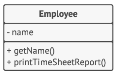

*ДО: класс сотрудника содержит разнородные поведения.*

Проблему можно решить, выделив операцию печати в отдельный класс.

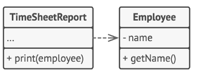

*ПОСЛЕ: лишнее поведение переехало в собственный класс.*

[к оглавлению](#OOD)

## 8. Каковы последствия нарушения SRP?

Что является причиной изменения логики работы класса?
Изменение отношений между классами, введение новых требований или отмена старых.

Если изменения в модуле могут запрашивать несколько ролей, то и меняться он будет часто.
А это ведет ***к хрупкости дизайна и ошибкам в неожиданных местах при изменениях кода***.

[к оглавлению](#OOD)

## 9. Что такое OCP?

**OCP (Open/Closed Principle)** - расширяйте классы, но не изменяйте их первоначальный код.

Стремитесь к тому, чтобы классы были открыты для расширения, но закрыты для изменения. Главная идея этого принципа в 
том, чтобы не ломать существующий код при внесении изменений в программу.

Класс можно назвать открытым, если он доступен для расширения. Например, у вас есть возможность расширить набор его 
операций или добавить к нему новые поля, создав собственный подкласс.

В то же время, класс можно назвать закрытым (а лучше сказать, *законченным*), если он готов для использования другими
классами. Это означает, что интерфейс класса уже окончательно определён и не будет изменяться в будущем.

Если класс уже был написан, одобрен, протестирован, возможно, внесён в библиотеку и включён в проект, после этого 
пытаться модифицировать его содержимое нежелательно. Вместо этого вы можете создать подкласс и расширить в нём базовое
поведение, не изменяя код родительского класса напрямую.

Но не стоит следовать этому принципу буквально для каждого изменения. Если вам нужно исправить ошибку в исходном классе,
просто возьмите и сделайте это. Нет смысла решать проблему родителя в дочернем классе.

[к оглавлению](#OOD)

## 10. Расскажите о нарушениях принципа OCP.

Пример:

Класс заказов имеет метод расчёта стоимости доставки, причём способы доставки «зашиты» непосредственно в сам
метод. Если вам нужно будет добавить новый способ доставки, то придётся трогать весь класс `Order`.

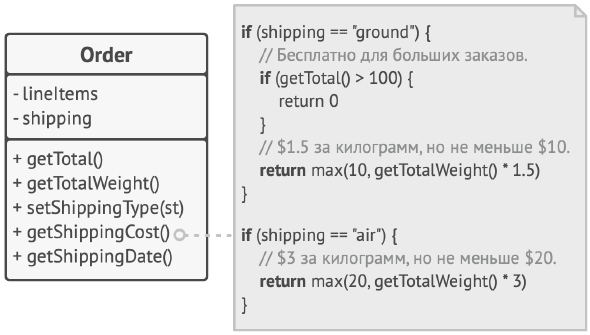

*ДО: код класса заказа нужно будет изменять при добавлении нового способа доставки.*

Проблему можно решить, если применить паттерн *Стратегия*. Для этого нужно выделить способы доставки в собственные 
классы с общим интерфейсом. 

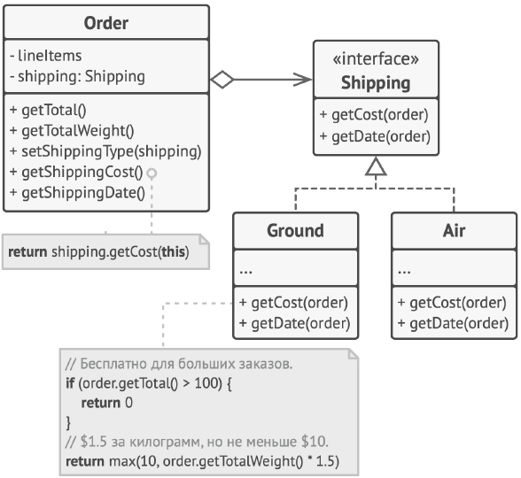

*ПОСЛЕ: новые способы доставки можно добавить, не трогая класс заказов.*

Теперь при добавлении нового способа доставки нужно будет реализовать новый класс интерфейса доставки, не трогая класс 
заказов. Объект способа доставки в класс заказа будет подавать клиентский код, который раньше устанавливал способ 
доставки простой строкой.

Бонус этого решения в том, что расчёт времени и даты доставки тоже можно поместить в новые классы, повинуясь принципу 
единственной ответственности.

[к оглавлению](#OOD)

## 11. Каковы последствия нарушения OCP?

При изменении требований придется каждый раз изменять существующий код, что влечет за собой также изменение тестов.

[к оглавлению](#OOD)

## 12. Что такое LSP?

**LSP (Liskov Substitution Principle)** - подклассы должны дополнять, а не замещать поведение базового класса.

Стремитесь создавать подклассы таким образом, чтобы их объекты можно было бы подставлять вместо объектов базового 
класса, не ломая при этом функциональности клиентского кода.

Принцип подстановки - это ряд проверок, которые помогают предсказать, останется ли подкласс совместим с остальным кодом
программы, который до этого успешно работал, используя объекты базового класса. Это особенно важно при разработке 
библиотек и фреймворков, когда ваши классы используются другими людьми, и вы не можете повлиять на чужой клиентский код,
даже если бы хотели.

В отличие от других принципов, которые определены очень свободно и имеют массу трактовок, принцип подстановки имеет ряд
формальных требований к подклассам, а точнее, к переопределённым в них методам.

+ **Типы параметров метода подкласса должны совпадать или быть более абстрактными, чем типы параметров базовного 
  метода.** Довольно запутанно? Рассмотрим, как это работает на примере.
  + Базовый класс содержит метод `feed(Cat c`, который умеет кормить домашних котов. Клиентский код это знает и всегда
   передаёт в метод кота.
  + **Хорошо:** Вы создали подкласс и переопределили метод кормёжки так, чтобы накормить любое животное: 
    `feed(Animal c)`. Если подставить этот подкласс в клиентский код, то ничего страшного не произойдёт. Клиентский код
    подаст в метод кота, но метод умеет кормить всех животных, поэтому накормит и кота.
  + **Плохо:** Вы создали другой подкласс, в котором метод умеет кормить только бенгальскую породу котов (подклссс 
    котов): `feed(BengalCat c)`. Что будет с клиентскоим кодом? Он всё так же подаст в метод обычного кота. Но метод 
    умеет кормить только бенгалов, поэтому не сможет обработать сломав клиентский код.
    

+ **Тип возвращаемого значения метода подкласса должен совпадать или быть подтипом возвращаемого значения базового 
  метода.** Здесь всё то же, что и в предыдущем пункте, но наоборот.
  + Базовый метод: `buyCat(): Cat`. Клиентский код ожидает на выходе любого домашнего кота.
  + **Хорошо:** Метод подкласса: `buyCat(): BengalCat`. Клиентский код получит бенгальского кота, который является
    домашним котом, поэтому всё будет хорошо.
  + **Плохо:** Метод подкласса: `buyCat(): Animal`. Клиентский код сломается, так как это непонятное животное (возможно,
    крокодил) не поместится в ящике-переноске для кота.


+ **Метод не должен выбрасывать исключения, которые не свойственны базовому методу.** Типы исключений в переопределённом
  методе должны совпадать или быть подтипами исключений, которые выбрасывает базовый метод. Блоки `try-catch` в
  клиентском коде нацелены на конкретные типы исключений, выбрасываемые базовыми методом. Поэтому неожиданное
  исключение, выброшенное подклассом, может проскочить сквозь обработчики клиентского кода и обрушить программу.

*В большинстве совеременных языков программирования, особенно строго типизированных (Java, C# и другие), перечисленные
ограничения встроены прямо в компилятор. Поэтому вы просто не сможете собрать программу, нарушив их.*

+ **Метод не должен ужесточать пред-условия.** Например, базовый метод работает с параметром типа `int`. Если подкласс 
  требует, чтобы значение этого параметра к тому же было больше нуля, то это ужесточает предусловия. Клиентский код, 
  который до этого отлично работал, подавая в метод негативные числа, теперь сломается при работе с объектом подкласса.
  
+ **Метод не должен ослаблять пост-условия.** Например, базовый метод требует, чтобы по завершению метода все 
  подключения к базе данных были закрыты, а подкласс оставляет эти подключения открытыми, чтобы потом повторно 
  использовать. Но клиентский код базового класса ничего об этом не знает. Он может завершить программу сразу после 
  вызова метода, оставив запущенные процессы-призраки в системе.
  
+ **Инварианты класса должны остаться без изменений.** Инвариант - это набор условий, при которых объект имеет смысл. 
  Например, инвариант кота - это наличие четырёх лап, хвоста, способность мурчать и прочее. Инвариант может быть описан 
  не только явным контрактом или проверками в методе класса, но и косвенно, например, юнит-тестами или клиентским кодом.
  
  Этот пункт проще всего нарушить при наследовании, так как вы можете попросту не подозревать о каком-то из условий 
  инварианта сложного класса. Идеальным в этом отношении был бы подкласс, который только вводит новые методы и поля, не 
  прикасаясь к полям базового класса.
  
+ **Подкласс не должен изменять значения приватных полей базового класса.** Этот пункт звучит странно, но в некоторых 
  языках доступ к приватным полям можно получить через механизм рефлексии.

[к оглавлению](#OOD)

## 13. Расскажите о нарушениях принципа LSP.

Пример неудачной иерархии классов документов.

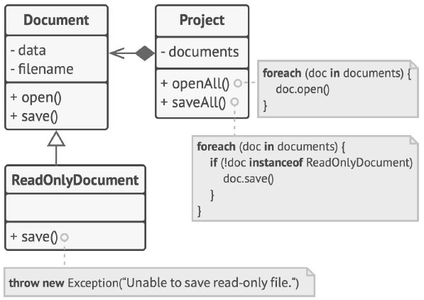

*ДО: подкласс «обнуляет» работу базового метода.*

Метод сохранения в подклассе `ReadOnlyDocuments` выбросит исключение, если кто-то попытается вызвать его метод 
сохранения. Базовый метод не имеет такого ограничения. Из-за этого клиентский код вынужден проверять тип документа при
сохранении всех документов.

При этом нарушается ещё и принцип открытости/закрытости, так как клиентский код начинает зависеть от конкретного класса,
который нельзя заменить на другой, не внося изменений в клиентский код.

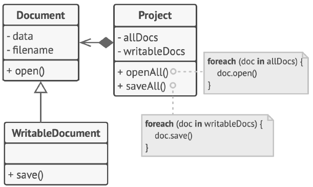

*ПОСЛЕ: подкласс расширяет базовый класс новым поведением.*

Проблему можно решить, перепроектировав иерархию классов. Базовый класс сможет только открывать документы, но не 
сохранять их. Подкласс, который теперь будет называться `WritableDocument`, расширит поведение родителя, позволив 
сохранять документ.

[к оглавлению](#OOD)

## 14. Каковы последствия нарушения LSP?

Неожиданное поведение классов. Ошибки в программе при замене на подклассы.

[к оглавлению](#OOD)

## 15. Что такое ISP?

**ISP (Interface Segregation Principle)** - Клиенты не должны зависеть от методов, которые они не используют.

Стремитесь к тому, чтобы интерфейсы были достаточно узкими, чтобы классам не приходилось реализовывать избыточное 
поведение.

Принцип разделения интерфейсов говорит о том, что слишком «толстые» интерфейсы необходимо разделять на более маленькие и
специфические, чтобы клиенты маленьких интерфейсов знали только о методах, которые необходимы им в работе. В итоге при
изменении метода интерфейса не должны меняться клиенты, которые этот метод не используют.

Наследование позволяет классу иметь только один суперкласс, но не ограничивает количество интерфейсов, которые он может
реализовать. Большинство объектных языков программирования позволяют классам реализовывать сразу несколько интерфейсов, 
поэтому нет нужды заталкивать в ваш интерфейс больше поведений, чем он того требует. Вы всегда можете присвоить классу
сразу несколько интерфейсов поменьше.

[к оглавлению](#OOD)

## 16. Расскажите о нарушениях принципа ISP.

Пример:

Представьте библиотеку для работы с облачными провайдерами. В первой версии она поддерживала только Amazon, имеющий 
полный набор облачный услуг. Исходя из них и проектировался интерфейс будущих классов.

Но позже стало ясно, что получившийся интерфейс облачного провайдера слишком широк, так как есть другие провайдеры, 
реализующие только часть из всех возможных сервисов.

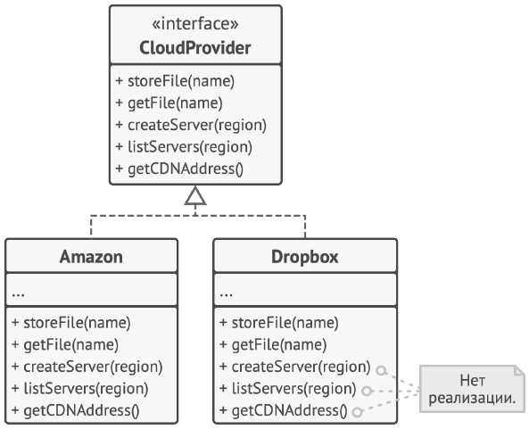

*ДО: не все клиенты могут реализовать операции интерфейса.*

Чтобы не плодить классы с пустой реализацией, раздутый интерфейс можно разбить на части. Классы, которые были способны 
реализовать все операции старого интерфейса, могут реализовать сразу несколько новых частичных интерфейсов.

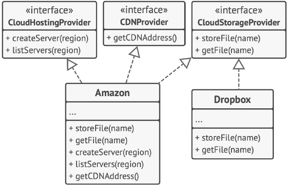

*ПОСЛЕ: раздутый интерфейс разбит на части.*

[к оглавлению](#OOD)

## 17. Каковы последствия нарушения ISP?

Дублирование кода - мы вынуждены будем переопределять неиспользуемые методы в классах, реализующих "большой" интерфейс.

Кроме того, с точки зрения архитектуры проекта, зависимости, несущие лишний груз ненужных и неиспользуемых особенностей, 
могут стать причиной неожиданных проблем.

[к оглавлению](#OOD)

## 18. Что такое DIP?

**DIP (Dependency Inversion Principle)** - классы верхних уровней не должны зависеть от классов нижних уровней. Оба 
должны зависеть от абстракций. Абстракции не должны зависеть от деталей. Детали должны зависеть от абстракций.

Обычно при проектировании программ можно выделить два уровня классов.

+ **Классы нижнего уровня** реализуют базовые операции вроде работы с диском, передачи данных по сети, подключения к 
  базе данных и прочее.
  
+ **Классы высокого уровня** содержат сложную базнес-логику программы, которая опирается на классы низкого уровня для 
  осуществления более простых операций.
  
Зачастую вы сперва проектируете классы нижнего уровня, а только потом берётесь за верхний уровень. При таком подходе 
классы бизнес-логики становятся зависимыми от более примитивных низкоуровневых классов. Каждое изменение в 
низкоуровневом классе может затронуть классы бизнес-логики, которые его используют.

Принцип инверсии зависимостей предлагает изменить направление, в котором происходит проектирование.

1. Для начала вам нужно описать интерфейс низкоуровневых операций, которые нужны классу бизнес-логики.
2. Это позволит убрать зависимость класса бизнес-логики от конкретного низкоуровневого класса, заменив её «мягкой» 
   зависимостью от интерфейса.
3. Низкоуровневый класс, в свою очередь, станет зависимым от интерфейса, определенного бизнес-логикой.

Принцип инверсии зависимостей часто идёт в ногу с принципом открытости/закрытости: вы сможете расширять низкоуровневые 
классы и использовать их вместе с классами бизнес-логики, не изменяя код последних.

[к оглавлению](#OOD)

## 19. Расскажите о нарушениях принципа DIP.

В этом примере высокоуровневый класс формирования бюджетных отчётов напрямую использует класс базы данных для загрузки и
сохранения своей информации.

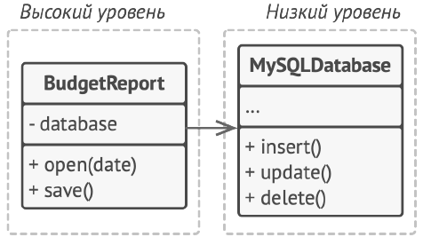

*ДО: высокоуровневый класс зависит от низкоуровневого.*

Проблему можно исправить, создав высокоуровневый интерфейс для загрузки/сохранения данных и привязав к нему класс 
отчетов. Низкоуровневые классы должны реализовать этот интерфейс, чтобы их объекты можно было использовать внутри 
объекта отчётов.

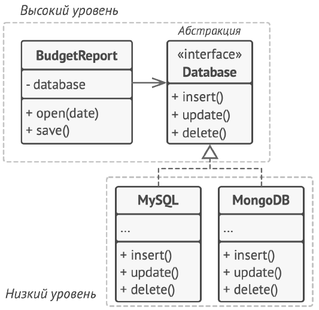

*ПОСЛЕ: низкоуровневые классы зависят от высокоуровневой абстракции.*

Таким образом, меняется направление зависимости. Если раньше высокий уровень зависел от низкого, то сейчас всё наоборот -
низкоуровневые классы зависят от высокоуровневого интерфейса.

[к оглавлению](#OOD)

## 20. Каковы последствия нарушения DIP?

Каждое изменение абстрактного интерфейса вызывает изменение его конкретной реализации. Изменение конкретной реализации, 
напротив, не всегда сопровождается изменениями и даже обычно не требует изменений в соответствующих интерфейсах. Т.е. 
интерфейсы менее изменчивы, чем реализации.

***Вместо замены реализации, придется изменять сам класс.***

Если в приложении абстракции не отделены от деталей, то изменение логики в низкоуровневых реализациях
может неожидано привести к поломке высокоуровневых модулей. Тестировать такую систему будет очень сложно. Даже если 
получится написать модульные тесты, то любое изменение в системе приведет к тому, что эти тесты придется переписывать.

***В результате получим жесткую, хрупкую, неподвижную систему, которую сложно тестировать.***

1. Жесткость - тяжело менять систему, потому что каждое изменение затрагивает очень много различных ее частей.
2. Хрупкость - когда вы вносите изменения в одну часть системы, то в неожиданном месте ломается другая.
3. Неподвижность - очень сложно повторно использовать код в другом приложении, т.к. модули сильно связаны между собой.

[к оглавлению](#OOD)

## 21. Расскажите, что такое автоматизированное тестирование.

**Автоматизированное тестирование** – это процесс написание тестов в виде повторно запускаемого блока кода. Тест – это 
проверка заведомо нужного поведения программы. В качестве противопоставления автоматизированному тестированию существует
ручное тестирование. Оно предполагает, что тест выполняется не компьютером, а человеком, он сам делает проверки и 
решает, что верно, а что нет.

Все тесты базируются на принципе **AAA** – **A**rrange **A**ct **A**ssert. **Arrange** – указание входных и ожидаемых 
данных программы. **Act** – выполнение программы путем передачи входных и получение выходных данных. **Assert** – 
сравнение выходных и ожидаемых данных.

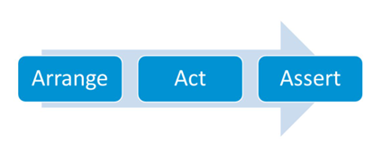

[к оглавлению](#OOD)

## 22. Как в Java осуществляется автоматизированное тестирование?

С помощью библиотек для автоматического тестирования (например):

+ **JUnit** - это опенсорсный фреймворк регрессионного тестирования, в основном используемый опытными разработчиками ПО 
  для выполнения юнит-тестирования, ускорения программирования и повышения качества кода в Java. Основная его цель - 
  позволить Java-разработчикам писать скрипты и реализовывать повторяющиеся тест-кейсы. Это один из наиболее часто 
  используемых фреймворков модульного тестирования Java.
  
+ **Serenity** - ранее известный как Thucydides, Serenity является одним из самых широко используемых открытых BDD-
  фреймворков тестирования Java. Он поможет в написании более четких, структурированных и настраиваемых критериев 
  приемки.
  
+ **Gauge** - это бесплатная open-source среда тестовой автоматизации Java, которая снижает нагрузку с приемочного 
  тестирования и сокращает использование кода. Это один из наиболее часто используемых фреймворков для тестирования 
  мобильных веб-сайтов.

[к оглавлению](#OOD)

## 23. Что такое JUnit? Как использовать ее для тестирования?

JUnit — это фреймворк автоматического тестирования отдельных модулей кода, например, методов или классов. Тесты это 
отдельный класс.

Юнит-тесты должны быть небольшими. В идеальном случае — одно утверждение (assert) на тест.
Так модульный тест будет соответствовать SRP, а также быстрее выполняться.

В юнит-тестах стоит использовать шаблон "Arrange, Act and Assert (AAA)", т.е. четко определить:
+ Arrange - предусловия (инициализация тестовых данных, предварительные установки);
+ Act - действие (вызыв тестируемого метода);
+ Assert - постусловия (что должно быть в результате выполнения действия).

Подобное оформление повышает читаемость кода и облегчает его использование в качестве документации
к тестируемой функциональности.

```java
import org.junit.Assert;
import org.junit.Test;

import static org.hamcrest.core.Is.is;

public class TemplateTest {

    @Test
    public void whenUniqueKeysThenTheyAreReplaced() {
       
        //arrange
        Template template = new SimpleGenerator();
        String data = "I am ${name}, Who are ${subject}?";
        Map<String, String> map = new HashMap<>();
        map.put("name", "Petr");
        map.put("subject", "you");
        String expected = "I am Petr, Who are you?";

        //act
        String result = template.generate(data, map);

        //action
        Assert.assertThat(result, is(expected));
    }
}
```

После объявления класса TemplateTest мы создаем тест-методы.

Методы должны иметь отличие только в имени, остальной каркас всегда остается одинаковым. Аннотация @Test позволяет 
запустить каждый метод по отдельности.

Для улучшения читаемости кода в связке c JUnit используется библиотека matcher-ов Hamcrest.
Matcher – это выражение, тестирующее на совпадение с определенным условием.

Плюсы использования JUnit:
+ Открытый исходный код, тестовые наборы/комплекты, аннотации, простая интеграция (Spring, CI и т.д.)
+ При рефакторинге кода, тесты JUnit помогут нам проследить, чтобы логика нашей программы не поломалась.
+ JUnit сработает еще лучше в связке с Maven. При сборке проекта Maven обязательно проведет все тесты и потом соберет 
  готовый проект. Если тесты будут провалены, проект не будет собран, но мы будем знать причины, и так будет легче 
  разобраться где именно поломка.

[к оглавлению](#OOD)

## 24. Что такое функциональное тестирование и чем отличается оно от модульного?

Обычно используют два вида автоматических тестов:

**Модульное тестирование (unit testing)** - это тестирование отдельных частей продукта. Unit — наименьшая тестируемая 
часть ПО, обычно метод или класс.

Юнит-тесты проверяют выполнение конкретного набора задач методом или классом. Юнит тестирование по определению является 
тестированием белого ящика.

**Функциональное тестирование (functional testing) —** это тестирование некоего функционала продукта, при этом продукт 
воспринимается как единый «чёрный ящик».

Функциональные тесты проверяют работу системы на соответствие требованиям, указанным в спецификации продукта. Внешнее 
поведение системы (логика работы продукта) проверяется независимо от внутренней реализации.

**Отличия:**
+ Даже успешное прохождение всех юнит-тестов не гарантирует правильной работы продукта: ведь одна и та же функция
  может быть использована в различных частях системы, в то время как юнит-тест писался для неё с оглядкой лишь
  на один вариант использования.

+ Функциональные тесты полностью определяют (по крайней мере должны) работоспособность продукта. И прежде всего нужны 
  заказчику/руководителю разработки. Юнит-тестирование прежде всего нужно самим разработчикам, для быстрого нахождения 
  ошибок или проверки последствий рефакторинга.

[к оглавлению](#OOD)

## 25. Расскажите про принцип TDD.

**TDD (Test Driven Development)** - это методология разработки программного обеспечения, которая основывается на 
повторении коротких циклов разработки. 

Методика разработки через тестирование заключается в организации автоматического тестирования разрабатываемых приложений
путем написания модульных, интеграционных и функциональных тестов, определяющих требования к коду непосредственно перед 
написанием этого самого кода. Сначала пишется тест, который проверяет корректность работы еще ненаписанного программного 
кода. Этот тест, разумеется, не проходит. После этого разработчик пишет код, который выполняет действия, требуемые для 
прохождения теста. После того, как тест успешно пройден, по необходимости осуществляется рефакторинг (доработка и 
переработка) написанного кода, причём в этом случае рефакторинг осуществляется уже под контролем прохождения тестов, что 
проще и надёжнее.

**Цикл разработки по TDD**

+ Добавить тест для новой (еще не реализованной) функциональности или для воспроизведения существующего бага
+ Запустить все тесты и убедиться, что новый тест не проходит
+ Написать код, который обеспечит прохождение теста
+ Запустить тесты и убедиться, что они все прошли успешно: прохождение нового теста подтверждает реализацию нового 
  функционала или исправление существующей ошибки, а прохождение остальных позволяет удостовериться, что ранее 
  реализованный функционал работает по-прежнему корректно.
+ Заняться рефакторингом и оптимизацией — улучшение сопровождаемости и быстродействия целесообразно осуществлять уже 
  после того, как получилось добиться проверяемой работоспособности
+ Перезапустить тесты и убедиться, что они все ещё проходят успешно
+ Повторить цикл

Эта методология позволяет добиться создания пригодного для автоматического тестирования приложения и очень хорошего 
покрытия кода тестами, так как ТЗ переводится на язык автоматических тестов, то есть всё, что программа должна делать, 
проверяется. Также TDD часто упрощает программную реализацию: так как исключается избыточность — если компонент проходит 
тест, то он считается готовым. Если же существующие тесты проходят, но работает компонент не так, как ожидается, то это 
значит, что тесты пока не отражают всех требований и это повод добавить новые тесты.

Архитектура программных продуктов, разрабатываемых таким образом, обычно лучше. Стабильность работы приложения, 
разработанного через тестирование, также выше за счёт того, что все основные функциональные возможноси программы покрыты
тестами и их работоспособность постоянно проверяется. Сопровождаемость проектов, где тестируется всё или практически 
всё, очень высока — разработчики могут не бояться вносить изменения в код, если что-то пойдёт не так, то об этом сообщат 
результаты автоматического тестирования.

[к оглавлению](#OOD)

## 26. Расскажите про принцип BDD.

**BDD (Behavior Driven Development)** - Разработка на основе поведения.

BDD является расширением TDD-подхода. В тоже время они предназначены для разных целей.

+ TDD подходит для юнит-тестирования. BDD - для интеграционного.
+ TDD: тесты сразу реализуются в коде, для BDD чаще всего описываются шаги на языке, понятном всем, а не только 
  разработчикам.
+ TDD: юнит тесты пишут разработчики. BDD требует объединения усилий разных членов команды.
+ TDD проверяет работу функций (методов), BDD - пользовательские сценарии.

**В чем преимущество BDD?**

+ Тесты читаемые не только для программистов.
+ Их легко изменять. Они часто пишутся почти на чистом английском.
+ Тесты не зависят от целевого языка программирования. Перенос на другой язык сильно упрощается.

В данном случае тесты это и описание и непосредственно реализация.

[к оглавлению](#OOD)

## 27. Что такое тестирование черным, белым, серым ящиком?

**Black Box**

**Summary: Мы не знаем, как устроена тестируемая система.**

Тестирование методом «черного ящика», также известное как тестирование, основанное на спецификации или тестирование 
поведения – техника тестирования, основанная на работе исключительно с внешними интерфейсами тестируемой системы.

**тестирование черного ящика – это:**

+ тестирование, как функциональное, так и нефункциональное, не предполагающее знания внутреннего устройства компонента 
  или системы.
+ тест-дизайн, основанный на технике черного ящика – процедура написания или выбора тест-кейсов на основе анализа 
  функциональной или нефункциональной спецификации компонента или системы  без знания ее внутреннего устройства.

Почему именно «черный ящик»? Тестируемая программа для тестировщика – как черный непрозрачный ящик, содержания которого 
он не видит. Целью этой техники является поиск ошибок в таких категориях:

+ неправильно реализованные или недостающие функции;
+ ошибки интерфейса;
+ ошибки в структурах данных или организации доступа к внешним базам данных;
+ ошибки поведения или недостаточная производительность системы;

Таким образом, мы не имеем представления о структуре и внутреннем устройстве системы. Нужно концентрироваться на том, 
что программа делает, а не на том, как она это делает.

**Преимущества:**

+ тестирование производится с позиции конечного пользователя и может помочь обнаружить неточности и противоречия в 
  спецификации;
+ тестировщику нет необходимости знать языки программирования и углубляться в особенности реализации программы;
+ тестирование может производиться специалистами, независимыми от отдела разработки, что помогает избежать предвзятого 
  отношения;
+ можно начинать писать тест-кейсы, как только готова спецификация.

**Недостатки:**

+ тестируется только очень ограниченное количество путей выполнения программы;
+ без четкой спецификации (а это скорее реальность на многих проектах) достаточно трудно составить эффективные 
  тест-кейсы;
+ некоторые тесты могут оказаться избыточными, если они уже были проведены разработчиком на уровне модульного 
  тестирования;

---

**White Box**

**Summary: Нам известны все детали реализации тестируемой программы.**

Тестирование методом белого ящика (также: прозрачного, открытого, стеклянного ящика; основанное на коде или структурное 
тестирование) – метод тестирования программного обеспечения, который предполагает, что внутренняя 
структура/устройство/реализация системы известны тестировщику. Мы выбираем входные значения, основываясь на знании кода,
который будет их обрабатывать. Точно так же мы знаем, каким должен быть результат этой обработки. Знание всех 
особенностей тестируемой программы и ее реализации – обязательны для этой техники. Тестирование белого ящика – 
углубление во внутренне устройство системы, за пределы ее внешних интерфейсов.

**тестирование белого ящика – это:**

+ тестирование, основанное на анализе внутренней структуры компонента или системы.
+ тест-дизайн, основанный на технике белого ящика – процедура написания или выбора тест-кейсов на основе анализа 
  внутреннего устройства системы или компонента.

Почему «белый ящик»? Тестируемая программа для тестировщика – прозрачный ящик, содержимое которого он прекрасно видит.

**Преимущества:**

+ тестирование может производиться на ранних этапах: нет необходимости ждать создания пользовательского интерфейса;
+ можно провести более тщательное тестирование, с покрытием большого количества путей выполнения программы.

**Недостатки:**

+ для выполнения тестирования белого ящика необходимо большое количество специальных знаний
+ при использовании автоматизации тестирования на этом уровне, поддержка тестовых скриптов может оказаться достаточно 
  накладной, если программа часто изменяется.
  
----

**Grey Box**

**Summary: Нам известны только некоторые особенности реализации тестируемой системы.**

Тестирование методом серого ящика – метод тестирования программного обеспечения, который предполагает, комбинацию White 
Box и Black Box подходов. То есть, внутреннее устройство программы нам известно лишь частично. Предполагается, например,
доступ к внутренней структуре и алгоритмам работы ПО для написания максимально эффективных тест-кейсов, но само 
тестирование проводится с помощью техники черного ящика, то есть, с позиции пользователя.

Эту технику тестирования также называют методом полупрозрачного ящика: что-то мы видим, а что-то – нет.

[к оглавлению](#OOD)
