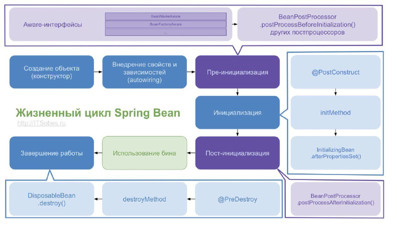
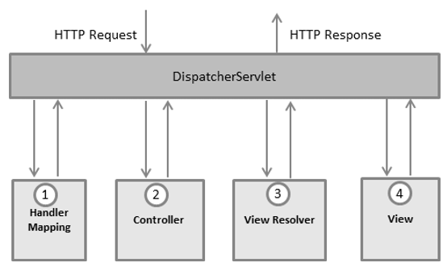

## Spring

[1. Что такое Spring? Какие основные задачи выполняет этот фреймворк?](#1-Что-такое-spring-Какие-основные-задачи-выполняет-этот-фреймворк)

[2. Что такое IoC и DI? В чем отличие этих терминов?](#2-Что-такое-ioc-и-di-В-чем-отличие-этих-терминов)

[3. Перечислите основные модули Spring фреймворка.](#3-Перечислите-основные-модули-spring-фреймворка)

[4. Перечислите способы инъекций зависимостей.](#4-Перечислите-способы-инъекций-зависимостей)

[5. Что такое ApplicationContext? Когда он создается?](#5-Что-такое-applicationcontext-Когда-он-создается)

[6. Расскажите, что такое Spring Bean? Опишите жизненный цикл Spring Bean?](#6-Расскажите-что-такое-spring-bean-Опишите-жизненный-цикл-spring-bean)

[7. Объясните для чего используются аннотации @Autowired @Qualifier. Когда, какой нужно использовать?](#7-Объясните-для-чего-используются-аннотации-autowired-qualifier-Когда-какой-нужно-использовать)

[8. Что такое FactoryBeans?](#8-Что-такое-factorybeans)

[9. Что такое Profiles? Когда их используют.](#9-Что-такое-profiles-Когда-их-используют)

[10. Расскажите про модуль Spring AOP.](#10-Расскажите-про-модуль-spring-aop)

[11. Объясните шаблон проектирование Proxy? Где он используется в Spring.](#11-Объясните-шаблон-проектирования-proxy-Где-он-используется-в-spring)

[12. Объясните, как происходит интеграция с JDBC.](#12-Объясните-как-происходит-интеграция-с-jdbc)

[13. Объясните, как происходит интеграция с Hibernate.](#13-Объясните-как-происходит-интеграция-с-hibernate)

[14. Что такое Transaction Manager? Где он используется? Когда он нужен?](#14-Что-такое-transaction-manager-Где-он-используется-Когда-он-нужен)

[15. Расскажите о модуле Spring MVC.](#15-Расскажите-о-модуле-spring-mvc)

[16. Объясните верхнеуровневую архитектуру Spring MVC: Dispatcher, ViewResolver.](#16-Объясните-верхнеуровневую-архитерктуру-spring-mvc-dispatcher-viewresolver)

[17. Как конфигурировать Spring MVC?](#17-Как-конфигурировать-spring-mvc)

[18. Что такое Spring scope? Какие типы Spring scope существуют?](#18-Что-такое-spring-scope-Какие-типы-spring-scope-существуют)

[19. Расскажите про аннотации @RequestMapping, @PathVariable, @RequestBody, @RequestParam, @ModelAttribute, @ResponseBody, @SessionAttribute, @CookieValue.](#19-Расскажите-про-аннотации-requestmapping-pathvariable-requestbody-requestparam-modelattribute-responsebody-sessionattribute-cookievalue)

[20. Расскажите про модуль Spring Security?](#20-Расскажите-про-модуль-spring-security)

[21. Как конфигурировать Spring Security?](#21-Как-конфигурировать-spring-security)

[22. Что такое UserDetails?](#22-Что-такое-userdetails)

[23. Расскажите верхнеуровневую архитектуру Spring Security.](#23-Расскажите-верхнеуровневую-архитектуру-spring-security)

[24. Что такое FilterChainProxy?](#24-Что-такое-filterchainproxy)

[25. Расскажите о схеме работы пользователь-роль.](#25-Расскажите-о-схеме-работы-пользователь-роль)

[26. Расскажите о SpringContextHolder.](#26-Расскажите-о-springcontextholder)

[27. Расскажите об аспектах многопоточного окружения в Spring.](#27-Расскажите-об-аспектах-многопоточного-окружения-в-spring)

[28. Расскажите о тестировании Spring приложений?](#28-Расскажите-о-тестировании-spring-приложений)

[29. Расскажите о тестирование Spring MVС приложений.](#29-Расскажите-о-тестировании-spring-mvс-приложений)

[30. Расскажите о мониторинге Spring приложений.](#30-Расскажите-о-мониторинге-spring-приложений)

## 1. Что такое Spring? Какие основные задачи выполняет этот фреймворк?

Обычно Spring описывают как облегченную платформу для построения Java-приложений, но с этим утверждением связаны два 
интересных момента. Во-первых, Spring можно использовать для построения любого приложения на языке Java (т.е. 
автономных, веб приложений, приложений JEE и т.д.), что отличает Spring от многих других платформ, таких как Apache 
Struts, которая ограничена только веб-приложениями. Во-вторых, характеристика “облегченная” в действительности не имеет 
никакого отношения к количеству классов или размеру дистрибутива; напротив, она определяет принцип всей философии Spring 
— минимальное воздействие. Платформа Spring является облегченной в том смысле, что для использования ядра Spring вы 
должны вносить минимальные (если вообще какие-либо) изменения в код своего приложения, а если в какой-то момент вы 
решите больше не пользоваться Spring, то и это сделать очень просто.

Spring Framework, вероятно, наиболее известен как источник расширений (features), нужных для эффективной разработки 
сложных бизнес-приложений вне тяжеловесных программных моделей, которые исторически были доминирующими в промышленности. 
Ещё одно его достоинство в том, что он ввел ранее неиспользуемые функциональные возможности в сегодняшние господствующие 
методы разработки, даже вне платформы Java. Этот фреймворк предлагает последовательную модель и делает её применимой к 
большинству типов приложений, которые уже созданы на основе платформы Java. Считается, что Spring Framework реализует 
модель разработки, основанную на лучших стандартах индустрии, и делает её доступной во многих областях Java. Таким 
образом к достоинствам Spring можно отнести:

- Относительная легкость в изучении и применении фреймворка в разработке и поддержке приложения.
- Внедрение зависимостей (DI) и инверсия управления (IoC) позволяют писать независимые друг от друга компоненты, что 
  дает преимущества в командной разработке, переносимости модулей и т.д..
- Spring IoC контейнер управляет жизненным циклом Spring Bean и настраивается наподобие JNDI lookup (поиска).
- Проект Spring содержит в себе множество подпроектов, которые затрагивают важные части создания софта, такие как 
  вебсервисы, веб программирование, работа с базами данных, загрузка файлов, обработка ошибок и многое другое. Всё это 
  настраивается в едином формате и упрощает поддержку приложения.

[к оглавлению](#spring)

## 2. Что такое IoC и DI? В чем отличие этих терминов?

Принцип инверсии зависимостей — важный принцип объектно-ориентированного программирования, используемый для уменьшения 
зацепления в компьютерных программах. Входит в пятёрку принципов SOLID. Формулировка: Модули верхних уровней не должны 
импортировать сущности из модулей нижних уровней.

Инверсия управления — важный принцип объектно-ориентированного программирования, используемый для уменьшения зацепления 
в компьютерных программах. Также архитектурное решение интеграции, упрощающее расширение возможностей системы, при 
котором поток управления программы контролируется фреймворком.

Внедрение зависимости (Dependency injection, DI) — процесс предоставления внешней зависимости программному компоненту. 
Является специфичной формой «инверсии управления» ( Inversion of control, IoC), когда она применяется к управлению 
зависимостями. В полном соответствии с принципом единой обязанности объект отдаёт заботу о построении требуемых ему 
зависимостей внешнему, специально предназначенному для этого общему механизму. К достоинствам применения DI можно 
отнести:

- Сокращение объема связующего кода. Одним из самых больших плюсов DI является возможность значительного сокращения 
  объема кода, который должен быть написан для связывания вместе различных компонентов приложения. Зачастую этот код 
  очень прост — при создании зависимости должен создаваться новый экземпляр соответствующего объекта.
- Упрощенная конфигурация приложения. За счет применения DI процесс конфигурирования приложения значительно упрощается. 
  Для конфигурирования классов, которые могут быть внедрены в другие классы, можно использовать аннотации или XML-файлы.
- Возможность управления общими зависимостями в единственном репозитории. При традиционном подходе к управлению 
  зависимостями в общих службах, к которым относятся, например, подключение к источнику данных, транзакция, удаленные 
  службы и т.п., вы создаете экземпляры (или получаете их из определенных фабричных классов) зависимостей там, где они 
  нужны — внутри зависимого класса. Это приводит к распространению зависимостей по множеству классов в приложении, что 
  может затруднить их изменение. В случае использования DI вся информация об общих зависимостях содержится в 
  единственном репозитории (в Spring есть возможность хранить эту информацию в XML-файлах или Java классах), что 
  существенно упрощает управление зависимостями и снижает количество возможных ошибок. Улучшенная возможность 
  тестирования. Когда классы проектируются для DI, становится возможной простая замена зависимостей. Это особенно 
  полезно при тестировании приложения.
- Стимулирование качественных проектных решений для приложений. Вообще говоря, проектирование для DI означает 
  проектирование с использованием интерфейсов. Используя Spring, вы получаете в свое распоряжение целый ряд средств DI и 
  можете сосредоточиться на построении логики приложения, а не на поддерживающей DI платформе.

[к оглавлению](#spring)

## 3. Перечислите основные модули Spring фреймворка.

На данный момент среда Spring интегрировала более 20 модулей. Эти модули в основном делятся на основной контейнер, 
доступ к данным / интеграцию, Интернет, АОП (аспектно-ориентированное программирование), инструменты, сообщения и 
тестовые модули, как показано на рисунке ниже.


[к оглавлению](#spring)

## 4. Перечислите способы инъекций зависимостей.

Реализация DI в Spring основана на двух ключевых концепциях Java — компонентах JavaBean и интерфейсах. При использовании 
Spring в качестве поставщика DI вы получаете гибкость определения конфигурации зависимостей внутри своих приложений 
разнообразными путями (т.е. внешне в XML-файлах, с помощью конфигурационных Java классов Spring или посредством 
аннотаций Java в коде). Компоненты JavaBean (также называемые POJO (Plain Old Java Object — простой старый объект Java)) 
предоставляют стандартный механизм для создания ресурсов Java, которые являются конфигурируемыми множеством способов. 
За счет применения DI объем кода, который необходим при проектировании приложения на основе интерфейсов, снижается почти 
до нуля. Кроме того, с помощью интерфейсов можно получить максимальную отдачу от DI, потому что бины могут использовать 
любую реализацию интерфейса для удовлетворения их зависимости.

К типам реализации внедрения зависимостей в Spring относят:

Constructor Dependency Injection — это тип внедрения зависимостей, при котором зависимости компонента предоставляются 
ему в его конструкторе (или конструкторах).

```java
public class ConstructorInjection {

    private Dependency dependency;
  
    public ConstructorInjection(Dependency dependency) {
        this.dependency = dependency;
    }
}
```

Setter Dependency Injection – контейнер IoC внедряет зависимости компонента в компонент через методы установки в стиле 
JavaBean.

```java
public class SetterInjection {
    
    private Dependency dependency;
    
    public void setDependency(Dependency dependency) {
        this.dependency = dependency;
    }
}
```

[к оглавлению](#spring)

## 5. Что такое ApplicationContext? Когда он создается?

Контекст (а у него есть даже интерфейс — ```java org.springframework.context.ApplicationContext```) — это некоторое 
окружение, в котором работает приложение на Spring Framework. Страшные аббревиатуры DI, IoC — это всё про него. 
Собственно, контекст создаёт и хранит экземпляры классов вашего приложения, определяет их зависимости друг с другом и 
автоматически их задаёт.

Безусловно, для того чтобы Spring создал контекст с экземплярами классов, ему нужно предоставить дополнительную 
информацию — мета-данные, из каких классов/объектов состоит ваше приложение, как они создаются, какие у них есть 
зависимости и т. д. Они отличаются друг от друга именно тем, каким способом задаются мета-данные и где хранится эта 
конфигурация. Например:

- ```java ClassPathXmlApplicationContext``` — метаданные конфигурируются XML-файлом(-ами) и они лежат в classpath, т. е. в ресурсах модуля; 
- ```java FileSystemXmlApplicationContext``` — метаданные тоже конфигурируются XML-файлом(-ами), но они находятся где-то в файловой системе, например, /etc/yourapp/spring-context.xml; 
- ```java AnnotationConfigApplicationContext``` — метаданные конфигурируются с помощью аннотаций прямо на классах.

Это класс, который в основном представляет собой реестр всех бинов, загруженных spring. В общем случае запуск spring 
означает поиск загружаемых бинов и помещение их в контекст приложения (это относится только к синглетам, бины областей 
прототипов не хранятся в ApplicationContext).

[к оглавлению](#spring)

## 6. Расскажите, что такое Spring Bean? Опишите жизненный цикл Spring Bean?

Знакомство со Spring IoC начнем с главного термина: бин (англ. — bean). Самыми простыми словами,
> Бин — создаваемый Spring-ом объект класса, который можно внедрить в качестве значения поля в другой объект.

Хотите словами посложнее? А пожалуйста:
> Бин — объект класса, представляющий собой завершенный программный элемент с определенной бизнес-функцией либо внутренней функцией Spring'а, жизненным циклом которого управляет контейнер бинов.



Следующие этапы проходит каждый отдельно взятый бин:

1. Инстанцирование объекта. Техническое начало жизни бина, работа конструктора его класса;
2. Установка свойств из конфигурации бина, внедрение зависимостей;
3. Нотификация aware-интерфейсов. BeanNameAware, BeanFactoryAware и другие. Мы уже писали о таких интерфейсах ранее. Технически, выполняется системными подтипами BeanPostProcessor, и совпадает с шагом 4;
4. Пре-инициализация – метод postProcessBeforeInitialization() интерфейса BeanPostProcessor;
5. Инициализация. Разные способы применяются в таком порядке:
   • Метод бина с аннотацией @PostConstruct из стандарта JSR-250 (рекомендуемый способ);
   • Метод afterPropertiesSet() бина под интерфейсом InitializingBean;
   • Init-метод. Для отдельного бина его имя устанавливается в параметре определения initMethod. В xml-конфигурации можно установить для всех бинов сразу, с помощью default-init-method;
6. Пост-инициализация – метод postProcessAfterInitialization() интерфейса BeanPostProcessor.
   Когда IoC-контейнер завершает свою работу, мы можем кастомизировать этап штатного уничтожения бина. Как со всеми способами финализации в Java, при жестком выключении (kill -9) гарантии вызова этого этапа нет. Три альтернативных способа «деинициализации» вызываются в том же порядке, что симметричные им методы инициализации: 
7. Метод с аннотацией @PreDestroy;
8. Метод с именем, которое указано в свойстве destroyMethod определния бина (или в глобальном default-destroy-method);
9. Метод destroy() интерфейса DisposableBean.

Не следует путать жизненный цикл отдельного бина с жизненным циклом контекста и этапами подготовки фабрик бинов.

[к оглавлению](#spring)

## 7. Объясните для чего используются аннотации @Autowired @Qualifier. Когда, какой нужно использовать?

> @Autowired - используется для автоматического связывания зависимостей в spring beans.
> 
> @Qualifier - используется совместно с @Autowired для уточнения данных связывания, когда возможны коллизии (например 
> одинаковых имен\типов).

[к оглавлению](#spring)

## 8. Что такое FactoryBeans?

BeanFactory можно понимать как фабричный класс, содержащий коллекцию bean-компонентов. BeanFactory содержит определение 
типа bean-компонента, так что соответствующий bean-компонент может быть создан при получении клиентского запроса. 

BeanFactory также может создавать отношения между кооперативными классами при создании экземпляров объектов. Это 
освободит сам компонент и конфигурацию клиента компонента. BeanFactory также содержит управление жизненным циклом 
компонента, вызывая методы инициализации клиента (методы инициализации) и методы уничтожения (методы уничтожения).

[к оглавлению](#spring)

## 9. Что такое Profiles? Когда их используют.

Активный профиль задается в файле application.properties:
```java
spring.profiles.active=dev
```

Для каждого профиля создадим соотвествующий файл:
```java
application-dev.properties
application-test.properties
application-prod.properties
```

Поскольку в application.properties стоит активация профиля dev, DataSource будет инициализироваться настройками файла application-dev.properties
Тестировочный профиль активируется с помощью аннотации @ActiveProfiles(«test»):
```java
@ActiveProfiles("test")
@RunWith(SpringRunner.class)
@SpringBootTest(webEnvironment = WebEnvironment.RANDOM_PORT)
```

Допустим, нам нужно создавать определенный бин только для определенного профиля. Для этого можно аннотировать бин с помощью @Profile. Аннотация применима как к классу, так и к методу.  
Давайте аннотируем класс ExampleTestBean, экземпляр которого будет создаваться только при активном профиле test:
```java
@Profile("test")
@Component
public class ExampleTestBean {
}
```

Обратите внимание, что в предыдущем примере мы взяли и напечатали текущий активный профиль:
```java
for (final String profileName : environment.getActiveProfiles()) {
    System.out.println("Currently active profile - " + profileName);
}
```

[к оглавлению](#spring)

## 10. Расскажите про модуль Spring AOP.

Модуль AOP в Spring обеспечивает нас такими сущностями, как “перехватчики” (interceptors) для перехвата приложения в 
определённые моменты. Например, когда выполняется определённый метод, мы можем добавить какую-то функциональность (к 
примеру, сделать запись в лог-файл приложения) как до, так и после выполнения метода.

```java
import org.aspectj.lang.annotation.*;

@Aspect
public class Logging {

    @Pointcut("execution(* net.proselyte.aop.*.*(..))")
    public void selectAllMethodsAvaliable() {

    }

    @Before("selectAllMethodsAvaliable()")
    public void beforeAdvice() {
        System.out.println("Now we are going to initiate developer's profile.");
    }

    @After("selectAllMethodsAvaliable()")
    public void afterAdvice() {
        System.out.println("Developer's profile has been initiated.");
    }

    @AfterReturning(pointcut = "selectAllMethodsAvaliable()", returning = "someValue")
    public void afterReturningAdvice(Object someValue) {
        System.out.println("Value: " + someValue.toString());
    }

    @AfterThrowing(pointcut = "selectAllMethodsAvaliable()", throwing = "e")
    public void inCaseOfExceptionThrowAdvice(ClassCastException e) {
        System.out.println("We have an exception here: " + e.toString());
    }

}
```

[к оглавлению](#spring)

## 11. Объясните шаблон проектирование Proxy? Где он используется в Spring.

Proxy (Заместитель) -  это структурный паттерн проектирования, который позволяет подставлять вместо реальных объектов 
специальные объекты-заменители. Эти объекты перехватывают вызовы к оригинальному объекту, позволяя сделать что-то до или 
после передачи вызова оригиналу.

Хороший пример использования Proxy — это org.springframework.aop.framework.ProxyFactoryBean.Эта фабрика создаёт 
AOP-прокси на основе Spring-бина. Прокси предоставляет заместителя для другого объекта, чтобы контролировать доступ к 
нему.

```java
public class Main {
	
	public static void main(String[] args) {
		// Create math proxy
		IMath p = new MathProxy();

		// Do the math
		System.out.println("4 + 2 = " + p.add(4, 2));
		System.out.println("4 - 2 = " + p.sub(4, 2));
		System.out.println("4 * 2 = " + p.mul(4, 2));
		System.out.println("4 / 2 = " + p.div(4, 2));
	}
}

/**
 * "Subject"
 */
public interface IMath {

	public double add(double x, double y);

	public double sub(double x, double y);

	public double mul(double x, double y);

	public double div(double x, double y);
}

/**
 * "Real Subject"
 */
public class Math implements IMath {

	public double add(double x, double y) {
		return x + y;
	}

	public double sub(double x, double y) {
		return x - y;
	}

	public double mul(double x, double y) {
		return x * y;
	}

	public double div(double x, double y) {
		return x / y;
	}
}

/**
 * "Proxy Object"
 */
public class MathProxy implements IMath {

    private Math math;

    public double add(double x, double y) {
        lazyInitMath();
        return math.add(x, y);
    }

    public double sub(double x, double y) {
        lazyInitMath();
        return math.sub(x, y);
    }

    public double mul(double x, double y) {
        lazyInitMath();
        return math.mul(x, y);
    }

    public double div(double x, double y) {
        lazyInitMath();
        return math.div(x, y);
    }

    private void lazyInitMath() {
        if (math == null) {
            math = new Math();
        }
    }
}
```

[к оглавлению](#spring)

## 12. Объясните, как происходит интеграция с JDBC.

Spring предоставляет отличную поддержку JDBC API и предлагает класс утилиту JdbcTemplate, с помощью которого можно 
избавиться от многократного повторения похожего кода в приложении (вроде операций open \ closing connection; ResultSet, 
PreparedStatement и др.). Для подключения необходимо настроить файл конфигурации spring и получить объект JdbcTemplate.
На данном этапы мы напишем все через JDBC. Spring напрямую не работает с базой. Он использует JDBC библиотеки.
Spring оборачивает JDBC в свои классы, делая их удобными для работы. Здесь используется шаблон "Декоратор".

```java
@Configuration
@PropertySource("classpath:app.properties")
@EnableTransactionManagement
public class JdbcConfig {

    @Bean
    public DataSource ds(@Value("${jdbc.driver}") String driver,
                         @Value("${jdbc.url}") String url,
                         @Value("${jdbc.username}") String username,
                         @Value("${jdbc.password}") String password) {
        BasicDataSource ds = new BasicDataSource();
        ds.setDriverClassName(driver);
        ds.setUrl(url);
        ds.setUsername(username);
        ds.setPassword(password);
        return ds;
    }

    @Bean
    public JdbcTemplate jdbc(DataSource ds) {
        return new JdbcTemplate(ds);
    }

}
```

[к оглавлению](#spring)

## 13. Объясните, как происходит интеграция с Hibernate.

Для интеграции Hibernate в Spring необходимо подключить зависимости, а так же настроить файл конфигурации Spring. Т.к. 
настройки несколько отличаются между проектами и версиями, то смотрите официальную документацию Spring и Hibernate для 
уточнения настроек для конкретных технологий.

[к оглавлению](#spring)

## 14. Что такое Transaction Manager? Где он используется? Когда он нужен?

Фабрика может создавать объекты EntityManager, вызывая методы которого можно управлять сущностями. EntityManager, в 
отличие от фабрики, достаточно легковесен и поэтому зачастую создаётся по месту использования и в больших количествах. 
Если проводить аналогию с обычным JDBC, то EntityManagerFactory будет аналогом DataSource, а EntityManager аналогом 
Connection.

Каждый экземпляр EntityManager связан с экземпляром EntityTransaction, что позволяет управлять транзакциями:

```java
EntityManager em = entityManagerFactory.createEntityManager();
em.getTransaction().begin();
//Some actions
em.getTransaction().commit();
em.getTransaction().begin();
//Some actions
em.getTransaction().rollback();
```

Один или несколько EntityManager образуют или могут образовать persistence context. Я не буду переводить этот термин, 
попробую лучше его объяснить. Наличие persistence context означает, что для каждой существующей на данный момент 
сущности существует EntityManager, который следит за её состоянием.

> Transaction менеджер

* Менеджер транзакций должен предоствить ответ на два вопроса:

Должен ли создаться новый Entity Manager?  
Должна ли стартовать новая транзакция БД?  
Ответы необходимы предоставить в момент когда вызывается логика аспекта транзакций в момент «до».  Менеджер транзакций 
принимает решение, основываясь на следующих фактах:

Выполняется ли хоть одна транзакция в текущий момент ли нет атрибута «propagation» у метода, аннотированного 
@Transactional (для примера, REQUIRES_NEW всегда стартует новую транзакцию).Если менеджер решил создать новую 
транзакцию, тогда:

Создается новый entity менеджер.
1. «Привязка» entity менеджера к текущему потоку (Thread)  
2. «Взятие» соединения из пула соединений БД  
3. «Привязка» соединения к текущему потоку  
4. И entity менеджер и это соединение привязываются к текущему потоку, используя переменные ThreadLocal.

Они хранятся в потоке, пока выполняется транзакция, и затем передаются менеджеру транзакций для очистки, когда они уже 
будут не нужны.

Любая часть программы, которой нужен текущий entity manager или соединение, может заполучить их из потока. Этим 
компонентом программы, который делает именно так является Entity Manager Proxy.

**EntityManager proxy.**

Прокси Entity менеджера (который был представлен ранее) это последний кусоче паззла. Когда бизнес метод делает вызов, 
например, entityManager.persist(), этот вызов не вызывается напрямую у entity менеджера. 

Вместо этого бизнес метод вызывает прокси, который достает текущий entity менеджер  из потока, в который его положил 
менеджер транзакций.

Зная теперь все части механизма @Transactional, давайте пройдемся по обычной конфигурации Spring, необходимой для работы 
всего этого.

[к оглавлению](#spring)

## 15. Расскажите о модуле Spring MVC.

Фреймворк Spring MVC обеспечивает архитектуру паттерна Model — View — Controller (Модель — Отображение (далее — Вид) — 
Контроллер) при помощи слабо связанных готовых компонентов. Паттерн MVC разделяет аспекты приложения (логику ввода, 
бизнес-логику и логику UI), обеспечивая при этом свободную связь между ними.

Model (Модель) инкапсулирует (объединяет) данные приложения, в целом они будут состоять из POJO («Старых добрых 
Java-объектов», или бинов). 

View (Отображение, Вид) отвечает за отображение данных Модели, — как правило, генерируя HTML, которые мы видим в своём 
браузере. 

Controller (Контроллер) обрабатывает запрос пользователя, создаёт соответствующую Модель и передаёт её для отображения 
в Вид.

[к оглавлению](#spring)

## 16. Объясните верхнеуровневую архитектуру Spring MVC: Dispatcher, ViewResolver.

Вся логика работы Spring MVC построена вокруг DispatcherServlet, который принимает и обрабатывает все HTTP-запросы 
(из UI) и ответы на них. Рабочий процесс обработки запроса DispatcherServlet'ом проиллюстрирован на следующей диаграмме:



Ниже приведена последовательность событий, соответствующая входящему HTTP-запросу:

После получения HTTP-запроса DispatcherServlet обращается к интерфейсу HandlerMapping, который определяет, какой 
Контроллер должен быть вызван, после чего, отправляет запрос в нужный Контроллер. Контроллер принимает запрос и вызывает 
соответствующий служебный метод, основанный на GET или POST. Вызванный метод определяет данные Модели, основанные на 
определённой бизнес-логике и возвращает в DispatcherServlet имя Вида (View). При помощи интерфейса ViewResolver 
DispatcherServlet определяет, какой Вид нужно использовать на основании полученного имени. После того, как Вид (View) 
создан, DispatcherServlet отправляет данные Модели в виде атрибутов в Вид, который в конечном итоге отображается в 
браузере.

Все вышеупомянутые компоненты, а именно, HandlerMapping, Controller и ViewResolver, являются частями интерфейса 
WebApplicationContext extends ApplicationContext, с некоторыми дополнительными особенностями, необходимыми для создания 
web-приложений.

[к оглавлению](#spring)

## 17. Как конфигурировать Spring MVC?

Вам будет необходимо связать (замапить) запросы, которые Вы хотите обработать при помощи DispatcherServlet, используя 
мапинг URL в файле web.xml

[к оглавлению](#spring)

## 18. Что такое Spring scope? Какие типы Spring scope существуют?

В Spring предусмотрены различные области времени действия бинов:

+ singleton – может быть создан только один экземпляр бина. Этот тип используется спрингом по умолчанию, если не указано другое. Следует осторожно использовать публичные свойства класса, т.к. они не будут потокобезопасными.
+ prototype – создается новый экземпляр при каждом запросе.
+ request – аналогичен prototype, но название служит пояснением к использованию бина в веб приложении. Создается новый экземпляр при каждом HTTP request.
+ session – новый бин создается в контейнере при каждой новой HTTP сессии.
+ global-session: используется для создания глобальных бинов на уровне сессии для Portlet приложений.

[к оглавлению](#spring)

## 19. Расскажите про аннотации @RequestMapping, @PathVariable, @RequestBody, @RequestParam, @ModelAttribute, @ResponseBody, @SessionAttribute, @CookieValue.

***@RequestMapping***

Аннотация @RequestMapping используется для мапинга (связывания) с URL для всего класса или для конкретного метода 
обработчика.

```java
@Controller
@RequestMapping("/hello")
public class HelloController { 
   @RequestMapping(method = RequestMethod.GET)
   public String printHello(ModelMap model) {
      model.addAttribute("message", "Hello Spring MVC Framework!");
      return "hello";
   }
}
```

В первом случае, @RequestMapping указывает, что все методы в данном Контроллере относятся к URL-адресу "/hello". 
Следующая аннотация @RequestMapping(method = RequestMethod.GET) использует для объявления метода **printHello()** как
дефолтного метода для обработки HTTP-запросов GET (а данном Контроллере). Вы можете определить любой другой метод как
обработчик всех POST-запросов по данному URL-адресу.

Вы можете написать вышеуказанный Контроллер по-другому, указав дополнительные атрибуты для аннотаций @RequestMapping 
следующим образом:

```java
@Controller
public class HelloController {
   @RequestMapping(value = "/hello", method = RequestMethod.GET)
   public String printHello(ModelMap model) {
      model.addAttribute("message", "Hello Spring MVC Framework!");
      return "hello";
   }
}
```

Атрибут «value» указывает URL, с которым мы связываем данный метод (value = "/hello"), далее указывается, что этот метод 
будет обрабатывать GET-запросы (method = RequestMethod.GET).

---

***@PathVariable***

В ряде случаев, удобно адресовать метода контроллера, включая в путь значения каких-то параметров, например, 
**http://mysite.ru/pages/5**. Для того, чтобы обрабатывать такие запросы методами контроллера, нужно использовать следующую 
конструкцию в контроллере:

```java
@RequestMapping(value = "/pages/{id}")
public String loadPage(@PathVariable(value = "id") Long id) {
  //---
}
```

Здесь в аннотации **@RequestMapping** в адресе использована конструкция **{id}**, определяющая место параметра в 
адресной строке. В параметрах метода использована дополнительная аннотация **@PathVariable**, указывающая на то, что 
данный параметр получается из адресной строки. Имя переменной не обязательно должно совпадать с тем, как оно обозначено 
в **@RequestMapping**. Поэтому указывается **@PathVariable(value = "id")**. Это позволяет очевидным образом использовать 
несколько параметров в одной адресной строке, например, **@RequestMapping(value = "users/{userId}/pages/{pageId}")**.

---

***@RequestBody***

HTTP-запрос кроме заголовков и параметров имеет также основную часть - тело запроса. Её содержимое также может быть 
распознано как параметр в методе контроллера. Для того, чтобы это произошло, необходимо указать @RequestBody в 
объявлении этого параметра:

```java
@RequestMapping(value = "/page", method = RequestMethod.POST)
public String savePage(@RequestBody String pageContent) {
  //---
}
```

Поскольку происходит распознавание всего тела запроса как объекта, нет возможности объявить более чем один параметр с 
аннотацией @RequestBody. Поэтому, если требуется получить от клиента несколько объектов, приходится создавать на сервере 
специальный "транспортный класс", объединяющий эти объекты в одну структуру - и принимать от клиента объект-экземпляр 
такого класса.

Существует возможность настроить распознавание тела запроса в конфигурационных файлах. Информацию об этом нужно включить 
в этот документ.

---

***@RequestParam***

@RequestParam аннотации используются для доступа к значениям параметров значения из запроса. Посмотрите на следующий 
запрос URL:

`http://localhost:8080/springmvc/hello/101?param1=10param2=20`

В запросе выше URL, значения для param1 и param2 могут быть доступны, как показано ниже:

```java
public String getDetails(
        @RequestParam(value="param1", required=true) String param1, 
        @RequestParam(value="param2", required=false) String param2) {
    
}
```

Ниже приведен список параметров, поддерживаемых @RequestParam аннотациями:

+ defaultValue – (Это значение по умолчанию в качестве механизма резервирования, если запрос не имеющее значения или оно пустое.) This is the default value as a fallback mechanism if request is not having the value or it is empty.
+ name – (Имя параметра, чтобы связать) Name of the parameter to bind
+ required – (Если параметр является обязательным или нет. Если это правда, не в состоянии послать этот параметр не удастся.) Whether the parameter is mandatory or not. If it is true, failing to send that parameter will fail.
+ value – (Это псевдоним для имени атрибута) This is an alias for the name attribute

---

***@ModelAttribute***

Некоторые методы контроллера должны добавлять поля в модель. Для того, чтобы это делать, используется аннотация 
@ModelAttribute:

```java
@ModelAttribute
public Account addAccount(@RequestParam String number) {
  //---
}
```

В этом примере в модель добавляется поле с названием account, и в него заносится результат работы этого метода. Название 
поля определено автоматически, исходя из названия метода. Можно вручную задать название поля: 
@ModelAttribute("myAccount"). Этот способ позволяет добавить в модель только одно поле за раз, по результатам работы 
метода. В некоторых случаях требуется добавить сразу несколько полей. Тогда в список параметров метода добавляется Model 
model и дальше, используя методы этого класса, происходит добавление нужных полей. Если требуется обратная задача - 
получить значение некоторого поля модели - не обязательно для этого запрашивать всю модель. Если требуется одно-два 
поля, можно использовать аннотацию @ModelAttribute непосредственно перед параметром в методе - и он будет загружен из 
модели по имени или по указанному названию.

```java
public void doSomething(@ModelAttribute("myField") String myParam) {
  //---
}
```

```java
@ModelAttribute
public Account addAccount(@ModelAttribute String myField) {
  //---
}
```

Оба примера получают одно и то же поле, разница только в том, как именуется переменная.

---

***@ResponseBody***

Если необходимо, чтобы результат работы метода в контроллере был выведен непосредственно в тело ответа на запрос, а не 
послужил адресом перехода и не был помещён как параметр в модель, нужно указать непосредственно перед методом аннотацию 
@ResponseBody. Например:

```java
@RequestMapping(value = "/page", method = RequestMethod.POST)
@ResponseBody
public String savePage(@RequestBody String pageContent) {
  //---
}
```

Используется, к примеру, для отправки json

---

***@SessionAttributes***

Для сохранения объектов в сессии в Spring MVC предусмотрена специальная Type-Level аннотация @SessionAttributes. Она 
декларирует атрибуты сессии используемые определенным обработчиком (handler’ом). Обычно это список имен или типов 
модели атрибутов, которые должны быть явно сохранены в сессии. Общая форма записи:

```java
@SessionAttributes(value = "user") //или @SessionAttributes("user")
public class HomeController{
    // ...
}
```

Мы указываем в аннотации @SessionAttributes перед классом какие объекты будут храниться в сессии. В примере указано, что
мы будем хранить в сессии объект по имени user.

Листинг класса User, который и будет сохранятся в сессии:

```java
package ru.javastudy.springMVC.model;
 
import org.springframework.stereotype.Component;

@Component
public class User {
 
    private String name;
    private String password;
 
    public String getName() {
        return name;
    }
 
    public void setName(String name) {
        this.name = name;
    }
 
    public String getPassword() {
        return password;
    }
 
    public void setPassword(String password) {
        this.password = password;
    }
}
```

Если вам необходимо сохранить данные объекта (объект) между запросами, то необходимо поместить этот объект в сессию. 
Рассмотрим пример вызова метода main() с входным атрибутом userJSP. Атрибут может быть передан, например, с формы 
представления (будет показана ниже в другом примере).

```java
package ru.javastudy.springMVC.controller;
 
import org.springframework.stereotype.Controller;
import org.springframework.web.bind.annotation.ModelAttribute;
import org.springframework.web.bind.annotation.RequestMapping;
import org.springframework.web.bind.annotation.RequestMethod;
import org.springframework.web.bind.annotation.SessionAttributes;
import org.springframework.web.servlet.ModelAndView;
import ru.javastudy.springMVC.model.User;
 
 
@Controller
@SessionAttributes(value = "userJSP")
public class MainController {
 
    /*First method on start application*/
    /*Попадаем сюда на старте приложения (см. параметры аннотации и настройки пути после деплоя) */
    @RequestMapping(value = "/", method = RequestMethod.GET)
    public ModelAndView main(@ModelAttribute("userJSP") User user) {
        ModelAndView modelAndView = new ModelAndView();
        modelAndView.addObject("userJSP", new User());
        modelAndView.setViewName("index");
        return modelAndView;
    }
 
    @ModelAttribute("userJSP")
    public User createUser() {
        return new User();
    }
 
    /*как только на index.jsp подтвердится форма
    <spring:form method="post"  modelAttribute="userJSP" action="check-user">,
    то попадем вот сюда
     */
    @RequestMapping(value = "/check-user")
    public ModelAndView checkUser(@ModelAttribute("userJSP") User user) {
        ModelAndView modelAndView = new ModelAndView();
 
        //имя представления, куда нужно будет перейти
        modelAndView.setViewName("secondPage");
 
        //записываем в атрибут userJSP (используется на странице *.jsp) объект user
        modelAndView.addObject("userJSP", user);
 
        return modelAndView; //после уйдем на представление, указанное чуть выше, если оно будет найдено.
    }
}
```

Здесь мы задали какое-то имя объекту user и далее передали его в новом ModelAndView. Объект userJSP будет сохранен в 
сессии и будет доступен между запросами.

Если вам необходимо уничтожить объекты в сессии, то это можно сделать с помощью передачи в метод контроллера объекта 
SessionStatus sessionStatus, и вызова у него метода setComplete();

После вызова метода setComplete() будет завершена Spring сессия и атрибуты, указанные в аннотации, будут удалены, но при 
этом сохранится HTTP сессия.

[Источник](https://javastudy.ru/spring-mvc/save-object-in-session/)

---

***@CookieValue***

Среди прочих данных, в методе контроллера может потребоваться значение какого-нибудь Cookie, относящегося к текущей 
сессии клиента. Для того, чтобы получить нужное значение, достаточно поставить аннотацию @CookieValue перед параметром - 
и он будет автоматически преобразован к указанному типу данных.

```java
@RequestMapping(value = "/page", method = RequestMethod.POST)
@ResponseBody
public String savePage(@CookieValue("JSESSIONID") String cookie) {
  //---
}
```

В этом примере загружается значение Cookie JSESSIONID.

[к оглавлению](#spring)

## 20. Расскажите про модуль Spring Security?

Проект Spring Security предоставляет широкие возможности для защиты приложения. Кроме стандартных настроек для 
аутентификации, авторизации и распределения ролей и маппинга доступных страниц, ссылок и т.п., предоставляет защиту от 
различных вариантов атак (например CSRF). Имеет множество различных настроек, но остается легким в использовании. Самым 
фундаментальным объектом является SecurityContextHolder. В нем хранится информация о текущем контексте безопасности 
приложения, который включает в себя подробную информацию о пользователе (принципале), работающим с приложением. Spring 
Security использует объект Authentication, пользователя авторизованной сессии.

[к оглавлению](#spring)

## 21. Как конфигурировать Spring Security?

Итак, создадим класс SecurityConfig, который расширяет класс WebSecurityConfigurerAdapter. Сделаем его бином с помощью 
@EnableWebSecurity:

```java
@Configuration
@EnableWebSecurity
public class WebSecurityConfig extends WebSecurityConfigurerAdapter {
    @Autowired
    UserService userService;

    @Bean
    public BCryptPasswordEncoder bCryptPasswordEncoder() {
        return new BCryptPasswordEncoder();
    }

    @Override
    protected void configure(HttpSecurity httpSecurity) throws Exception {
        httpSecurity
                .csrf()
                    .disable()
                .authorizeRequests()
                    //Доступ только для не зарегистрированных пользователей
                    .antMatchers("/registration").not().fullyAuthenticated()
                    //Доступ только для пользователей с ролью Администратор
                    .antMatchers("/admin/**").hasRole("ADMIN")
                    .antMatchers("/news").hasRole("USER")
                    //Доступ разрешен всем пользователей
                    .antMatchers("/", "/resources/**").permitAll()
                //Все остальные страницы требуют аутентификации
                .anyRequest().authenticated()
                .and()
                    //Настройка для входа в систему
                    .formLogin()
                    .loginPage("/login")
                    //Перенарпавление на главную страницу после успешного входа
                    .defaultSuccessUrl("/")
                    .permitAll()
                .and()
                    .logout()
                    .permitAll()
                    .logoutSuccessUrl("/");
    }

    @Autowired
    protected void configureGlobal(AuthenticationManagerBuilder auth) throws Exception {
    }
    
    @Override
    protected void configure(AuthenticationManagerBuilder auth) throws Exception {
        auth.jdbcAuthentication()
                .dataSource(ds)
                .withUser(User.withUsername("user")
                        .password(passwordEncoder().encode("123456"))
                        .roles("USER"));
    }
}
```

Аннотацию @EnableWebSecurity необходимо прописывать при настройке аутентификации, а иначе, как сказано в документации, 
поведение будет непредсказуемым. Хотя наш пример работает и просто с @Configuration.

Аутентификацию выполняет AuthenticationManager, но определять этот бин явно нам не надо. Вместо этого надо 
переопределить метод configure(AuthenticationManagerBuilder auth) класса WebSecurityConfigurerAdapter — так мы получим 
доступ к билдеру AuthenticationManagerBuilder, а уж через него настроим нужный нам AuthenticationManager. Делается это 
так:

Во первых, в билдере надо задать тип аутентификации — она может быть не In-Memory, а другой: например, Jdbc, LDAP или 
кастомной (тип аутинтификации задает где в принципе хранится пользователь). У нас In-Memory аутентификация — этот факт 
задается строкой auth.inMemoryAuthentication(). Далее идут специфические настройки выбранного AuthenticationManager. В 
них уточняется, как AuthenticationManager извлекает хранимого пользователя, чтоб потом сравнить его с введенным. В 
случае In-Memory аутентификации менеджеру далеко ходить не надо, реальные имя и пароль задаются тут же с помощью 
withUser() и password():

```java
@EnableWebSecurity
public class SecurityConfig extends WebSecurityConfigurerAdapter {
    @Bean
    public PasswordEncoder passwordEncoder() {
        return NoOpPasswordEncoder.getInstance();
    }
    @Override
    public void configure(AuthenticationManagerBuilder auth) throws Exception {
        auth.inMemoryAuthentication()
                .withUser("u1")
                   .password("p1")
                   .authorities("ROLE_USER")
                .and()
                .withUser("u2")
                   .password("p2")
                   .authorities("ROLE_USER");
    }
}
```

На самом деле AuthenticationManager достает не только реальные имя и пароль, но еще разрешение пользователя (что ему 
разрешено делать в приложении). Мы задали двух пользователей с разрешением ROLE_USER. В данном примере разрешения не 
используются, мы будем их использовать в примере про авторизацию.

Итак, мы настроили AuthenticationManager, который сравнивает переданные имя и пароль со значениями имени и пароля u1 p1 
и u2 p2. В случае совпадения с любым из пользователей, аутентификация проходит успешно.

Обратите внимание на бин PasswordEncoder — в нем задается, как шифровать пароль. Мы задали NoOpPasswordEncoder, который 
не делает ничего — оставляет пароль в первоначальном виде. Это выбрано в учебных целях, чтобы было наглядно, что 
требуется вводить в форму логина при запуске примера — ведь в методе password(«p2») задается уже зашифрованный пароль. 
Конечно, в реальном приложении NoOpPasswordEncoder не пригоден — пароль нужно шифровать, например, с помощью 
BCryptPasswordEncoder.

[к оглавлению](#spring)

## 22. Что такое UserDetails?

UserDetails предоставляет необходимую информацию для построения объекта Authentication из DAO объектов приложения или 
других источников данных системы безопасности. Объект UserDetails содержит имя пользователя, пароль, флаги: 
isAccountNonExpired, isAccountNonLocked, isCredentialsNonExpired, isEnabled и Collection — прав (ролей) пользователя.

Пользователь – это просто Object. В большинстве случаев он может быть приведен к классу UserDetails. UserDetails можно 
представить, как адаптер между БД пользователей и тем что требуется Spring Security внутри SecurityContextHolder.

[к оглавлению](#spring)

## 23. Расскажите верхнеуровневую архитектуру Spring Security.

[Статья](https://habr.com/ru/post/346628/)

[к оглавлению](#spring)

## 24. Что такое FilterChainProxy?

[Видео](https://www.youtube.com/watch?v=D0ysdBq9z5w&ab_channel=javabegin)

[к оглавлению](#spring)

## 25. Расскажите о схеме работы пользователь-роль.

[Статья](https://javascopes.com/spring-security-check-user-role-5bbfd016/)

[к оглавлению](#spring)

## 26. Расскажите о SpringContextHolder.

[Статья](https://coderlessons.com/articles/java/chto-takoe-securitycontext-i-securitycontextholder-v-spring-security)

[к оглавлению](#spring)

## 27. Расскажите об аспектах многопоточного окружения в Spring.

[к оглавлению](#spring)

## 28. Расскажите о тестировании Spring приложений?

Spring Boot предоставляет аннотацию @SpringBootTest, которую можно использовать в качестве альтернативы стандартной 
аннотации spring-test @ContextConfiguration, когда вам нужны функции Spring Boot. Аннотация работает, создавая 
ApplicationContext, используемый в ваших тестах, через SpringApplication. В дополнение к @SpringBootTest также 
предусмотрен ряд других аннотаций для тестирования более специфических фрагментов приложения.

Если вы используете JUnit 4, не забудьте также добавить @RunWith(SpringRunner.class) в ваш тест, иначе аннотации будут 
проигнорированы. Если вы используете JUnit 5, нет необходимости добавлять эквивалент @ExtendWith(SpringExtension.class)
в качестве @SpringBootTest, а остальные @… аннотации теста уже аннотированы с ним.

По умолчанию @SpringBootTest не запускает сервер. Вы можете использовать атрибут webEnvironment @SpringBootTest для 
дальнейшего уточнения того, как выполняются ваши тесты:

* MOCK (по умолчанию): загружает веб ApplicationContext и предоставляет фиктивную веб-среду. Встроенные серверы не запускаются при использовании этой аннотации. Если веб-среда недоступна на вашем пути к классам, этот режим прозрачно возвращается к созданию обычного не веб ApplicationContext. Его можно использовать вместе с @AutoConfigureMockMvc или @AutoConfigureWebTestClient для тестового тестирования вашего веб-приложения.
* RANDOM_PORT: загружает WebServerApplicationContext и предоставляет реальную веб-среду. Встроенные серверы запускаются и прослушивают случайный порт.
* DEFINED_PORT: загружает WebServerApplicationContext и предоставляет реальную веб-среду. Встроенные серверы запускаются и прослушивают определенный порт (из вашего application.properties) или порт 8080 по умолчанию.
* NONE: загружает ApplicationContext с помощью SpringApplication, но не предоставляет какой-либо веб-среды (фиктивной или иной).  
  Если ваш тест является @Transactional, он по умолчанию откатывает транзакцию в конце каждого метода тестирования. Однако, поскольку использование этого соглашения с RANDOM_PORT или DEFINED_PORT неявно обеспечивает реальную среду сервлета, HTTP-клиент и сервер работают в отдельных потоках и, таким образом, в отдельных транзакциях. Любая транзакция, инициированная на сервере, в этом случае не откатывается.

@SpringBootTest с webEnvironment = WebEnvironment.RANDOM_PORT также запустит сервер управления на отдельном случайном 
порте, если ваше приложение использует другой порт для сервера управления.

[к оглавлению](#spring)

## 29. Расскажите о тестирование Spring MVС приложений.

Сердцем Spring-test-mvc является класс MockMvc, который можно использовать для написания тестов для любого приложения, 
реализованного с помощью Spring MVC

[к оглавлению](#spring)

## 30. Расскажите о мониторинге Spring приложений.

[Статья](https://habr.com/ru/post/535816/)

[к оглавлению](#spring)