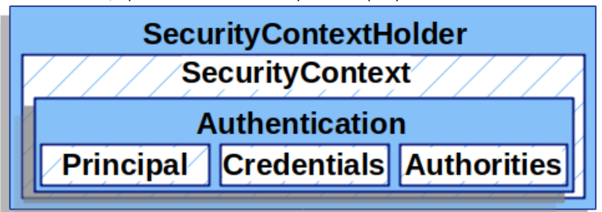
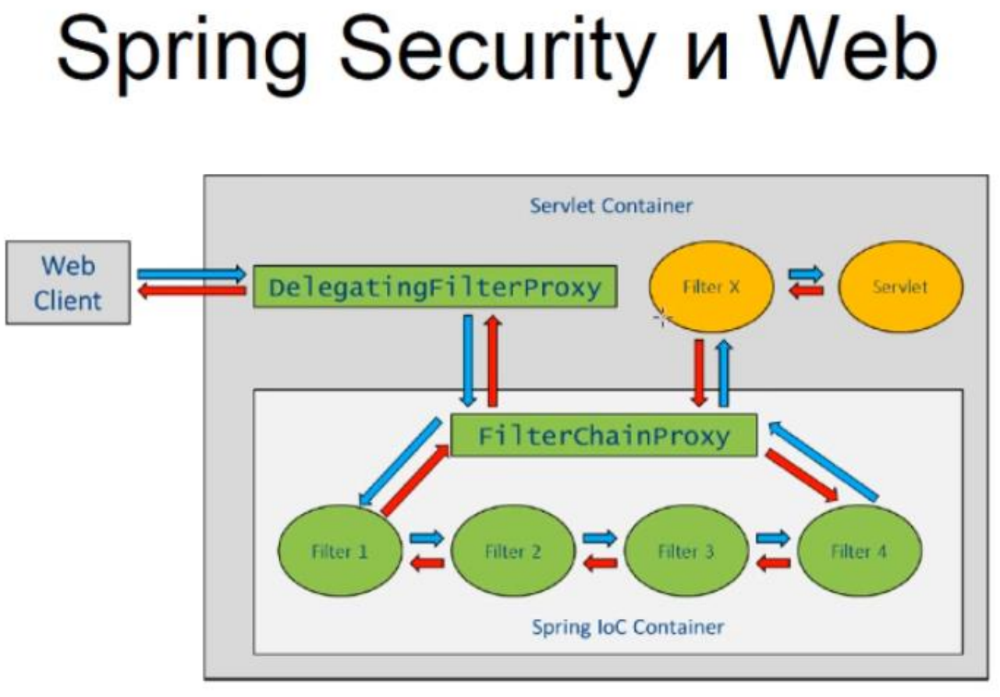

## Spring

[1. Что такое Spring? Какие основные задачи выполняет этот фреймворк?](#1-Что-такое-spring-Какие-основные-задачи-выполняет-этот-фреймворк)

[2. Что такое IoC и DI? В чем отличие этих терминов?](#2-Что-такое-ioc-и-di-В-чем-отличие-этих-терминов)

[3. Перечислите основные модули Spring фреймворка.](#3-Перечислите-основные-модули-spring-фреймворка)

[4. Что такое фабрика бинов BeanFactory?](#4-Что-такое-фабрика-бинов-beanfactory)

[5. Перечислите способы внедрения зависимостей и объясните их отличия друг от друга.](#5-Перечислите-способы-внедрения-зависимостей-и-объясните-их-отличия-друг-от-друга)

[6. Что такое ApplicationContext? Когда он создается?](#6-Что-такое-applicationcontext-Когда-он-создается)

[7. С какой целью выполняется конфигурирование контекста, какими способами это конфигурирование может производиться и какие отличия есть между ними.](#7-С-какой-целью-выполняется-конфигурирование-контекста-какими-способами-это-конфигурирование-может-производиться-и-какие-отличия-есть-между-ними)

[8. Где и для чего применяются аннотации @Configuration, @ComponentScan, @PropertySource. Что в них должно быть указано?](#8-Где-и-для-чего-применяются-аннотации-configuration-componentscan-propertysource-Что-в-них-должно-быть-указано)

[9. Можно ли использовать несколько конфигурационных файлов? Если да, то как это сделать? Если нет, то почему? ](#9-Можно-ли-использовать-несколько-конфигурационных-файлов-Если-да-то-как-это-сделать-Если-нет-то-почему)

[10. Расскажите, что такое Spring Bean? Опишите жизненный цикл Spring Bean?](#10-Расскажите-что-такое-spring-bean-Опишите-жизненный-цикл-spring-bean)

[11. Когда необходимо объект делать бином?](#11-Когда-необходимо-объект-делать-бином)

[12. Какие существуют способы создания бинов? Чем они друг от друга отличаются?](#12-Какие-существуют-способы-создания-бинов-Чем-они-друг-от-друга-отличаются)

[13. Опишите стратегию нейминга (присвоения имени бину) в Spring.](#13-Опишите-стратегию-нейминга-присвоения-имени-бину-в-spring)

[14. Каким образом можно самостоятельно присвоить имя бину?](#14-Каким-образом-можно-самостоятельно-присвоить-имя-бину)

[15. Опишите предназначение каждого этапа жизненного цикла бина.](#15-Опишите-предназначение-каждого-этапа-жизненного-цикла-бина)

[16. Какие аннотации являются стереотипными? Почему они имеют такое название? Какие особенности в поведение бина они привносят?](#16-Какие-аннотации-являются-стереотипными-Почему-они-имеют-такое-название-Какие-особенности-в-поведении-бина-они-привносят)

[17. Объясните для чего используются аннотации @Autowired, @Qualifier, @Primary, @Resource. Когда какую нужно использовать?](#17-Объясните-для-чего-используются-аннотации-autowired-qualifier-primary-resource-Когда-какую-нужно-использовать)

[18. Что такое Profiles? Когда их используют.](#18-Что-такое-profiles-Когда-их-используют)

[19. Что такое AOP и для чего используется модуль Spring AOP.](#19-Что-такое-aop-и-для-чего-используется-модуль-spring-aop)

[20. Назовите основные аннотации, используемые в модуле AOP.](#20-Назовите-основные-аннотации-используемые-в-модуле-aop)

[21. Как подключить AOP к проекту?](#21-Как-подключить-aop-к-проекту)

[22. Что означает термин "Аспект" в парадигме AOP?](#22-Что-означает-термин-аспект-в-парадигме-aop)

[23. Что означает термин "advice" (совет) в парадигме AOP?](#23-Что-означает-термин-advice-совет-в-парадигме-aop)

[24. Какие бывают виды advice? В чем их отличие друг от друга?](#24-Какие-бывают-виды-advice-В-чем-их-отличие-друг-от-друга)

[25. Что такое PointCut?](#25-Что-такое-pointcut)

[26. Опишите, каким образом происходит работа Srping при использовании модуля AOP.](#26-Опишите-каким-образом-происходит-работа-srping-при-использовании-модуля-aop)

[27. Объясните шаблон проектирование Proxy? Где он используется в Spring.](#27-Объясните-шаблон-проектирования-proxy-Где-он-используется-в-spring)

[28. Объясните, как происходит интеграция с JDBC.](#28-Объясните-как-происходит-интеграция-с-jdbc)

[29. Объясните, как происходит интеграция с Hibernate.](#29-Объясните-как-происходит-интеграция-с-hibernate)

[30. Что такое Transaction Manager? Где он используется? Когда он нужен?](#30-Что-такое-transaction-manager-Где-он-используется-Когда-он-нужен)

[31. Расскажите о модуле Spring MVC.](#31-Расскажите-о-модуле-spring-mvc)

[32. Объясните верхнеуровневую архитектуру Spring MVC: Dispatcher, ViewResolver.](#32-Объясните-верхнеуровневую-архитерктуру-spring-mvc-dispatcher-viewresolver)

[33. Как конфигурировать Spring MVC?](#33-Как-конфигурировать-spring-mvc)

[34. Что такое Spring scope? Какие типы Spring scope существуют?](#34-Что-такое-spring-scope-Какие-типы-spring-scope-существуют)

[35. Расскажите про аннотации @RequestMapping, @PathVariable, @RequestBody, @RequestParam, @ModelAttribute, @ResponseBody, @SessionAttribute, @CookieValue.](#35-Расскажите-про-аннотации-requestmapping-pathvariable-requestbody-requestparam-modelattribute-responsebody-sessionattribute-cookievalue)

[36. Расскажите про модуль Spring Security?](#36-Расскажите-про-модуль-spring-security)

[37. Как конфигурировать Spring Security?](#37-Как-конфигурировать-spring-security)

[38. Что такое UserDetails?](#38-Что-такое-userdetails)

[39. Расскажите верхнеуровневую архитектуру Spring Security.](#39-Расскажите-верхнеуровневую-архитектуру-spring-security)

[40. Что такое FilterChainProxy?](#40-Что-такое-filterchainproxy)

[41. Расскажите о схеме работы пользователь-роль.](#41-Расскажите-о-схеме-работы-пользователь-роль)

[42. Расскажите о SpringContextHolder.](#42-Расскажите-о-springcontextholder)

[43. Расскажите об аспектах многопоточного окружения в Spring.](#43-Расскажите-об-аспектах-многопоточного-окружения-в-spring)

[44. Расскажите о тестировании Spring приложений?](#44-Расскажите-о-тестировании-spring-приложений)

[45. Расскажите о тестирование Spring MVС приложений.](#45-Расскажите-о-тестировании-spring-mvс-приложений)

[46. Расскажите о мониторинге Spring приложений.](#46-Расскажите-о-мониторинге-spring-приложений)

[47. Расскажите про REST модель.](#47-Расскажите-про-rest-модель)

[48. Что такое коды состояния HTTP?](#48-Что-такое-коды-состояния-http)

## 1. Что такое Spring? Какие основные задачи выполняет этот фреймворк?

Обычно Spring описывают как облегченную платформу для построения Java-приложений, но с этим утверждением связаны два 
интересных момента. Во-первых, Spring можно использовать для построения любого приложения на языке Java (т.е. 
автономных, веб приложений, приложений JEE и т.д.), что отличает Spring от многих других платформ, таких как Apache 
Struts, которая ограничена только веб-приложениями. Во-вторых, характеристика “облегченная” в действительности не имеет 
никакого отношения к количеству классов или размеру дистрибутива; напротив, она определяет принцип всей философии Spring 
— минимальное воздействие. Платформа Spring является облегченной в том смысле, что для использования ядра Spring вы 
должны вносить минимальные (если вообще какие-либо) изменения в код своего приложения, а если в какой-то момент вы 
решите больше не пользоваться Spring, то и это сделать очень просто.

Spring Framework, вероятно, наиболее известен как источник расширений (features), нужных для эффективной разработки 
сложных бизнес-приложений вне тяжеловесных программных моделей, которые исторически были доминирующими в промышленности. 
Ещё одно его достоинство в том, что он ввел ранее неиспользуемые функциональные возможности в сегодняшние господствующие 
методы разработки, даже вне платформы Java. Этот фреймворк предлагает последовательную модель и делает её применимой к 
большинству типов приложений, которые уже созданы на основе платформы Java. Считается, что Spring Framework реализует 
модель разработки, основанную на лучших стандартах индустрии, и делает её доступной во многих областях Java. Таким 
образом к достоинствам Spring можно отнести:

- Относительная легкость в изучении и применении фреймворка в разработке и поддержке приложения.
- Внедрение зависимостей (DI) и инверсия управления (IoC) позволяют писать независимые друг от друга компоненты, что 
  дает преимущества в командной разработке, переносимости модулей и т.д.
- Spring IoC контейнер управляет жизненным циклом Spring Bean и настраивается наподобие JNDI lookup (поиска).
- Проект Spring содержит в себе множество подпроектов, которые затрагивают важные части создания софта, такие как 
  веб сервисы, веб программирование, работа с базами данных, загрузка файлов, обработка ошибок и многое другое. Всё это 
  настраивается в едином формате и упрощает поддержку приложения.

[к оглавлению](#spring)

## 2. Что такое IoC и DI? В чем отличие этих терминов?

Принцип инверсии зависимостей — важный принцип объектно-ориентированного программирования, используемый для уменьшения 
зацепления в компьютерных программах. Входит в пятёрку принципов SOLID. Формулировка: Модули верхних уровней не должны 
импортировать сущности из модулей нижних уровней.

Инверсия управления — важный принцип объектно-ориентированного программирования, используемый для уменьшения зацепления 
в компьютерных программах. Также архитектурное решение интеграции, упрощающее расширение возможностей системы, при 
котором поток управления программы контролируется фреймворком.

Внедрение зависимости (Dependency injection, DI) — процесс предоставления внешней зависимости программному компоненту. 
Является специфичной формой «инверсии управления» (Inversion of control, IoC), когда она применяется к управлению 
зависимостями. В полном соответствии с принципом единой обязанности объект отдаёт заботу о построении требуемых ему 
зависимостей внешнему, специально предназначенному для этого общему механизму. К достоинствам применения DI можно 
отнести:

- Сокращение объема связующего кода. Одним из самых больших плюсов DI является возможность значительного сокращения 
  объема кода, который должен быть написан для связывания вместе различных компонентов приложения. Зачастую этот код 
  очень прост — при создании зависимости должен создаваться новый экземпляр соответствующего объекта.
- Упрощенная конфигурация приложения. За счет применения DI процесс конфигурирования приложения значительно упрощается. 
  Для конфигурирования классов, которые могут быть внедрены в другие классы, можно использовать аннотации или XML-файлы.
- Возможность управления общими зависимостями в единственном репозитории. При традиционном подходе к управлению 
  зависимостями в общих службах, к которым относятся, например, подключение к источнику данных, транзакция, удаленные 
  службы и т.п., вы создаете экземпляры (или получаете их из определенных фабричных классов) зависимостей там, где они 
  нужны — внутри зависимого класса. Это приводит к распространению зависимостей по множеству классов в приложении, что 
  может затруднить их изменение. В случае использования DI вся информация об общих зависимостях содержится в 
  единственном репозитории (в Spring есть возможность хранить эту информацию в XML-файлах или Java классах), что 
  существенно упрощает управление зависимостями и снижает количество возможных ошибок. Улучшенная возможность 
  тестирования. Когда классы проектируются для DI, становится возможной простая замена зависимостей. Это особенно 
  полезно при тестировании приложения.
- Стимулирование качественных проектных решений для приложений. Вообще говоря, проектирование для DI означает 
  проектирование с использованием интерфейсов. Используя Spring, вы получаете в свое распоряжение целый ряд средств DI и 
  можете сосредоточиться на построении логики приложения, а не на поддерживающей DI платформе.

[к оглавлению](#spring)

## 3. Перечислите основные модули Spring фреймворка.

На данный момент среда Spring интегрировала более 20 модулей. Эти модули в основном делятся на основной контейнер, 
доступ к данным / интеграцию, Интернет, АОП (аспектно-ориентированное программирование), инструменты, сообщения и 
тестовые модули, как показано на рисунке ниже.


[к оглавлению](#spring)

## 4. Что такое фабрика бинов BeanFactory?

BeanFactory можно понимать как фабричный класс, содержащий коллекцию bean-компонентов. BeanFactory содержит определение
типа bean-компонента, так что соответствующий bean-компонент может быть создан при получении клиентского запроса.

BeanFactory также может создавать отношения между кооперативными классами при создании экземпляров объектов. Это
освободит сам компонент и конфигурацию клиента компонента. BeanFactory также содержит управление жизненным циклом
компонента, вызывая методы инициализации клиента (методы инициализации) и методы уничтожения (методы уничтожения).

[к оглавлению](#spring)

## 5. Перечислите способы внедрения зависимостей и объясните их отличия друг от друга.

Реализация DI в Spring основана на двух ключевых концепциях Java — компонентах JavaBean и интерфейсах. При использовании 
Spring в качестве поставщика DI вы получаете гибкость определения конфигурации зависимостей внутри своих приложений 
разнообразными путями (т.е. внешне в XML-файлах, с помощью конфигурационных Java классов Spring или посредством 
аннотаций Java в коде). Компоненты JavaBean (также называемые POJO (Plain Old Java Object — простой старый объект Java)) 
предоставляют стандартный механизм для создания ресурсов Java, которые являются конфигурируемыми множеством способов. 
За счет применения DI объем кода, который необходим при проектировании приложения на основе интерфейсов, снижается почти 
до нуля. Кроме того, с помощью интерфейсов можно получить максимальную отдачу от DI, потому что бины могут использовать 
любую реализацию интерфейса для удовлетворения их зависимости.

К типам реализации внедрения зависимостей в Spring относят:

Constructor Dependency Injection — это тип внедрения зависимостей, при котором зависимости компонента предоставляются 
ему в его конструкторе (или конструкторах).

```java
public class ConstructorInjection {

    private Dependency dependency;
  
    public ConstructorInjection(Dependency dependency) {
        this.dependency = dependency;
    }
}
```

Setter Dependency Injection – контейнер IoC внедряет зависимости компонента в компонент через методы установки в стиле 
JavaBean.

```java
public class SetterInjection {
    
    private Dependency dependency;
    
    public void setDependency(Dependency dependency) {
        this.dependency = dependency;
    }
}
```

[к оглавлению](#spring)

## 6. Что такое ApplicationContext? Когда он создается?

Контекст (а у него есть даже интерфейс — ```java org.springframework.context.ApplicationContext```) — это некоторое 
окружение, в котором работает приложение на Spring Framework. Аббревиатуры DI, IoC — это всё про него. Контекст создаёт 
и хранит экземпляры классов вашего приложения, определяет их зависимости друг с другом и автоматически их задаёт.

Безусловно, для того чтобы Spring создал контекст с экземплярами классов, ему нужно предоставить дополнительную 
информацию — мета-данные, из каких классов/объектов состоит ваше приложение, как они создаются, какие у них есть 
зависимости и т. д. 

**Где найти контекст?**

Контекст является ключевой функциональностью Spring и лежит в maven-зависимости spring-context (на момент написания — 
`org.springframework:spring-context:5.1.4.RELEASE`). Обычно эта зависимость является транзитивной для остальных проектов 
Spring. И если вы, например, подключаете `spring-boot-starter`, то она подключится автоматически, и не нужно думать про
то, где её взять.

Но если вы хотите попробовать "голый" Spring, т. е. только ту часть, которая называется IoC-контейнер, то достаточно 
подключить лишь spring-context.

Итого: подключите `org.springframework:spring-context:5.1.4.RELEASE`.

**Жизненный цикл Context**

+ Контейнер создается при запуске приложения
+ Контейнер считывает конфигурационные данные (парсинг XML, JavaConfig)
+ Из конфигурационных данных создается описание бинов (BeanDafinition) BeanDefenitionReader
+ BeanFactoryPostProcessors обрабатывают описание бина
+ Контейнер создает бины используя их описание
+ Бины инициализируются — значения свойств и зависимости внедряются в бин (настраиваются)
+ BeanPostProcessor запускают методы обратного вызова(callback methods)
+ Приложение запущено и работает
+ Инициализируется закрытие приложения
+ Контейнер закрывается
+ Вызываются callback methods

[к оглавлению](#spring)

## 7. С какой целью выполняется конфигурирование контекста, какими способами это конфигурирование может производиться и какие отличия есть между ними.

**Какие бывают контексты и как их создать?**

У интерфейса `ApplicationContext` есть большое количество реализаций:
+ `ClassPathXmlApplicationContext`;
+ `FileSystemXmlApplicationContext`;
+ `GenericGroovyApplicationContext`;
+ `AnnotationConfigApplicationContext`;
+ и даже `StaticApplicationContext`;
+ а также некоторые другие.

Они отличаются друг от друга именно тем, каким способом задаются мета-данные и где хранится эта
конфигурация. Например:

- ```java ClassPathXmlApplicationContext``` — метаданные конфигурируются XML-файлом(-ами) и они лежат в classpath, т. е.
  в ресурсах модуля;
- ```java FileSystemXmlApplicationContext``` — метаданные тоже конфигурируются XML-файлом(-ами), но они находятся где-то
  в файловой системе, например, /etc/yourapp/spring-context.xml;
- ```java AnnotationConfigApplicationContext``` — метаданные конфигурируются с помощью аннотаций прямо на классах.

Это класс, который в основном представляет собой реестр всех бинов, загруженных spring. В общем случае запуск spring
означает поиск загружаемых бинов и помещение их в контекст приложения (это относится только к синглетам, бины областей
прототипов не хранятся в ApplicationContext).

[к оглавлению](#spring)

## 8. Где и для чего применяются аннотации @Configuration, @ComponentScan, @PropertySource. Что в них должно быть указано?

**@Configuration**

`@Configuration` – это аннотация на уровне класса, указывающая на то, что объект является источником определений бина. 
Классы, аннотированные `@Configuration`, объявляют бины через методы, аннотированные `@Bean`. Вызовы методов `@Bean` для
классов `@Configuration` также могут быть использованы для определения межбиновых зависимостей.

Классы, аннотированные `@Configuration`, проксируются через `CGLIB`. Классы `@Component` или обычные классы не 
проксируются и не перехватывают вызовы методов с аннотациями `@Bean`, что означает, что вызовы не будут 
маршрутизироваться через контейнер и каждый раз будет возвращаться новый экземпляр бина.

`CGLIB` (Code Generation Library) - Это библиотека инструментария байтов, используемая во многих средах Java, таких как
Hibernate или Spring. Инструментарий байт-кода позволяет манипулировать или создавать классы после фазы компиляции
программы.

---

**@ComponentScan**

Аннотация `@ComponentScan` в Spring представляет собой аннотацию, которая указывает Spring-контейнеру на то, какие 
пакеты нужно сканировать для поиска компонентов, которые должны быть управляемыми контейнером.

При использовании аннотации `@ComponentScan`, Spring-контейнер автоматически находит и регистрирует все классы, которые
отмечены аннотациями, такими как `@Component`, `@Service`, `@Repository` и `@Controller`, в указанных пакетах.

Например, если у вас есть следующая структура пакетов:

`com.example.service com.example.repository com.example.controller`

Вы можете использовать аннотацию `@ComponentScan` следующим образом:
```java
@Configuration @ComponentScan(basePackages = "com.example") 
public class AppConfig { // Конфигурация бинов }
```

В этом примере, Spring-контейнер будет сканировать пакеты `com.example.service`, `com.example.repository` и 
`com.example.controller` и регистрировать все классы, отмеченные соответствующими аннотациями, как управляемые 
компоненты контейнера.

Аннотация `@ComponentScan` также поддерживает другие параметры, такие как `includeFilters` и `excludeFilters`, которые 
позволяют более точно настроить процесс сканирования компонентов.

В целом, аннотация `@ComponentScan` является мощным инструментом в Spring Framework, который позволяет автоматически 
обнаруживать и регистрировать компоненты контейнера, что упрощает конфигурацию Spring-приложений.

---

**@PropertySource**

Аннотация `@PropertySource` предоставляет удобный и декларативный механизм для добавления PropertySource в Spring
Environment.

В классическом Spring аннотация `@PropertySource` обязательна. Она ставится на любой configuration-класс (класс, уже 
помеченный аннотацией `@Configuration`), в котором предполагается доступ к настраиваемым параметрам, и выглядит так:

```java
@Configuration
@PropertySource("classpath:application.properties")
public class AppConfig { … }
```

Spring Boot позволяет иметь несколько вариантов настроек в разных файлах. В этом случае имя файла должно соответствовать 
следующему шаблону: `application.<profile-name>.properties`, ну или `application.<profile-name>.yml`. Актуальный вариант 
будет выбран в зависимости от активного spring-профиля.

Где находятся эти источники настраиваемых параметров?

По умолчанию такие файлы должны лежать в `classpath`. Чаще всего в папке «`src/main/resources`». Если есть желание 
сложить настройки в файл с другим именем и/или по другому пути, необходимо перед классом, помеченным аннотацией 
`@Configuration` или перед тем классом, в котором планируется использовать настраиваемые параметры, указать уже знакомую
аннотацию `@PropertySource` с путём и именем файла параметров, например так:

```java
@PropertySource("file:/home/alex/tmp/temporary.properties")
```

Также в качестве источника файлов конфигурации при использовании SpringBoot может выступать `config-server`. Как
приложение узнаёт, по какому url-у искать config-server? Сначала оно находит локальный config для загрузки базовых 
параметров, как раз таких, как путь к config-server-у. Этот файл должен лежать в classpath и называться 
`application.properties` или `application.yml` или `application.yaml`. В зависимости от версии Spring Сloud, имя может быть
не application, а bootstrap. Допустимые расширения имени файла такие же.

В этом файле Spring ищет параметр с именем (в формате через точку) `spring.cloud.config.uri` или 
`spring.cloud.config.discovery.serviceId`. Пример:

`spring.cloud.config.uri=http://localhost:8888`

или

`spring.cloud.config.discovery.serviceId=config`

[к оглавлению](#spring)

## 9. Можно ли использовать несколько конфигурационных файлов? Если да, то как это сделать? Если нет, то почему?

Да, для чего используется `contextConfigLocation`. С его помощью вы сможете задать несколько файлов конфигурации, 
указывая параметры через пробел либо запятую:

```xml
<servlet>
    <servlet-name>appServlet</servlet-name>
    <servlet-class>org.springframework.web.servlet.DispatcherServlet</servlet-class>
    <init-param>
        <param-name>contextConfigLocation</param-name>
        <param-value>/WEB-INF/spring/appServlet/servlet-context.xml,/WEB-INF/spring/appServlet/servlet-jdbc.xml</param-value>
    </init-param>
    <load-on-startup>1</load-on-startup>
</servlet>
```

Поддерживается возможность указания нескольких корневых файлов конфигурации Spring:

```xml
<context-param>
    <param-name>contextConfigLocation</param-name>
    <param-value>/WEB-INF/spring/root-context.xml /WEB-INF/spring/root-security.xml</param-value>
</context-param>
```

Файл конфигурации можно импортировать:
```xml
<beans:import resource="spring-jdbc.xml"/>
```

[к оглавлению](#spring)

## 10. Расскажите, что такое Spring Bean? Опишите жизненный цикл Spring Bean?

Знакомство со Spring IoC начнем с главного термина: бин (англ. — bean). Самыми простыми словами,
> Бин — создаваемый Spring-ом объект класса, который можно внедрить в качестве значения поля в другой объект.

Хотите словами посложнее? А пожалуйста:
> Бин — объект класса, представляющий собой завершенный программный элемент с определенной бизнес-функцией либо 
> внутренней функцией Spring'а, жизненным циклом которого управляет контейнер бинов.


Следующие этапы проходит каждый отдельно взятый бин:

1. Создание объекта. Техническое начало жизни бина, работа конструктора его класса;
2. Установка свойств из конфигурации бина, внедрение зависимостей;
3. Нотификация aware-интерфейсов. `BeanNameAware`, `BeanFactoryAware`. Технически, выполняется системными подтипами 
   `BeanPostProcessor`, и совпадает с шагом 4;
4. Пре-инициализация – метод `postProcessBeforeInitialization()` интерфейса `BeanPostProcessor`;
5. Инициализация. Разные способы применяются в таком порядке:
   + Метод бина с аннотацией `@PostConstruct` из стандарта JSR-250 (рекомендуемый способ);
   + Метод `afterPropertiesSet()` бина под интерфейсом `InitializingBean`;
   + Init-метод. Для отдельного бина его имя устанавливается в параметре определения `initMethod`.
   + В xml-конфигурации можно установить для всех бинов сразу, с помощью `default-init-method`;
6. Пост-инициализация – метод `postProcessAfterInitialization()` интерфейса `BeanPostProcessor`.
   Когда IoC-контейнер завершает свою работу, мы можем кастомизировать этап штатного уничтожения бина. Как со всеми 
   способами финализации в Java, при жестком выключении (kill -9) гарантии вызова этого этапа нет. Три альтернативных 
   способа «деинициализации» вызываются в том же порядке, что симметричные им методы инициализации: 
7. Метод с аннотацией `@PreDestroy`;
8. Метод с именем, которое указано в свойстве `destroyMethod` определения бина (или в глобальном `default-destroy-method`);
9. Метод `destroy()` интерфейса `DisposableBean`.

Не следует путать жизненный цикл отдельного бина с жизненным циклом контекста и этапами подготовки фабрик бинов.

[к оглавлению](#spring)

## 11. Когда необходимо объект делать бином?

**Бин (bean)** — это не что иное, как самый обычный объект. Разница лишь в том, что бинами принято называть те объекты,
которые управляются Spring-ом и живут внутри его DI-контейнера. Бином является почти все в Spring — сервисы, контроллеры,
репозитории, по сути все приложение состоит из набора бинов. Их можно регистрировать, получать в качестве зависимостей, 
проксировать, мокать и т.п.

[к оглавлению](#spring)

## 12. Какие существуют способы создания бинов? Чем они друг от друга отличаются?

Есть два основных способа создания таких компонентов.

**Создание компонента при помощи аннотаций**

Самый простой и наиболее распространённый способ создания компонента — при помощи аннотации `@Component` или аннотаций, 
наследующих её, таких как `@Service`, `@Repository` или `@Controller` из пакета `org.springframework.stereotype`.

Пример простого компонента:
```java
import org.springframework.stereotype.Component;
 
@Component
public class SimpleBean {
    
    public String hello() {
        return "Hello world!";
    }
}
```

В данном случае будет создан компонент типа `SimpleBean` с именем и идентификатором `simpleBean`. Контекст Spring 
автоматически найдёт этот класс и создаст объект этого типа, который будет использоваться в дальнейшем для внедрения
зависимостей.

---

**Создание компонента при помощи @Bean-метода**

Ещё один популярный способ создания компонентов — при помощи метода, помеченного аннотацией `@Bean`. В этом случае сам
тип компонента не нужно помечать аннотацией `@Component`.

```java
import org.acruxsource.sandbox.filters.SimpleBean;
import org.springframework.context.annotation.Bean;
import org.springframework.context.annotation.Configuration;
 
@Configuration
public class ContextConfig {
    
    @Bean
    public SimpleBean simpleBean() {
        return new SimpleBean();
    }
 
    @Bean
    public SimpleBean anotherSimpleBean() {
        return new SimpleBean();
    }
}
```

В данном случае будут созданы 2 компонента типа `SimpleBean` и с именами и идентификаторами `simpleBean` и 
`anotherSimpleBean`. Данный способ удобен тем, что можно создавать компоненты сторонних классов. Так же отмечу тот 
момент, что создание компонентов при помощи `@Bean`-методов возможно только в классах, помеченных аннотацией 
`@Confuguration`, как это показано в примере выше. Так же этот код соответствует следующей XML-конфигурации:

```xml
<bean class="name.alexkosarev.blog.beans.SimpleBean" name="simpleBean"/>
<bean class="name.alexkosarev.blog.beans.SimpleBean" name="anotherSimpleBean"/>
```

При создании компонентов таким способом стоит помнить, что если в классе, объект которого вы создаёте, есть зависимости
внедряемые при помощи аннотации `@Autowired`, они будут автоматически внедрены.

[к оглавлению](#spring)

## 13. Опишите стратегию нейминга (присвоения имени бину) в Spring.

**Аннотации на уровне класса**

По-умолчанию, чтобы назвать bean-компонент, Spring использует имя класса и преобразует первую букву в нижний регистр.

Пример:
```java
@Service
public class LoggingService {
}
```

Здесь Spring создает bean-компонент для класса `LoggingService` и регистрирует его, используя имя «loggingService».

Эта же стратегия именования по умолчанию применима ко всем аннотациям уровня класса, которые используются для создания
bean-компонента Spring, например, `@Component`, `@Service` и `@Controller`.

---

**Аннотации уровня метода**

Spring предоставляет аннотации, такие как `@Bean` и `@Qualifier`, которые можно использовать в методах создания 
bean-компонентов.

Давайте посмотрим на пример, чтобы понять стратегию именования по умолчанию для аннотации `@Bean`:

```java
@Configuration
public class AuditConfiguration {
    @Bean
    public AuditService audit() {
          return new AuditService();
    }
}
```

В этом классе конфигурации Spring регистрирует bean-компонент типа `AuditService` под именем «audit», потому что, когда 
мы используем аннотацию `@Bean` для метода, Spring использует имя метода в качестве имени bean-компонента.

[к оглавлению](#spring)

## 14. Каким образом можно самостоятельно присвоить имя бину?

Когда нам нужно создать несколько bean-компонентов одного типа в одном и том же контексте Spring, мы можем дать
bean-компонентам собственные имена и ссылаться на них, используя эти имена.

Итак, давайте посмотрим, как мы можем дать собственное имя нашему компоненту Spring:

```java
@Component("myBean")
public class MyCustomComponent {
}
```

На этот раз Spring создаст bean-компонент типа `MyCustomComponent` с именем «myBean».

Поскольку мы явно даем имя компоненту, Spring будет использовать это имя, которое затем можно использовать для обращения 
к компоненту или доступа к нему.

Подобно `@Component("myBean")`, мы можем указать имя, используя другие аннотации, такие как `@Service("myService")`, 
`@Controller("myController")` и `@Bean("myCustomBean")`, и тогда Spring зарегистрирует этот компонент с заданным именем.

[к оглавлению](#spring)

## 15. Опишите предназначение каждого этапа жизненного цикла бина.

**1. Парсирование конфигурации и создание `BeanDefinition`**

Цель первого этапа — это создание всех `BeanDefinition`. Объекты `BeanDefinition` — это набор метаданных будущего бина, 
макет, по которому нужно будет создавать бин в случае необходимости. То есть для каждого бина создается свой объект 
`BeanDefinition`, в котором хранится описание того, как создавать и управлять этим конкретным бином. Проще говоря, 
сколько бинов в программе - столько и объектов `BeanDefinition`, их описывающих.

`BeanDefinition` содержат (среди прочего) следующие метаданные:

+ Имя класса с указанием пакета: обычно это фактический класс бина.
+ Элементы поведенческой конфигурации бина, которые определяют, как бин должен вести себя в контейнере (scope, обратные
  вызовы жизненного цикла и т.д.).
+ Ссылки на другие bean-компоненты, которые необходимы для его работы. Эти ссылки также называются зависимостями.
+ Другие параметры конфигурации для установки во вновь созданном объекте - например, ограничение размера пула или 
  количество соединений, используемых в бине, который управляет пулом соединений.

Эти метаданные преобразуются в набор свойств, которые составляют каждое `BeanDefinition`. В следующей таблице описаны эти
свойства:

При конфигурации через аннотации с указанием пакета для сканирования или JavaConfig используется класс 
`AnnotationConfigApplicationContext`. Регистрируются все классы с `@Configuration` для дальнейшего парсирования, затем
регистрируется специальный `BeanFactoryPostProcessor`, а именно `BeanDefinitionRegistryPostProcessor`, который при 
помощи класса `ConfigurationClassParser` парсирует JavaConfig, загружает описания бинов (`BeanDefinition`), создаёт граф 
зависимостей (между бинами) и создаёт:

`Map<String, BeanDefinition> beanDefinitionMap = new ConcurrentHashMap<>(256);`

В которой хранятся все описания бинов, обнаруженных в ходе парсинга конфигурации.

**2. Настройка созданных `BeanDefinition`**

После первого этапа у нас имеется коллекция `Map`, в которой хранятся `BeanDefinition`-ы. `BeanFactoryPostProcessor`-ы 
на этапе создания `BeanDefinition`-ов могут их настроить как нам необходимо. `BeanFactoryPostProcessor`-ы могут даже 
настроить саму `BeanFactory` ещё до того, как она начнет работу по созданию бинов. В интерфейсе `BeanFactoryPostProcessor`
всего один метод:

```java
public interface BeanFactoryPostProcessor {
void postProcessBeanFactory(ConfigurableListableBeanFactory beanFactory) throws BeansException;
}
```

**3. Создание кастомных FactoryBean (только для XML-конфигурации)**

**4. Создание экземпляров бинов**

Сначала `BeanFactory` из коллекции `Map` с объектами `BeanDefinition` достаёт те из них, из которых создаёт все 
`BeanPostProcessor`-ы, необходимые для настройки обычных бинов. Создаются экземпляры бинов через `BeanFactory` на основе
ранее созданных `BeanDefinition`

**5. Настройка созданных бинов**

На данном этапе бины уже созданы, мы можем лишь их донастроить.

Интерфейс `BeanPostProcessor` позволяет вклиниться в процесс настройки наших бинов до того, как они попадут в контейнер.
`ApplicationContext` автоматически обнаруживает любые бины с реализацией `BeanPostProcessor` и помечает их как 
“post-processors” для того, чтобы создать их определенным способом. Например, в Spring есть реализации 
`BeanPostProcessor`-ов, которые обрабатывают аннотации `@Autowired`, `@Inject`, `@Value` и `@Resource`.

Интерфейс несет в себе два метода: `postProcessBeforeInitialization(Object bean, String beanName)` и 
`postProcessAfterInitialization(Object bean, String beanName)`. У обоих методов параметры абсолютно одинаковые. Разница 
только в порядке их вызова. Первый вызывается до init-метода, второй - после.

Как правило, `BeanPostProcessor`-ы, которые заполняют бины через маркерные интерфейсы или тому подобное, реализовывают 
метод `postProcessBeforeInitialization(Object bean, String beanName)`, тогда как `BeanPostProcessor`-ы, которые 
оборачивают бины в прокси, обычно реализуют `postProcessAfterInitialization(Object bean, String beanName)`.

Прокси — это класс-декорация над бином. Например, мы хотим добавить логику нашему бину, но джава-код уже скомпилирован,
поэтому нам нужно на лету сгенерировать новый класс. Этим классом мы должны заменить оригинальный класс так, чтобы никто 
не заметил подмены.

Есть два варианта создания этого класса:

+ либо он должен наследоваться от оригинального класса (CGLIB) и переопределять его методы, добавляя нужную логику;
+ либо он должен имплементировать те же самые интерфейсы, что и первый класс(Dynamic Proxy).

По конвенции спринга, если какой-то из `BeanPostProcessor`-ов меняет что-то в классе, то он должен это делать на этапе 
`postProcessAfterInitialization()`. Таким образом мы уверены, что `initMethod` у данного бина, работает на оригинальный 
метод, до того, как на него накрутился прокси.

Хронология событий:
1. Сначала сработает метод `postProcessBeforeInitialization()` всех имеющихся `BeanPostProcessor`-ов.
2. Затем, при наличии, будет вызван метод, аннотированный `@PostConstruct`.
3. Если бин имплементирует `InitializingBean`, то Spring вызовет метод `afterPropertiesSet()` - не рекомендуется к 
   использованию как устаревший.
4. При наличии, будет вызван метод, указанный в параметре `initMethod` аннотации `@Bean`.
5. В конце бины пройдут через `postProcessAfterInitialization(Object bean, String beanName)`. Именно на данном этапе 
   создаются прокси стандартными `BeanPostProcessor`-ами. Затем отработают наши кастомные `BeanPostProcessor`-ы и 
   применят нашу логику к прокси-объектам. После чего все бины окажутся в контейнере, который будет обязательно обновлен 
   методом `refresh()`.
6. Но даже после этого мы можем донастроить наши бины `ApplicationListener`-ами.
7. Теперь всё


**6. Бины готовы к использованию**

Их можно получить с помощью метода `ApplicationContext#getBean()`.

**7. Закрытие контекста**

Когда контекст закрывается (метод `close()` из `ApplicationContext`), бин уничтожается.

Если в бине есть метод, аннотированный `@PreDestroy`, то перед уничтожением вызовется этот метод.

Если бин имплементирует `DisposibleBean`, то Spring вызовет метод `destroy()` - не рекомендуется к использованию как устаревший.

Если в аннотации `@Bean` определен метод destroyMethod, то будет вызван и он.

**@PostConstruct**

Spring вызывает методы, аннотированные `@PostConstruct`, только один раз, сразу после инициализации свойств компонента. 
За данную аннотацию отвечает один из `BeanPostProcessor`-ов.

Метод, аннотированный `@PostConstruct`, может иметь любой уровень доступа, может иметь любой тип возвращаемого значения
(хотя тип возвращаемого значения игнорируется Spring-ом), метод не должен принимать аргументы. Он также может быть 
статическим, но преимуществ такого использования метода нет, т.к. доступ у него будет только к статическим полям/методам
бина, и в таком случае смысл его использования для настройки бина пропадает.

Одним из примеров использования `@PostConstruct` является заполнение базы данных. Например, во время разработки нам может
потребоваться создать пользователей по умолчанию.

**@PreDestroy**

Метод, аннотированный `@PreDestroy`, запускается только один раз, непосредственно перед тем, как Spring удаляет наш
компонент из контекста приложения.

Как и в случае с `@PostConstruct`, методы, аннотированные `@PreDestroy`, могут иметь любой уровень доступа, но не могут
быть статическими.

Целью этого метода может быть освобождение ресурсов или выполнение любых других задач очистки до уничтожения бина, 
например, закрытие соединения с базой данных.

Обратите внимание, что аннотации `@PostConstruct` и `@PreDestro`y являются частью Java EE, а именно пакета 
`javax.annotation` модуля `java.xml.ws.annotation`. И поскольку Java EE устарела в Java 9, то с этой версии пакет 
считается устаревшим (`Deprecated`). С Java 11 данный пакет вообще удален, поэтому мы должны добавить дополнительную
зависимость для использования этих аннотаций:

```xml
<dependency>
<groupId>javax.annotation</groupId>
<artifactId>javax.annotation-api</artifactId>
<version>1.3.2</version>
</dependency>
```

[к оглавлению](#spring)

## 16. Какие аннотации являются стереотипными? Почему они имеют такое название? Какие особенности в поведение бина они привносят?

Существует 4 аннотации, которые объявляют Spring'у, что данный класс является бином — `@Component`, `Service`, 
`Repository` и `Controller`. На самом деле все эти аннотации практически не отличаются друг от друга, однако `@Component` 
является наиболее общей для всех. Для чего же тогда столько вариантов? Ответов на этот вопрос несколько: более четкое 
разделение по слоям (`Repository` — слой работы с БД; `Controller` — слой работы с представлением; `Service` — сервисный 
слой, бизнес-логика и т.п.); возможность использования аспектов для различных слоев; может быть будет добавлен какой-то
функционал в будущем. Лучше всегда помечать более специфичными аннотациями, т.е. при выборе между `Component` и 
`Service` лучше выбрать `Service`.

[к оглавлению](#spring)

## 17. Объясните для чего используются аннотации @Autowired, @Qualifier, @Primary, @Resource. Когда какую нужно использовать?

**@Autowired**

Процесс внедрения зависимостей в бины при инициализации называется Spring Bean Wiring. Считается хорошей практикой 
задавать явные связи между зависимостями, но в Spring предусмотрен дополнительный механизм связывания `@Autowired`. 
Аннотация может использоваться над конструктор, поле, сеттер-метод или метод конфигурации для связывания по типу. Если в
контейнере не будет обнаружен необходимый для вставки бин, то будет выброшено исключение, либо можно указать 
`@Autowired(required = false)`, означающее, что внедрение зависимости в данном месте не обязательно. Чтобы аннотация 
заработала, необходимо указать небольшие настройки в конфигурационном файле спринг с помощью элемента 
`context:annotation-config/`.

Типы связывания:
+ autowire byName,
+ autowire byType,
+ autowire by constructor,
+ autowiring by `@Autowired` and `@Qualifier` annotations

Начиная со Spring Framework 4.3, аннотация `@Autowired` для конструктора больше не требуется, если целевой компонент 
определяет только один конструктор. Однако, если доступно несколько конструкторов и нет основного/стандартного
конструктора, по крайней мере один из конструкторов должен быть аннотирован `@Autowired`, чтобы указать контейнеру, 
какой из них использовать.

Мы также можем указать Spring предоставить все бины определенного типа из `ApplicationContext`, добавив аннотацию 
`@Autowired` в поле или метод с массивом или коллекцией этого типа, как показано в следующем примере:

```java
@Autowired
private MovieCatalog[] movieCatalogs;
или:
@Autowired
private Set<MovieCatalog> movieCatalogs;
или:
@Autowired
public void setMovieCatalogs(Set<MovieCatalog> movieCatalogs) {
this.movieCatalogs = movieCatalogs;
}
```

Даже коллекции типа Map могут быть подключены автоматически, если тип ключа - `String`. Ключами будут имена бинов, а 
значениями - сами бины, как показано в следующем примере:

```java
public class MovieRecommender {
private Map<String, MovieCatalog> movieCatalogs;
@Autowired
public void setMovieCatalogs(Map<String, MovieCatalog> movieCatalogs){
    this.movieCatalogs = movieCatalogs;
}
// ...
}
```

---

**@Qualifier**

Используется совместно с @Autowired для уточнения данных связывания, когда возможны коллизии (например одинаковых имен\типов).

---

**@Primary**

Если есть два одинаковых бина (по типу и имени) спринг не знает какой именно использовать и выдаёт exeption. Если над 
одним из этих бинов установленна `@Primary`, то его использовать предпочтительнее. Но если нам нужно использовать в 
работе оба этих бина, можно над каждым поставить `@Qualifier` и задать имя, для идентификации этих бинов.

---

**@Resource**

Java-аннотация `@Resource` может применяться к классам, полям и методам. Она пытается получить зависимость: сначала по
имени, затем по типу, затем по описанию (`Qualifier`). Имя извлекается из имени аннотируемого сеттера или поля, либо
берется из параметра `name`. При аннотировании классов имя не извлекается из имени класса по умолчанию, поэтому оно 
должно быть указано явно.

Указав данную аннотацию у полей или методов с аргументом `name`, в контейнере будет произведен поиск компонентов с данным 
именем, и в контейнере должен быть бин с таким именем:

```
@Resource(name="namedFile")
private File defaultFile;
```

Если указать её без аргументов, то Spring Framework поможет найти бин по типу. Если в контейнере несколько 
бинов-кандидатов на внедрение, то нужно использовать аннотацию `@Qualifier`:

```java
@Resource
@Qualifier("defaultFile")
private File dependency1;

@Resource
@Qualifier("namedFile")
private File dependency2;
```

Разница с `@Autowired`:
+ ищет бин сначала по имени, а потом по типу;
+ не нужна дополнительная аннотация для указания имени конкретного бина;
+ `@Autowired` позволяет отметить место вставки бина как необязательное `@Autowired(required = false)`;
+ при замене Spring Framework на другой фреймворк, менять аннотацию `@Resource` не нужно

[к оглавлению](#spring)

## 18. Что такое Profiles? Когда их используют.

Активный профиль задается в файле application.properties:
```java
spring.profiles.active=dev
```

Для каждого профиля создадим соотвествующий файл:
```java
application-dev.properties
application-test.properties
application-prod.properties
```

Поскольку в application.properties стоит активация профиля dev, DataSource будет инициализироваться настройками файла 
`application-dev.properties`

Тестировочный профиль активируется с помощью аннотации `@ActiveProfiles(«test»)`:
```java
@ActiveProfiles("test")
@RunWith(SpringRunner.class)
@SpringBootTest(webEnvironment = WebEnvironment.RANDOM_PORT)
```

Допустим, нам нужно создавать определенный бин только для определенного профиля. Для этого можно аннотировать бин с 
помощью `@Profile`. Аннотация применима как к классу, так и к методу. Давайте аннотируем класс `ExampleTestBean`, 
экземпляр которого будет создаваться только при активном профиле test:

```java
@Profile("test")
@Component
public class ExampleTestBean {
}
```

Обратите внимание, что в предыдущем примере мы взяли и напечатали текущий активный профиль:
```java
for (final String profileName : environment.getActiveProfiles()) {
    System.out.println("Currently active profile - " + profileName);
}
```

[к оглавлению](#spring)

## 19. Что такое AOP и для чего используется модуль Spring AOP.

ООП, AOP и Spring - взаимодополняющие технологии, которые позволяют решать сложные проблемы путем разделения функционала 
на отдельные модули. АОП предоставляет возможность реализации сквозной логики - т.е. логики, которая применяется к
множеству частей приложения - в одном месте и обеспечения автоматического применения этой логики по всему приложению. 
Подход Spring к АОП заключается в создании "динамических прокси" для целевых объектов и "привязывании" объектов к 
конфигурированному совету для выполнения сквозной логики.

Модуль AOP в Spring обеспечивает нас такими сущностями, как “перехватчики” (interceptors) для перехвата приложения в 
определённые моменты. Например, когда выполняется определённый метод, мы можем добавить какую-то функциональность (к 
примеру, сделать запись в лог-файл приложения) как до, так и после выполнения метода.

```java
import org.aspectj.lang.annotation.*;

@Aspect
public class Logging {

    @Pointcut("execution(* net.proselyte.aop.*.*(..))")
    public void selectAllMethodsAvaliable() {

    }

    @Before("selectAllMethodsAvaliable()")
    public void beforeAdvice() {
        System.out.println("Now we are going to initiate developer's profile.");
    }

    @After("selectAllMethodsAvaliable()")
    public void afterAdvice() {
        System.out.println("Developer's profile has been initiated.");
    }

    @AfterReturning(pointcut = "selectAllMethodsAvaliable()", returning = "someValue")
    public void afterReturningAdvice(Object someValue) {
        System.out.println("Value: " + someValue.toString());
    }

    @AfterThrowing(pointcut = "selectAllMethodsAvaliable()", throwing = "e")
    public void inCaseOfExceptionThrowAdvice(ClassCastException e) {
        System.out.println("We have an exception here: " + e.toString());
    }

}
```

[к оглавлению](#spring)

## 20. Назовите основные аннотации, используемые в модуле AOP.

`@EnableAspectJAutoProxy` - подключает и активирует механизм аспектов

`@Aspect` - для класса помечает его как аспект и, следовательно, исключает его из автопроксирования

`@Before` - выполняется перед исполнением целевого метода.

`@AfterReturning` - выполняется только после нормального (без выбрасывания исключения) завершения работы целевого метода,
но до присвоения результата работы метода какой-либо переменной. Поэтому с помощью `@AfterReturning` мы можем изменять 
содержание возвращаемого результата работы метода.

`@AfterTrowing` - выполняется только если целевой метод завершился выбросом исключения. При этом мы можем получить 
доступ к параметрам исключения, но не можем его обработать или как-то повлиять на дальнейшее выполнение программы.

`@After` - выполняется после завершения работы целевого метода, при этом не важно, было ли выброшено исключение или 
метод завершился в нормальном режиме. В этом совете мы не можем получить доступ к результату работы метода и не можем 
получить доступ к исключению, если оно было выброшено целевым методом.

`@Around` - выполняется вместо целевого метода. При этом внутри этого аспекта мы имеем доступ к аргументам, с которыми
вызывается целевой метод (а, следовательно, мы можем их изменить), мы можем самостоятельно вызвать целевой метод (а, 
следовательно, можем и не вызывать целевой метод), и мы имеем доступ к возвращаемому результату работы целевого метода 
(и можем его изменить). Также мы можем выполнить нужные нам действия перед и/или после целевого метода. Если целевой 
метод выбросит исключение, мы можем его пробросить дальше или обработать в блоке catch.

[к оглавлению](#spring)

## 21. Как подключить AOP к проекту?

Добавить зависимость в pom.xml

```xml
<dependency>
    <groupId>org.springframework</groupId>
    <artifactId>spring-aspects</artifactId>
    <version>6.0.10</version>
</dependency>
```

Чтобы активировать поддержку **AOP** с помощью `@Configuration` Java, добавьте аннотацию `@EnableAspectJAutoProxy`

```java
package ru.job4j.aop.config;

import org.springframework.context.annotation.ComponentScan;
import org.springframework.context.annotation.Configuration;
import org.springframework.context.annotation.EnableAspectJAutoProxy;

@Configuration
@ComponentScan(basePackages = "ru.job4j.aop")
@EnableAspectJAutoProxy
public class Config {
}
```

[к оглавлению](#spring)

## 22. Что означает термин "Аспект" в парадигме AOP?

Аспектно-ориентированное программирование (АОП) — это парадигма программирования, целью которой является повышение
модульности за счет разделения междисциплинарных задач. Это достигается путем добавления дополнительного поведения к
существующему коду без изменения самого кода.

[к оглавлению](#spring)

## 23. Что означает термин "advice" (совет) в парадигме AOP?

Совет (Advice) - Это фактическое действие, которое должно быть предпринято до и/или после выполнения метода. Это 
конкретный код, который вызывается во время выполнения программы.

[к оглавлению](#spring)

## 24. Какие бывают виды advice? В чем их отличие друг от друга?

+ before - Запускает совет перед выполнением метода.
+ after - Запускает совет после выполнения метода, независимо от результата его работы (кроме случая остановки работы
  JVM).
+ after-returning - Запускает совет после выполнения метода, только в случае его успешного выполнения.
+ after-throwing - Запускает совет после выполнения метода, только в случае, когда этот метод “бросает” исключение.
+ around - Запускает совет до и после выполнения метода. При этом инпоинты видят только начало и конец метода. Например,
  если метод выполняет транзакцию и где-то в середине кода try/catch поймал exception, транзакция все равно будет
  свершена, rollback не произойдет. В этом случае нужно пробрасывать ошибку за пределы метода.

[к оглавлению](#spring)

## 25. Что такое PointCut?

Срез точек (Pointcut) - Срезом называется несколько объединённых точек (join points), в котором должен быть выполнен 
совет.

Объединённая точка (Join point) - Это такая точка в приложении, где мы можем подключить аспект. Другими словами, это 
место, где начинаются определённые действия модуля АОП в Spring.

[к оглавлению](#spring)

## 26. Опишите, каким образом происходит работа Srping при использовании модуля AOP.

С помощью АОП мы можем прописать, например, что будет выполняться до или после какого-то действия. Прописываем это один
раз и этот функционал будет работать везде. Например нам нужно сделать логирование во всех методах `@Service`, с ООП нам
бы пришлось прописывать этот функционал в каждом методе для всех `@Service`. А с АОП мы можем в конфигах прописать для 
`@Service` что будет происходить с каждым вызовом его методов, - в нашем случае писать логи. Элементы АОП такие как
аспекты также используются в транзакциях спринга.

Рассмотрим класс `BeforeAndAfterLoggingAspect`

```java
package ru.job4j.aop.aspects;

import org.aspectj.lang.JoinPoint;
import org.aspectj.lang.Signature;
import org.aspectj.lang.annotation.AfterReturning;
import org.aspectj.lang.annotation.Aspect;
import org.aspectj.lang.annotation.Before;
import org.slf4j.Logger;
import org.slf4j.LoggerFactory;
import org.springframework.stereotype.Component;
import java.util.Arrays;

@Aspect
@Component
public class BeforeAndAfterLoggingAspect {
    private static final Logger LOG = LoggerFactory.getLogger(BeforeAndAfterLoggingAspect.class.getName());

    @Before("execution(* ru.job4j.aop.service.*.*(..))")
    public void logBefore(JoinPoint joinPoint) {
        Signature signature = joinPoint.getSignature();
        Object[] argsObj = joinPoint.getArgs();
        String args = Arrays.toString(argsObj);
        String methodName = signature.toShortString();
        LOG.info("Вызван метод:  {}", methodName );
        LOG.info("аргументы: {}", args);
    }

    @AfterReturning(pointcut = "execution(int ru.job4j.aop.service.*.*(..))", returning = "result")
    public void logAfterReturning(JoinPoint joinPoint, int result) {
        Signature signature = joinPoint.getSignature();
        String methodName = signature.toShortString();
        LOG.info("Метод завершил работу: {}", methodName);
        LOG.info("с результатом: {}", result);
    }
}
```


Spring, используя информацию об отдельных объектах (аспектах), выполняет следующие действия:

Как только фреймворк обнаруживает вызов целевого метода `publishingComment()`, он осуществляет перехват управления, 
выполняет логику аспекта `logBefore()`, затем возвращает управление методу `main()` - происходит выполнение целевого
метода.

То же самое происходит и при обнаружении вызова целевого метода `deleteComment()` - перед ним выполняется аспект 
`logBefore()`, но, в момент окончания работы целевого метода, происходит опять перехват управления и выполняется аспект 
`logAfterReturning()`, и только после выполнения кода аспекта происходит возврат управления методу `main()`, который 
только теперь получает результаты работы целевого метода.

[к оглавлению](#spring)

## 27. Объясните шаблон проектирование Proxy? Где он используется в Spring.

Proxy (Заместитель) - это структурный паттерн проектирования, который позволяет подставлять вместо реальных объектов 
специальные объекты-заменители. Эти объекты перехватывают вызовы к оригинальному объекту, позволяя сделать что-то до или 
после передачи вызова оригиналу.

Хороший пример использования Proxy — это org.springframework.aop.framework.ProxyFactoryBean. Эта фабрика создаёт 
AOP-прокси на основе Spring-бина. Прокси предоставляет заместителя для другого объекта, чтобы контролировать доступ к 
нему.

```java
public class Main {
	
	public static void main(String[] args) {
		// Create math proxy
		IMath p = new MathProxy();

		// Do the math
		System.out.println("4 + 2 = " + p.add(4, 2));
		System.out.println("4 - 2 = " + p.sub(4, 2));
		System.out.println("4 * 2 = " + p.mul(4, 2));
		System.out.println("4 / 2 = " + p.div(4, 2));
	}
}

/**
 * "Subject"
 */
public interface IMath {

	public double add(double x, double y);

	public double sub(double x, double y);

	public double mul(double x, double y);

	public double div(double x, double y);
}

/**
 * "Real Subject"
 */
public class Math implements IMath {

	public double add(double x, double y) {
		return x + y;
	}

	public double sub(double x, double y) {
		return x - y;
	}

	public double mul(double x, double y) {
		return x * y;
	}

	public double div(double x, double y) {
		return x / y;
	}
}

/**
 * "Proxy Object"
 */
public class MathProxy implements IMath {

    private Math math;

    public double add(double x, double y) {
        lazyInitMath();
        return math.add(x, y);
    }

    public double sub(double x, double y) {
        lazyInitMath();
        return math.sub(x, y);
    }

    public double mul(double x, double y) {
        lazyInitMath();
        return math.mul(x, y);
    }

    public double div(double x, double y) {
        lazyInitMath();
        return math.div(x, y);
    }

    private void lazyInitMath() {
        if (math == null) {
            math = new Math();
        }
    }
}
```

[к оглавлению](#spring)

## 28. Объясните, как происходит интеграция с JDBC.

Spring предоставляет отличную поддержку JDBC API и предлагает класс утилиту `JdbcTemplate`, с помощью которого можно 
избавиться от многократного повторения похожего кода в приложении (вроде операций open \ closing connection; `ResultSet`, 
`PreparedStatement` и др.). Для подключения необходимо настроить файл конфигурации spring и получить объект `JdbcTemplate`.
На данном этапы мы напишем все через JDBC. Spring напрямую не работает с базой. Он использует JDBC библиотеки.
Spring оборачивает JDBC в свои классы, делая их удобными для работы. Здесь используется шаблон "Декоратор".

```java
@Configuration
@PropertySource("classpath:app.properties")
@EnableTransactionManagement
public class JdbcConfig {

    @Bean
    public DataSource ds(@Value("${jdbc.driver}") String driver,
                         @Value("${jdbc.url}") String url,
                         @Value("${jdbc.username}") String username,
                         @Value("${jdbc.password}") String password) {
        BasicDataSource ds = new BasicDataSource();
        ds.setDriverClassName(driver);
        ds.setUrl(url);
        ds.setUsername(username);
        ds.setPassword(password);
        return ds;
    }

    @Bean
    public JdbcTemplate jdbc(DataSource ds) {
        return new JdbcTemplate(ds);
    }

}
```

[к оглавлению](#spring)

## 29. Объясните, как происходит интеграция с Hibernate.

Для интеграции Hibernate в Spring необходимо подключить зависимости, а так же настроить файл конфигурации Spring. Т.к. 
настройки несколько отличаются между проектами и версиями, то смотрите официальную документацию Spring и Hibernate для 
уточнения настроек для конкретных технологий.

[к оглавлению](#spring)

## 30. Что такое Transaction Manager? Где он используется? Когда он нужен?

Фабрика может создавать объекты `EntityManager`, вызывая методы которого можно управлять сущностями. `EntityManager`, в 
отличие от фабрики, достаточно легковесен и поэтому зачастую создаётся по месту использования и в больших количествах. 
Если проводить аналогию с обычным JDBC, то `EntityManagerFactory` будет аналогом `DataSource`, а `EntityManager` аналогом 
`Connection`.

Каждый экземпляр `EntityManager` связан с экземпляром `EntityTransaction`, что позволяет управлять транзакциями:

```java
EntityManager em = entityManagerFactory.createEntityManager();
em.getTransaction().begin();
//Some actions
em.getTransaction().commit();
em.getTransaction().begin();
//Some actions
em.getTransaction().rollback();
```

Один или несколько `EntityManager` образуют или могут образовать persistence context. Я не буду переводить этот термин, 
попробую лучше его объяснить. Наличие persistence context означает, что для каждой существующей на данный момент 
сущности существует `EntityManager`, который следит за её состоянием.

> Transaction менеджер

* Менеджер транзакций должен предоставить ответ на два вопроса:

Должен ли создаться новый Entity Manager?  
Должна ли стартовать новая транзакция БД?  
Ответы необходимы предоставить в момент когда вызывается логика аспекта транзакций в момент «до».  Менеджер транзакций 
принимает решение, основываясь на следующих фактах:

Выполняется ли хоть одна транзакция в текущий момент ли нет атрибута «propagation» у метода, аннотированного 
`@Transactional` (для примера, `REQUIRES_NEW` всегда стартует новую транзакцию). Если менеджер решил создать новую 
транзакцию, тогда:

Создается новый entity менеджер.
1. «Привязка» entity менеджера к текущему потоку (Thread)  
2. «Взятие» соединения из пула соединений БД  
3. «Привязка» соединения к текущему потоку  
4. И entity менеджер и это соединение привязываются к текущему потоку, используя переменные ThreadLocal.

Они хранятся в потоке, пока выполняется транзакция, и затем передаются менеджеру транзакций для очистки, когда они уже 
будут не нужны.

Любая часть программы, которой нужен текущий entity manager или соединение, может заполучить их из потока. Этим 
компонентом программы, который делает именно так является Entity Manager Proxy.

**EntityManager proxy.**

Прокси Entity менеджера (который был представлен ранее) это последний кусочек паззла. Когда бизнес метод делает вызов, 
например, `entityManager.persist()`, этот вызов не вызывается напрямую у entity менеджера. 

Вместо этого бизнес метод вызывает прокси, который достает текущий entity менеджер из потока, в который его положил 
менеджер транзакций.

[к оглавлению](#spring)

## 31. Расскажите о модуле Spring MVC.

Spring имеет собственную MVC-платформу веб-приложений, которая не была первоначально запланирована. Spring MVC является 
фреймворком, ориентированным на запросы. В нем определены стратегические интерфейсы для всех функций современной 
запросно-ориентированной системы. Цель каждого интерфейса — быть простым и ясным, чтобы пользователям было легко его 
заново имплементировать, если они того пожелают. MVC прокладывает путь к более чистому front-end-коду. Все интерфейсы 
тесно связаны с Servlet API. Эта связь рассматривается некоторыми как неспособность разработчиков Spring предложить для
веб-приложений абстракцию более высокого уровня. Однако эта связь оставляет особенности Servlet API доступными для
разработчиков, облегчая все же работу с ним.

Фреймворк Spring MVC обеспечивает архитектуру паттерна Model — View — Controller (Модель — Отображение (далее — Вид) — 
Контроллер) при помощи слабо связанных готовых компонентов. Паттерн MVC разделяет аспекты приложения (логику ввода, 
бизнес-логику и логику UI), обеспечивая при этом свободную связь между ними.

Model (Модель) инкапсулирует (объединяет) данные приложения, в целом они будут состоять из POJO («Старых добрых 
Java-объектов», или бинов). 

View (Отображение, Вид) отвечает за отображение данных Модели, — как правило, генерируя HTML, которые мы видим в своём 
браузере. 

Controller (Контроллер) обрабатывает запрос пользователя, создаёт соответствующую Модель и передаёт её для отображения 
в Вид.

[к оглавлению](#spring)

## 32. Объясните верхнеуровневую архитектуру Spring MVC: Dispatcher, ViewResolver.

Наиболее важные интерфейсы, определенные Spring MVC, перечислены ниже:

**HandlerMapping**: выбор класса и его метода, которые должны обработать данный входящий запрос на основе любого
внутреннего или внешнего для этого запроса атрибута или состояния.

**HandlerAdapter**: вызов и выполнение выбранного метода обработки входящего запроса.

**Controller**: включен между Моделью (Model) и Представлением (View). Управляет процессом преобразования входящих
запросов в адекватные ответы. Действует как ворота, направляющие всю поступающую информацию. Переключает поток
информации из модели в представление и обратно.

Класс `DispatcherServlet` является главным контроллером, которые получает запросы и распределяет их между другими 
контроллерами. `@RequestsMapping` указывает, какие именно запросы будут обрабатываться в конкретном контроллере. Может 
быть несколько экземпляров `DispatcherServlet`, отвечающих за разные задачи (обработка запросов пользовательского 
интерфейса, REST служб и т.д.). Каждый экземпляр `DispatcherServlet` имеет собственную конфигурацию 
`WebApplicationContext`, которая определяет характеристики уровня сервлета, такие как контроллеры, поддерживающие 
сервлет, отображение обработчиков, распознавание представлений, интернационализация, оформление темами, проверка 
достоверности, преобразование типов и форматирование и т.п.

**ContextLoaderListener** - слушатель при старте и завершении корневого класса Spring `WebApplicationContext`. Основным 
назначением является связывание жизненного цикла `ApplicationContext` и `ServletContext`, а так же автоматического 
создания `ApplicationContext`. Можно использовать этот класс для доступа к бинам из различных контекстов спринг.
Настраивается в `web.xml`

**Model**: Этот блок инкапсулирует (объединяет) данные приложения. На практике это POJO-классы.

**View**: ответственно за возвращение ответа клиенту в виде текстов и изображений. Некоторые запросы могут идти прямо во
View, не заходя в Model; другие проходят через все три слоя.

**ViewResolver**: выбор, какое именно View должно быть показано клиенту. Поддерживает распознавание представлений на основе 
логического имени, возвращаемого контроллером. Для поддержки различных механизмов распознавания представлений 
предусмотрено множество классов реализации. Например, класс UrlBasedViewResolver поддерживает прямое преобразование 
логических имен в URL.

Класс `ContentNegotiatingViewResolver` поддерживает динамическое распознавание представлений в зависимости от типа медиа,
поддерживаемого клиентом (XML, PDF, JSON и т.д.). Существует также несколько реализаций для интеграции с различными
технологиями представлений, такими как FreeMarker (FreeMarkerViewResolver), Velocity (VelocityViewResolver) и 
JasperReports (JasperReportsViewResolver).

**HandlerInterceptor**: перехват входящих запросов. Сопоставим, но не эквивалентен сервлет-фильтрам (использование не 
является обязательным и не контролируется DispatcherServlet-ом).

**LocaleResolver**: получение и, возможно, сохранение локальных настроек (язык, страна, часовой пояс) пользователя.

**MultipartResolver**: обеспечивает Upload — загрузку на сервер локальных файлов клиента. По умолчанию этот интерфейс 
не включается в приложении и необходимо указывать его в файле конфигурации. После настройки любой запрос о загрузке
будет отправляться этому интерфейсу.

Spring MVC предоставляет разработчику следующие возможности:
+ Ясное и прозрачное разделение между слоями в MVC и запросах.
+ Стратегия интерфейсов — каждый интерфейс делает только свою часть работы.
+ Интерфейс всегда может быть заменен альтернативной реализацией.
+ Интерфейсы тесно связаны с Servlet API.
+ Высокий уровень абстракции для веб-приложений.
+ В веб-приложениях можно использовать различные части Spring, а не только Spring MVC.

---

Вся логика работы Spring MVC построена вокруг DispatcherServlet, который принимает и обрабатывает все HTTP-запросы 
(из UI) и ответы на них. Рабочий процесс обработки запроса DispatcherServlet'ом проиллюстрирован на следующей диаграмме:


Ниже приведена последовательность событий, соответствующая входящему HTTP-запросу:

После получения HTTP-запроса DispatcherServlet обращается к интерфейсу HandlerMapping, который определяет, какой 
Контроллер должен быть вызван, после чего, отправляет запрос в нужный Контроллер. Контроллер принимает запрос и вызывает 
соответствующий служебный метод, основанный на GET или POST. Вызванный метод определяет данные Модели, основанные на 
определённой бизнес-логике и возвращает в DispatcherServlet имя Вида (View). При помощи интерфейса ViewResolver 
DispatcherServlet определяет, какой Вид нужно использовать на основании полученного имени. После того, как Вид (View) 
создан, DispatcherServlet отправляет данные Модели в виде атрибутов в Вид, который в конечном итоге отображается в 
браузере.

Все вышеупомянутые компоненты, а именно, HandlerMapping, Controller и ViewResolver, являются частями интерфейса 
WebApplicationContext extends ApplicationContext, с некоторыми дополнительными особенностями, необходимыми для создания 
web-приложений.

[к оглавлению](#spring)

## 33. Как конфигурировать Spring MVC?

Вам будет необходимо связать (замапить) запросы, которые Вы хотите обработать при помощи DispatcherServlet, используя 
мапинг URL в файле web.xml

[к оглавлению](#spring)

## 34. Что такое Spring scope? Какие типы Spring scope существуют?

В Spring предусмотрены различные области времени действия бинов:

+ singleton – может быть создан только один экземпляр бина. Этот тип используется спрингом по умолчанию, если не указано 
  другое. Следует осторожно использовать публичные свойства класса, т.к. они не будут потокобезопасными.
+ prototype – создается новый экземпляр при каждом запросе.
+ request – аналогичен prototype, но название служит пояснением к использованию бина в веб приложении. Создается новый 
  экземпляр при каждом HTTP request.
+ session – новый бин создается в контейнере при каждой новой HTTP сессии.
+ global-session: используется для создания глобальных бинов на уровне сессии для Portlet приложений.

[к оглавлению](#spring)

## 35. Расскажите про аннотации @RequestMapping, @PathVariable, @RequestBody, @RequestParam, @ModelAttribute, @ResponseBody, @SessionAttribute, @CookieValue.

***@RequestMapping***

Аннотация @RequestMapping используется для мапинга (связывания) с URL для всего класса или для конкретного метода 
обработчика.

```java
@Controller
@RequestMapping("/hello")
public class HelloController { 
   @RequestMapping(method = RequestMethod.GET)
   public String printHello(ModelMap model) {
      model.addAttribute("message", "Hello Spring MVC Framework!");
      return "hello";
   }
}
```

В первом случае, @RequestMapping указывает, что все методы в данном Контроллере относятся к URL-адресу "/hello". 
Следующая аннотация @RequestMapping(method = RequestMethod.GET) использует для объявления метода **printHello()** как
дефолтного метода для обработки HTTP-запросов GET (а данном Контроллере). Вы можете определить любой другой метод как
обработчик всех POST-запросов по данному URL-адресу.

Вы можете написать вышеуказанный Контроллер по-другому, указав дополнительные атрибуты для аннотаций @RequestMapping 
следующим образом:

```java
@Controller
public class HelloController {
   @RequestMapping(value = "/hello", method = RequestMethod.GET)
   public String printHello(ModelMap model) {
      model.addAttribute("message", "Hello Spring MVC Framework!");
      return "hello";
   }
}
```

Атрибут «value» указывает URL, с которым мы связываем данный метод (value = "/hello"), далее указывается, что этот метод 
будет обрабатывать GET-запросы (method = RequestMethod.GET).

---

***@PathVariable***

В ряде случаев, удобно адресовать метода контроллера, включая в путь значения каких-то параметров, например, 
**http://mysite.ru/pages/5**. Для того, чтобы обрабатывать такие запросы методами контроллера, нужно использовать следующую 
конструкцию в контроллере:

```java
@RequestMapping(value = "/pages/{id}")
public String loadPage(@PathVariable(value = "id") Long id) {
  //---
}
```

Здесь в аннотации **@RequestMapping** в адресе использована конструкция **{id}**, определяющая место параметра в 
адресной строке. В параметрах метода использована дополнительная аннотация **@PathVariable**, указывающая на то, что 
данный параметр получается из адресной строки. Имя переменной не обязательно должно совпадать с тем, как оно обозначено 
в **@RequestMapping**. Поэтому указывается **@PathVariable(value = "id")**. Это позволяет очевидным образом использовать 
несколько параметров в одной адресной строке, например, **@RequestMapping(value = "users/{userId}/pages/{pageId}")**.

---

***@RequestBody***

HTTP-запрос кроме заголовков и параметров имеет также основную часть - тело запроса. Её содержимое также может быть 
распознано как параметр в методе контроллера. Для того, чтобы это произошло, необходимо указать @RequestBody в 
объявлении этого параметра:

```java
@RequestMapping(value = "/page", method = RequestMethod.POST)
public String savePage(@RequestBody String pageContent) {
  //---
}
```

Поскольку происходит распознавание всего тела запроса как объекта, нет возможности объявить более чем один параметр с 
аннотацией @RequestBody. Поэтому, если требуется получить от клиента несколько объектов, приходится создавать на сервере 
специальный "транспортный класс", объединяющий эти объекты в одну структуру - и принимать от клиента объект-экземпляр 
такого класса.

Существует возможность настроить распознавание тела запроса в конфигурационных файлах. Информацию об этом нужно включить 
в этот документ.

---

***@RequestParam***

@RequestParam аннотации используются для доступа к значениям параметров значения из запроса. Посмотрите на следующий 
запрос URL:

`http://localhost:8080/springmvc/hello/101?param1=10param2=20`

В запросе выше URL, значения для param1 и param2 могут быть доступны, как показано ниже:

```java
public String getDetails(
        @RequestParam(value="param1", required=true) String param1, 
        @RequestParam(value="param2", required=false) String param2) {
    
}
```

Ниже приведен список параметров, поддерживаемых @RequestParam аннотациями:

+ defaultValue – (Это значение по умолчанию в качестве механизма резервирования, если запрос не имеющее значения или 
  оно пустое.) This is the default value as a fallback mechanism if request is not having the value or it is empty.
+ name – (Имя параметра, чтобы связать) Name of the parameter to bind
+ required – (Если параметр является обязательным или нет. Если это правда, не в состоянии послать этот параметр не 
  удастся.) Whether the parameter is mandatory or not. If it is true, failing to send that parameter will fail.
+ value – (Это псевдоним для имени атрибута) This is an alias for the name attribute

---

***@ModelAttribute***

Некоторые методы контроллера должны добавлять поля в модель. Для того, чтобы это делать, используется аннотация 
@ModelAttribute:

```java
@ModelAttribute
public Account addAccount(@RequestParam String number) {
  //---
}
```

В этом примере в модель добавляется поле с названием account, и в него заносится результат работы этого метода. Название 
поля определено автоматически, исходя из названия метода. Можно вручную задать название поля: 
@ModelAttribute("myAccount"). Этот способ позволяет добавить в модель только одно поле за раз, по результатам работы 
метода. В некоторых случаях требуется добавить сразу несколько полей. Тогда в список параметров метода добавляется Model 
model и дальше, используя методы этого класса, происходит добавление нужных полей. Если требуется обратная задача - 
получить значение некоторого поля модели - не обязательно для этого запрашивать всю модель. Если требуется одно-два 
поля, можно использовать аннотацию @ModelAttribute непосредственно перед параметром в методе - и он будет загружен из 
модели по имени или по указанному названию.

```java
public void doSomething(@ModelAttribute("myField") String myParam) {
  //---
}
```

```java
@ModelAttribute
public Account addAccount(@ModelAttribute String myField) {
  //---
}
```

Оба примера получают одно и то же поле, разница только в том, как именуется переменная.

---

***@ResponseBody***

Если необходимо, чтобы результат работы метода в контроллере был выведен непосредственно в тело ответа на запрос, а не 
послужил адресом перехода и не был помещён как параметр в модель, нужно указать непосредственно перед методом аннотацию 
@ResponseBody. Например:

```java
@RequestMapping(value = "/page", method = RequestMethod.POST)
@ResponseBody
public String savePage(@RequestBody String pageContent) {
  //---
}
```

Используется, к примеру, для отправки json

---

***@SessionAttributes***

Для сохранения объектов в сессии в Spring MVC предусмотрена специальная Type-Level аннотация @SessionAttributes. Она 
декларирует атрибуты сессии используемые определенным обработчиком (handler’ом). Обычно это список имен или типов 
модели атрибутов, которые должны быть явно сохранены в сессии. Общая форма записи:

```java
@SessionAttributes(value = "user") //или @SessionAttributes("user")
public class HomeController{
    // ...
}
```

Мы указываем в аннотации @SessionAttributes перед классом какие объекты будут храниться в сессии. В примере указано, что
мы будем хранить в сессии объект по имени user.

Листинг класса User, который и будет сохранятся в сессии:

```java
package ru.javastudy.springMVC.model;
 
import org.springframework.stereotype.Component;

@Component
public class User {
 
    private String name;
    private String password;
 
    public String getName() {
        return name;
    }
 
    public void setName(String name) {
        this.name = name;
    }
 
    public String getPassword() {
        return password;
    }
 
    public void setPassword(String password) {
        this.password = password;
    }
}
```

Если вам необходимо сохранить данные объекта (объект) между запросами, то необходимо поместить этот объект в сессию. 
Рассмотрим пример вызова метода main() с входным атрибутом userJSP. Атрибут может быть передан, например, с формы 
представления (будет показана ниже в другом примере).

```java
package ru.javastudy.springMVC.controller;
 
import org.springframework.stereotype.Controller;
import org.springframework.web.bind.annotation.ModelAttribute;
import org.springframework.web.bind.annotation.RequestMapping;
import org.springframework.web.bind.annotation.RequestMethod;
import org.springframework.web.bind.annotation.SessionAttributes;
import org.springframework.web.servlet.ModelAndView;
import ru.javastudy.springMVC.model.User;
 
 
@Controller
@SessionAttributes(value = "userJSP")
public class MainController {
 
    /*First method on start application*/
    /*Попадаем сюда на старте приложения (см. параметры аннотации и настройки пути после деплоя) */
    @RequestMapping(value = "/", method = RequestMethod.GET)
    public ModelAndView main(@ModelAttribute("userJSP") User user) {
        ModelAndView modelAndView = new ModelAndView();
        modelAndView.addObject("userJSP", new User());
        modelAndView.setViewName("index");
        return modelAndView;
    }
 
    @ModelAttribute("userJSP")
    public User createUser() {
        return new User();
    }
 
    /*как только на index.jsp подтвердится форма
    <spring:form method="post"  modelAttribute="userJSP" action="check-user">,
    то попадем вот сюда
     */
    @RequestMapping(value = "/check-user")
    public ModelAndView checkUser(@ModelAttribute("userJSP") User user) {
        ModelAndView modelAndView = new ModelAndView();
 
        //имя представления, куда нужно будет перейти
        modelAndView.setViewName("secondPage");
 
        //записываем в атрибут userJSP (используется на странице *.jsp) объект user
        modelAndView.addObject("userJSP", user);
 
        return modelAndView; //после уйдем на представление, указанное чуть выше, если оно будет найдено.
    }
}
```

Здесь мы задали какое-то имя объекту user и далее передали его в новом ModelAndView. Объект userJSP будет сохранен в 
сессии и будет доступен между запросами.

Если вам необходимо уничтожить объекты в сессии, то это можно сделать с помощью передачи в метод контроллера объекта 
SessionStatus sessionStatus, и вызова у него метода setComplete();

После вызова метода setComplete() будет завершена Spring сессия и атрибуты, указанные в аннотации, будут удалены, но при 
этом сохранится HTTP сессия.

[Источник](https://javastudy.ru/spring-mvc/save-object-in-session/)

---

***@CookieValue***

Среди прочих данных, в методе контроллера может потребоваться значение какого-нибудь Cookie, относящегося к текущей 
сессии клиента. Для того, чтобы получить нужное значение, достаточно поставить аннотацию @CookieValue перед параметром - 
и он будет автоматически преобразован к указанному типу данных.

```java
@RequestMapping(value = "/page", method = RequestMethod.POST)
@ResponseBody
public String savePage(@CookieValue("JSESSIONID") String cookie) {
  //---
}
```

В этом примере загружается значение Cookie JSESSIONID.

[к оглавлению](#spring)

## 36. Расскажите про модуль Spring Security?

Проект Spring Security предоставляет широкие возможности для защиты приложения. Кроме стандартных настроек для 
аутентификации, авторизации и распределения ролей и маппинга доступных страниц, ссылок и т.п., предоставляет защиту от 
различных вариантов атак (например CSRF). Имеет множество различных настроек, но остается легким в использовании. Самым 
фундаментальным объектом является `SecurityContextHolder`. В нем хранится информация о текущем контексте безопасности 
приложения, который включает в себя подробную информацию о пользователе (принципале), работающим с приложением. Spring 
Security использует объект `Authentication`, пользователя авторизованной сессии.

[к оглавлению](#spring)

## 37. Как конфигурировать Spring Security?

Итак, создадим класс `SecurityConfig`, который расширяет класс `WebSecurityConfigurerAdapter`. Сделаем его бином с помощью 
`@EnableWebSecurity`:

```java
@Configuration
@EnableWebSecurity
public class WebSecurityConfig extends WebSecurityConfigurerAdapter {
    @Autowired
    UserService userService;

    @Bean
    public BCryptPasswordEncoder bCryptPasswordEncoder() {
        return new BCryptPasswordEncoder();
    }

    @Override
    protected void configure(HttpSecurity httpSecurity) throws Exception {
        httpSecurity
                .csrf()
                    .disable()
                .authorizeRequests()
                    //Доступ только для не зарегистрированных пользователей
                    .antMatchers("/registration").not().fullyAuthenticated()
                    //Доступ только для пользователей с ролью Администратор
                    .antMatchers("/admin/**").hasRole("ADMIN")
                    .antMatchers("/news").hasRole("USER")
                    //Доступ разрешен всем пользователей
                    .antMatchers("/", "/resources/**").permitAll()
                //Все остальные страницы требуют аутентификации
                .anyRequest().authenticated()
                .and()
                    //Настройка для входа в систему
                    .formLogin()
                    .loginPage("/login")
                    //Перенарпавление на главную страницу после успешного входа
                    .defaultSuccessUrl("/")
                    .permitAll()
                .and()
                    .logout()
                    .permitAll()
                    .logoutSuccessUrl("/");
    }

    @Autowired
    protected void configureGlobal(AuthenticationManagerBuilder auth) throws Exception {
    }
    
    @Override
    protected void configure(AuthenticationManagerBuilder auth) throws Exception {
        auth.jdbcAuthentication()
                .dataSource(ds)
                .withUser(User.withUsername("user")
                        .password(passwordEncoder().encode("123456"))
                        .roles("USER"));
    }
}
```

Аннотацию `@EnableWebSecurity` необходимо прописывать при настройке аутентификации, а иначе, как сказано в документации, 
поведение будет непредсказуемым. Хотя наш пример работает и просто с `@Configuration`.

Аутентификацию выполняет `AuthenticationManager`, но определять этот бин явно нам не надо. Вместо этого надо 
переопределить метод `configure(AuthenticationManagerBuilder auth)` класса `WebSecurityConfigurerAdapter` — так мы получим 
доступ к билдеру `AuthenticationManagerBuilder`, а уж через него настроим нужный нам `AuthenticationManager`. Делается
это так:

Во-первых, в билдере надо задать тип аутентификации — она может быть не In-Memory, а другой: например, Jdbc, LDAP или 
кастомной (тип аутинтификации задает где в принципе хранится пользователь). У нас In-Memory аутентификация — этот факт 
задается строкой `auth.inMemoryAuthentication()`. Далее идут специфические настройки выбранного `AuthenticationManager`. 
В них уточняется, как `AuthenticationManager` извлекает хранимого пользователя, чтоб потом сравнить его с введенным. В 
случае In-Memory аутентификации менеджеру далеко ходить не надо, реальные имя и пароль задаются тут же с помощью 
`withUser()` и `password()`:

```java
@EnableWebSecurity
public class SecurityConfig extends WebSecurityConfigurerAdapter {
    @Bean
    public PasswordEncoder passwordEncoder() {
        return NoOpPasswordEncoder.getInstance();
    }
    @Override
    public void configure(AuthenticationManagerBuilder auth) throws Exception {
        auth.inMemoryAuthentication()
                .withUser("u1")
                   .password("p1")
                   .authorities("ROLE_USER")
                .and()
                .withUser("u2")
                   .password("p2")
                   .authorities("ROLE_USER");
    }
}
```

На самом деле `AuthenticationManager` достает не только реальные имя и пароль, но еще разрешение пользователя (что ему 
разрешено делать в приложении). Мы задали двух пользователей с разрешением ROLE_USER. В данном примере разрешения не 
используются, мы будем их использовать в примере про авторизацию.

Итак, мы настроили `AuthenticationManager`, который сравнивает переданные имя и пароль со значениями имени и пароля u1 p1 
и u2 p2. В случае совпадения с любым из пользователей, аутентификация проходит успешно.

Обратите внимание на бин `PasswordEncoder` — в нем задается, как шифровать пароль. Мы задали `NoOpPasswordEncoder`, который 
не делает ничего — оставляет пароль в первоначальном виде. Это выбрано в учебных целях, чтобы было наглядно, что 
требуется вводить в форму логина при запуске примера — ведь в методе password(«p2») задается уже зашифрованный пароль. 
Конечно, в реальном приложении `NoOpPasswordEncoder` не пригоден — пароль нужно шифровать, например, с помощью 
`BCryptPasswordEncoder`.

[к оглавлению](#spring)

## 38. Что такое UserDetails?

`UserDetails` предоставляет необходимую информацию для построения объекта `Authentication` из DAO объектов приложения или 
других источников данных системы безопасности. Объект `UserDetails` содержит имя пользователя, пароль, флаги: 
`isAccountNonExpired`, `isAccountNonLocked`, `isCredentialsNonExpired`, `isEnabled` и `Collection` — прав (ролей)
пользователя.

Пользователь – это просто `Object`. В большинстве случаев он может быть приведен к классу `UserDetails`. `UserDetails` 
можно представить, как адаптер между БД пользователей и тем что требуется Spring Security внутри `SecurityContextHolder`.

[к оглавлению](#spring)

## 39. Расскажите верхнеуровневую архитектуру Spring Security.

Основные классы и интерфейсы:

**SecurityContext** - интерфейс, отражающий контекст безопасности для текущего потока. Является контейнером для объекта 
типа Authentication. (Аналог - ApplicationContext, в котором лежат бины).

По умолчанию на каждый поток создается один SecurityContext. SecurityContext-ы хранятся в SecurityContextHolder.

Имеет только два метода: `getAuthentication()` и `setAuthentication(Authentication authentication)`. 
`SecurityContextHolder` - это место, где Spring Security хранит информацию о том, кто аутентифицирован. Класс, хранящий 
в `ThreadLocal` SecurityContext-ы для каждого потока, и содержащий статические методы для работы с SecurityContext-ами,
а через них с текущим объектом `Authentication`, привязанным к нашему веб-запросу.



**Authentication** - объект, отражающий информацию о текущем пользователе и его привилегиях. Вся работа Spring Security 
будет заключаться в том, что различные фильтры и обработчики будут брать и класть объект Authentication для каждого 
посетителя. Кстати объект Authentication можно достать в Spring MVC контроллере командой 
`SecurityContextHolder.getContext().getAuthentication()`. Authentication имеет реализацию по умолчанию - класс 
`UsernamePasswordAuthenticationToken`, предназначенный для хранения логина, пароля и коллекции Authorities.

**Principal** - интерфейс из пакета `java.security`, отражающий учетную запись пользователя. В терминах логин-пароль это 
логин. В интерфейсе Authentication есть метод getPrincipal(), возвращающий Object. При аутентификации с использованием 
имени пользователя/пароля Principal реализуется объектом типа UserDetails. 

**Credentials** - любой Object; то, что подтверждает учетную запись пользователя, как правило пароль (отпечатки пальцев,
пин - всё это Credentials, а владелец отпечатков и пина - Principal). 

**GrantedAuthority** - полномочия, предоставленные пользователю, например, роли или уровни доступа. 

**UserDetails** - интерфейс, представляющий учетную запись пользователя. Как правило модель нашего пользователя должна
имплементировать его. Она просто хранит пользовательскую информацию в виде логина, пароля и флагов `isAccountNonExpired`, 
`isAccountNonLocked`, `isCredentialsNonExpired`, `isEnabled`, а также коллекции прав (ролей)пользователя. Данная 
информация позже инкапсулируется в объекты `Authentication`. 

**UserDetailsService** - интерфейс объекта, реализующего загрузку пользовательских данных из хранилища. Созданный нами
объект с этим интерфейсом должен обращаться к БД и получать оттуда юзеров. Используется чтобы создать UserDetails объект
путем реализации единственного метода этого интерфейса.

```java
UserDetails loadUserByUsername(String username) throws UsernameNotFoundException;
```

**AuthenticationManager** - основной стратегический интерфейс для аутентификации. Имеет только один метод, который 
срабатывает, когда пользователь пытается аутентифицироваться в системе.

```java
public interface AuthenticationManager {
Authentication authenticate(Authentication authentication)
throws AuthenticationException;
}
```

AuthenticationManager может сделать одну из 3 вещей в своем методе authenticate():
1. вернуть Authentication (с authenticated=true), если предполагается, что вход осуществляет корректный пользователь.
2. бросить AuthenticationException, если предполагается, что вход осуществляет некорректный пользователь.
3. вернуть null, если принять решение не представляется возможным.

Наиболее часто используемая реализация `AuthenticationManager` - родной класс `ProviderManager`, который содержит поле
private Listproviders со списком AuthenticationProvider-ов и итерирует запрос аутентификации по этому списку 
AuthenticationProvider-ов. Идея такого разделения - поддержка различных механизмов аутентификации на сайтах.

**AuthenticationProvider** - интерфейс объекта, выполняющего аутентификацию. Имеет массу готовых реализаций. Также можем 
задать свой тип аутентификации. Как правило в небольших проектах одна логика аутентификации - по логину и паролю. В 
проектах побольше логик может быть несколько: Google-аутентификация и т.д., и для каждой из них создается свой объект 
AuthenticationProvider.

AuthenticationProvider немного похож на AuthenticationManager, но у него есть дополнительный метод, позволяющий
вызывающей стороне спрашивать, поддерживает ли он переданный ему объект Authentication, возможно этот 
AuthenticationProvider может поддерживать только аутентификацию по логину и паролю, но не поддерживать 
Google�аутентификацию:
```java
boolean supports(java.lang.Class<?> authentication)
```

**PasswordEncoder** - интерфейс для шифрования/расшифровывания паролей. Одна из популярных реализаций - `BCryptPasswordEncoder`

В случае, если нам необходимо добавить логику при успешной/неудачной аутентификации, мы можем создать класс и 
имплементировать интерфейсы AuthenticationSuccessHandler и AuthenticationFailureHandler соответственно, переопределив их методы.

Аннотации:

+ `@EnableGlobalMethodSecurity` - включает глобальный метод безопасности.
+ `@EnableWebMvcSecurity` - "включает" Spring Security. Не будет работать, если наш класс не наследует 
   WebSecurityConfigurerAdapter
+ `@Secured` используется для указания списка ролей в методе
+ `@PreAuthorize` и `@PostAuthorize` обеспечивают контроль доступа на основе выражений. @PreAuthorize проверяет данное
   выражение перед входом в метод, тогда как аннотация @PostAuthorize проверяет его после выполнения метода и может
   изменить результат.
+ `@PreFilter` для фильтрации аргумента коллекции перед выполнением метода

[к оглавлению](#spring)

## 40. Что такое FilterChainProxy?

Spring Security - это список фильтров в виде класса `FilterChainProxy`, интегрированного в контейнер сервлетов, и в
котором есть поле List. Каждый фильтр реализует какой-то механизм безопасности. Важна последовательность фильтров в
цепочке.



Когда мы добавляем аннотацию `@EnableWebSecurity` добавляется `DelegatingFilterProxy`, его задача заключается в том, 
чтобы вызвать цепочку фильтров (`FilterChainProxy`) из Spring Security.

В Java-based конфигурации цепочка фильтров создается неявно.

Если мы хотим настроить свою цепочку фильтров, мы можем сделать это, создав класс, конфигурирующий наше Spring Security
приложение, и имплементировав интерфейс `WebSecurityConfigurerAdapter`. В данном классе, мы можем переопределить метод:

```java
@Override
protected void configure(HttpSecurity http) throws Exception {
   http
   .csrf().disable()
   .authorizeRequests();
}
```

Именно этот метод конфигурирует цепочку фильтров Spring Security и логика, указанная в этом методе, настроит цепочку фильтров.

[к оглавлению](#spring)

## 41. Расскажите о схеме работы пользователь-роль.

В Spring Security иногда необходимо проверить, имеет ли аутентифицированный пользователь определенную роль. Это может 
быть полезно для включения или отключения определенных функций в наших приложениях.

Spring Security предоставляет несколько способов проверки ролей пользователей в Java-коде. Мы рассмотрим каждый из них 
ниже.

**@PreAuthorize**

Первый способ проверить наличие ролей пользователей в Java-это использовать аннотацию `@PreAuthorize`, предоставляемую 
Spring Security. Эта аннотация может быть применена к классу или методу, и она принимает одно строковое значение, 
представляющее выражение SpEL.

Прежде чем мы сможем использовать эту аннотацию, мы должны сначала включить глобальную безопасность метода. Это можно 
сделать в Java-коде, добавив аннотацию `@EnableGlobalMethodSecurity` к любому классу конфигурации.

Затем Spring Security предоставляет два выражения, которые мы можем использовать с аннотацией @PreAuthorize для проверки 
ролей пользователей:

```java
@PreAuthorize("hasRole('ROLE_ADMIN')")
@GetMapping("/user/{id}")
public String getUser(@PathVariable("id") String id) {
    ...
}
```

Мы также можем проверить несколько ролей в одном выражении:
```java
@PreAuthorize("hasAnyRole('ROLE_ADMIN','ROLE_MANAGER')")
@GetMapping("/users")
public String getUsers() {
    ...
}
```

В этом случае запрос будет разрешен, если пользователь имеет любую из указанных ролей.

Если метод вызывается без соответствующей роли, Spring Security создает исключение и перенаправляет его на страницу ошибки.

---

**SecurityContext**

Следующий способ, которым мы можем проверить наличие ролей пользователей в коде Java, – это класс SecurityContext.

По умолчанию Spring Security использует локальную копию этого класса в потоке. Это означает, что каждый запрос в нашем
приложении имеет свой контекст безопасности, который содержит подробную информацию о пользователе, делающем запрос.

Чтобы использовать его, мы просто вызываем статические методы в SecurityContextHolder:
```java
Authentication auth = SecurityContextHolder.getContext().getAuthentication();
if (auth != null && auth.getAuthorities().stream().anyMatch(a -> a.getAuthority().equals("ADMIN"))) {
    ...
}
```
Обратите внимание, что здесь мы используем простое имя полномочий вместо полного имени роли.

Это хорошо работает, когда нам нужны более мелкие проверки-например, определенная часть одного метода. Однако этот 
подход не будет работать, если мы используем режим глобального держателя контекста в Spring Security.

---

**UserDetailsService**

Третий способ поиска ролей пользователей в коде Java-это использование UserDetailsService. Это бин, который мы можем 
ввести в любое место нашего приложения и вызвать его по мере необходимости:

```java
@GetMapping("/users")
public String getUsers() {
    UserDetails details = userDetailsService.loadUserByUsername("mike");
    if (details != null && details.getAuthorities().stream()
      .anyMatch(a -> a.getAuthority().equals("ADMIN"))) {
        // ...
    }
}
```

Опять же, здесь мы должны использовать имя полномочий, а не полное имя роли с префиксом.

Преимущество такого подхода заключается в том, что мы можем проверять роли для любого пользователя, а не только для того,
кто сделал запрос.

---

**Запрос сервлета**

Если мы используем Spring MVC , мы также можем проверить роли пользователей в Java с помощью класса HttpServletRequest:

```java
@GetMapping("/users")
public String getUsers(HttpServletRequest request) {
    if (request.isUserInRole("ROLE_ADMIN")) {
        ...
    }
}
```

[к оглавлению](#spring)

## 42. Расскажите о SpringContextHolder.

`SecurityContext` и `SecurityContextHolder` являются двумя основными классами Spring Security. SecurityContext
используется для хранения сведений о текущем аутентифицированном пользователе, также известном как принцип. Итак, если 
вам нужно получить имя пользователя или любые другие данные пользователя, вам нужно сначала получить этот SecurityContext. 
SecurityContextHolder является вспомогательным классом, который обеспечивает доступ к контексту безопасности. По 
умолчанию он использует объект ThreadLocal для хранения контекста безопасности, что означает, что контекст безопасности
всегда доступен для методов в одном и том же потоке выполнения, даже если вы не передаете объект SecurityContext. Не
беспокойтесь об утечке памяти ThreadLocal в веб-приложении, хотя Spring Security позаботится об очистке ThreadLocal.

Кстати, это не единственный способ, когда SecurityContextHolder может хранить текущий SecurityContext, его можно 
настроить с помощью стратегии при запуске, чтобы указать, каким образом вы хотите сохранить контекст. Например, вы 
можете использовать стратегию SecurityContextHolder.MODE_GLOBAL для автономного приложения.

[к оглавлению](#spring)

## 43. Расскажите об аспектах многопоточного окружения в Spring.

Многопоточность в Java EE и Spring основывается на стандартных средствах многопоточности языка Java, таких как классы из 
пакета `java.util.concurrent` и `synchronized` блоки. Однако есть несколько особенностей, связанных с использованием 
многопоточности в контексте Java EE и Spring:

+ **Контейнер управления** - в Java EE и Spring есть контейнеры управления, которые предоставляют более высокий уровень 
  абстракции для управления потоками. Например, в контейнерах можно настроить параметры пула потоков (такие как 
  максимальное количество потоков), чтобы оптимизировать использование ресурсов.
+ **Жизненный цикл** - в Java EE и Spring есть особенности жизненного цикла приложения, которые могут повлиять на 
  многопоточность. Например, создание и уничтожение объектов может происходить в разных потоках, что может привести к
  возникновению race conditions и других проблем синхронизации.
+ **Аннотации** - в Spring используются аннотации для управления многопоточностью. Например, @Async аннотация позволяет 
  запускать методы в отдельном потоке, а @Transactional аннотация обеспечивает синхронизацию доступа к базе данных в 
  многопоточной среде.
+ **Использование EJB** - в Java EE можно использовать Enterprise Java Beans (EJB) для реализации многопоточных
  приложений. EJB предоставляет механизмы управления потоками, такие как контейнеры транзакций и пулы потоков.

Безопасность - многопоточные приложения должны быть разработаны с учетом безопасности. Например, в Java EE и Spring 
используются механизмы безопасности, такие как контроль доступа и аутентификация пользователей, чтобы предотвратить 
несанкционированный доступ к общим ресурсам.

В целом, многопоточность в Java EE и Spring имеет большое значение и широко используется для создания эффективных и 
отзывчивых приложений. Однако, важно хорошо понимать особенности и ограничения многопоточности в этих фреймворках и 
использовать соответствующие методы и инструменты для обеспечения безопасности и эффективности работы.

[к оглавлению](#spring)

## 44. Расскажите о тестировании Spring приложений?

Spring Boot предоставляет аннотацию `@SpringBootTest`, которую можно использовать в качестве альтернативы стандартной 
аннотации spring-test `@ContextConfiguration`, когда вам нужны функции Spring Boot. Аннотация работает, создавая 
`ApplicationContext`, используемый в ваших тестах, через `SpringApplication`. В дополнение к `@SpringBootTest` также 
предусмотрен ряд других аннотаций для тестирования более специфических фрагментов приложения.

Если вы используете JUnit 4, не забудьте также добавить `@RunWith(SpringRunner.class)` в ваш тест, иначе аннотации будут 
проигнорированы. Если вы используете JUnit 5, нет необходимости добавлять эквивалент `@ExtendWith(SpringExtension.class)`
в качестве` @SpringBootTest`, а остальные @… аннотации теста уже аннотированы с ним.

По умолчанию `@SpringBootTest` не запускает сервер. Вы можете использовать атрибут webEnvironment @SpringBootTest для 
дальнейшего уточнения того, как выполняются ваши тесты:

* MOCK (по умолчанию): загружает веб `ApplicationContext` и предоставляет фиктивную веб-среду. Встроенные серверы не 
  запускаются при использовании этой аннотации. Если веб-среда недоступна на вашем пути к классам, этот режим прозрачно 
  возвращается к созданию обычного не веб `ApplicationContext`. Его можно использовать вместе с `@AutoConfigureMockMvc` 
  или `@AutoConfigureWebTestClient` для тестового тестирования вашего веб-приложения.
* RANDOM_PORT: загружает `WebServerApplicationContext` и предоставляет реальную веб-среду. Встроенные серверы 
  запускаются и прослушивают случайный порт.
* DEFINED_PORT: загружает `WebServerApplicationContext` и предоставляет реальную веб-среду. Встроенные серверы 
  запускаются и прослушивают определенный порт (из вашего `application.properties`) или порт 8080 по умолчанию.
* NONE: загружает `ApplicationContext` с помощью `SpringApplication`, но не предоставляет какой-либо веб-среды 
  (фиктивной или иной).  

Если ваш тест является `@Transactional`, он по умолчанию откатывает транзакцию в конце каждого метода тестирования. 
Однако, поскольку использование этого соглашения с RANDOM_PORT или DEFINED_PORT неявно обеспечивает реальную среду
сервлета, HTTP-клиент и сервер работают в отдельных потоках и, таким образом, в отдельных транзакциях. Любая транзакция,
инициированная на сервере, в этом случае не откатывается.

`@SpringBootTest` с webEnvironment = WebEnvironment.RANDOM_PORT также запустит сервер управления на отдельном случайном 
порте, если ваше приложение использует другой порт для сервера управления.

[к оглавлению](#spring)

## 45. Расскажите о тестирование Spring MVС приложений.

Сердцем Spring-test-mvc является класс MockMvc, который можно использовать для написания тестов для любого приложения, 
реализованного с помощью Spring MVC

[к оглавлению](#spring)

## 46. Расскажите о мониторинге Spring приложений.

Важно отслеживать показатели и работоспособность приложения: это помогает нам повышать производительность, лучше им 
управлять и замечать неоптимизированное поведение. Мониторинг каждого сервисного модуля важен для поддержания системы, 
состоящей из множества микросервисов.

Веб-приложение Spring Boot можно мониторить с помощью Micrometer, который отображает метрики нашего приложения, 
Prometheus, который хранит их, и Grafana для визуализации этих данных в виде графиков.

**Micrometer**

Micrometer предоставляет простой фасад поверх клиентов инструментария наиболее популярных систем мониторинга, 
позволяя вам выполнять инструментарий кода приложений на базе JVM без привязки к производителю. Вспомните мигратор 
SLF4J, но для метрик.

Micrometer является проектом с открытым исходным кодом и предоставляет метрический фасад, который отображает метрические 
данные в независимом от поставщика формате, понятном системе мониторинга.

Micrometer не является частью экосистемы Spring и должен быть добавлен в качестве зависимости.

**Prometheus**

Prometheus хранит наши метрические данные в виде временных рядов в памяти, периодически извлекая их через HTTP. Данные
можно визуализировать с помощью языка шаблонов консоли, встроенного браузера выражений или же интегрировав Grafana
(что мы сделаем после настройки Prometheus).

**Grafana**

Grafana предоставляет богатый пользовательский интерфейс, позволяющий создавать, исследовать и совместно использовать 
дашборды, содержащие несколько графиков. Grafana может получать данные из различных источников данных, таких как
Prometheus, Elasticsearch, InfluxDB и др. Она также позволяет настраивать на основе правил оповещения, которые затем
могут уведомлять вас через Slack, Email, Hipchat и т.п.


[Статья](https://habr.com/ru/post/535816/)

[к оглавлению](#spring)

## 47. Расскажите про REST модель.

REST (Representational state transfer) – это стиль архитектуры программного обеспечения для распределенных систем, таких
как World Wide Web, который, как правило, используется для построения веб-служб. Термин REST был введен в 2000 году 
Роем Филдингом, одним из авторов HTTP-протокола. Системы, поддерживающие REST, называются RESTful-системами.

В общем случае REST является очень простым интерфейсом управления информацией без использования каких-то дополнительных 
внутренних прослоек. Каждая единица информации однозначно определяется глобальным идентификатором, таким как URL. Каждая 
URL в свою очередь имеет строго заданный формат.

[к оглавлению](#spring)

## 48. Что такое коды состояния HTTP?

**Код состояния HTTP** - это часть строки заголовка, ответа веб-сервера на запрос клиента, информирующая о результате 
запроса и о том, что клиент должен предпринять далее. Каждый, пользующийся интернетом, не раз сталкивались, со страницей 
404 Not Found или 403 Forbidden. За кодом ответа следует отделённая пробелом поясняющая фраза на английском языке, 
которая разъясняет человеку причину именно такого ответа.

Коды состояния HTTP, разделены на 5 категорий. Клиент может быть не знаком с тем или иным кодом ответа HTTP, однако он
должен отреагировать согласно категории кода. Итак протокол HTTP поддерживает следующие коды статуса, разделенные по
категориям:

+ **1xx: Information - информационные**
+ **2xx: Success - Успешное завершение**
+ **3xx: Redirection** - Редирект (перенаправление). Коды данной категории, сообщают клиенту, что для завершения запроса,
  ему необходимо выполнить дополнительный запрос, как правило по другому URI, соответствующий адрес указывается в строке 
  Location, ответа сервера. Программа - клиент может совершать дополнительные запросы без участия пользователя, при 
  условии, что дополнительный запрос делается методами GET или HEAD. Некоторые клиенты некорректно работают с редиректами 
  301 и 302, применяя в запросе ко второму ресурсу метод GET, несмотря на то, что первый запрос был сделан с 
  использованием другого метода. В протоколе HTTP версии 1.1, вместо ответа статуса 302, были введены дополнительные 
  коды ответов, 303 и 307. Изменять метод, необходимо только в случае ответа сервера со статусом 303, в остальных 
  случаях использовать исходный метод.
+ **4xx: Client Error** - Ошибка клиента. Коды данной категории служат для указание на ошибку со стороны клиента. При 
  использовании любых методов запроса, кроме HEAD, сервера возвращает пользователю гипертекстовое пояснение по данной 
  ошибке.
+ **5xx: Server Error** - Ошибка на стороне сервера. Коды данной категории, предназначены для ситуаций, когда обработка 
  запроса не возможна по вине сервера. Во всех случаях, кроме использования метода HEAD, сервер должен включать в тело 
  ответа, объяснение для пользователя.

[к оглавлению](#spring)