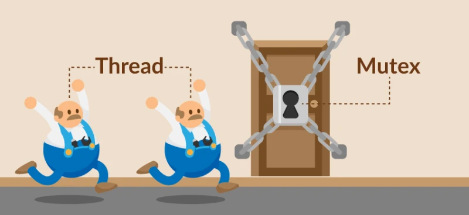
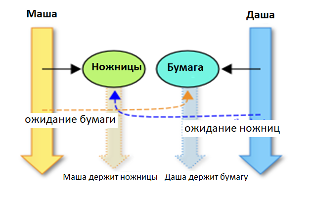
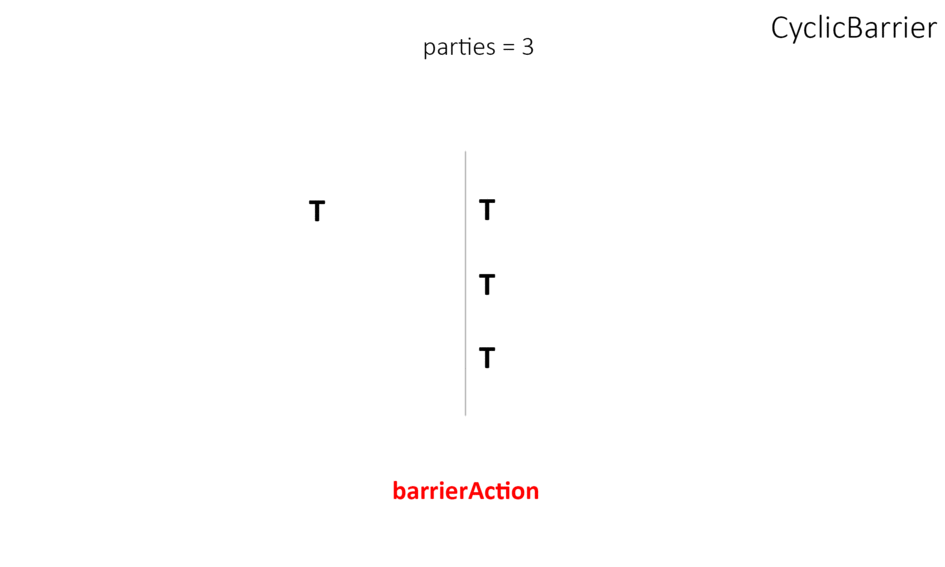
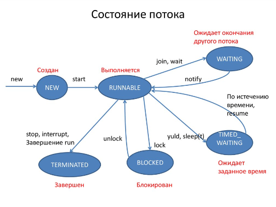

## Thread

[1. Чем отличается процесс от потока?](#1-Чем-отличается-процесс-от-потока)

[2. Каким образом можно создать поток?](#2-Каким-образом-можно-создать-поток)

[3. Как работают методы sleep, yield, wait, notify и notifyAll?](#3-Как-работают-методы-sleep-yield-wait-notify-и-notifyall)

[4. Объясните следующие термины: монитор, мьютекс, критическая секция.](#4-Объясните-следующие-термины-монитор-мьютекс-критическая-секция)

[5. Как работает join()?](#5-Как-работает-join)

[6. Что такое DeadLock? Приведите примеры.](#6-Что-такое-deadlock-Приведите-примеры)

[7. Назовите различия между Collections.synchronizedMap(new HashMap()) и ConcurrentHashMap.](#7-Назовите-различия-между-collectionssynchronizedmapnew-hashmap-и-concurrenthashmap)

[8. Различия в интерфейсах Runnable и Callable.](#8-Различия-в-интерфейсах-runnable-и-callable)

[9. Различия между isInterrupted(), interrupted(), interrupt()](#9-Различия-между-isinterrupted-interrupted-interrupt)

[10. Что происходит при вызове Thread.interrupt()?](#10-Что-происходит-при-вызове-threadinterrupt)

[11. Перечислите ВСЕ причины по которым может выскочить InterruptedException.](#11-Перечислите-ВСЕ-причины-по-которым-может-выскочить-interruptedexception)

[12. Назовите отличия synchronize{} и ReentrantLock.](#12-Назовите-отличия-synchronize-и-reentrantlock)

[13. Приведите наиболее существенное отличие между CountDownLatch и CyclicBarrier.](#13-Приведите-наиболее-существенное-отличие-между-countdownlatch-и-cyclicbarrier)

[14. Приведите наиболее существенное отличие между CyclicBarrier и Phaser.](#14-Приведите-наиболее-существенное-отличие-между-cyclicbarrier-и-phaser)

[15. Расскажите про Exchanger.](#15-Расскажите-про-exchanger)

[16. Отличие Thread.start() и Thread.run()?](#16-Отличие-threadstart-и-threadrun)

[17. Объясните ключевое слово volatile.](#17-Объясните-ключевое-слово-volatile)

[18. Расскажите про приоритеты потока.](#18-Расскажите-про-приоритеты-потока)

[19. Что такое потоки-демоны?](#19-Что-такое-потоки-демоны)

[20. Назовите все возможные состояния потока.](#20-Назовите-все-возможные-состояния-потока)

[21. Что такое race condition?](#21-Что-такое-race-condition)

[22. Что такое Thread Local переменная?](#22-Что-такое-thread-local-переменная)

[23. Что такое FutureTask?](#23-Что-такое-futuretask)

[24. Что такое Thread Pool?](#24-Что-такое-thread-pool)

[25. Что такое Semaphore?](#25-Что-такое-semaphore)

[26. Чем отличается submit от execute у ExecutorServices?](#26-Чем-отличается-submit-от-execute-у-executorservices)

[27. Чем отличается shutdown от shutdownNow у ThreadPoolExecutor?](#27-Чем-отличается-shutdown-от-shutdownnow-у-threadpoolexecutor)

[28. Как создать ThreadPool у ExecutorService только на 1, на 5, на неограниченное количество потоков.](#28-Как-создать-threadpool-у-executorservice-только-на-1-на-5-на-неограниченное-количество-потоков)

[29. Что такое ReadWriteLock?](#29-Что-такое-readwritelock)

[30. В чём отличие Thread от FutureTask? В чём отличие Thread.interrupt() и FutureTask.cancel().](#30-В-чем-отличие-thread-от-futuretask-В-чём-отличие-threadinterrupt-и-futuretaskcancel)

[31. Расскажите про шаблон проектирования Producer Consumer.](#31-Расскажите-про-шаблон-проектирования-producer-consumer)

[32. Как можно запустить параллельный поток (parallelStream)?](#32-Как-можно-запустить-параллельный-поток-parallelstream)

[33. Что делают методы parallel и sequential?](#33-Что-делают-методы-parallel-и-sequential)

[34. Расскажите про порядок следования элементов в параллельном потоке и его особенностях.](#34-Расскажите-про-порядок-следования-элементов-в-параллельном-потоке-и-его-особенностях)

[35. В чем разница между методами forEach и forEachOrdered?](#35-В-чем-разница-между-методами-foreach-и-foreachordered)

[36. В чем разница между применением метода peek() в последовательном и параллельном потоках?](#36-В-чем-разница-между-применением-метода-peek-в-последовательном-и-параллельном-потоках)

[37. Что делает метод unordered?](#37-Что-делает-метод-unordered)

[38. Когда имеет смысл распараллеливать поток и какие при этом должны соблюдаться условия?](#38-Когда-имеет-смысл-распараллеливать-поток-и-какие-при-этом-должны-соблюдаться-условия)

[39. Расскажите про Java NIO и её главные составляющие.](#39-Расскажите-про-java-nio-и-её-главные-составляющие)

[40. Что такое канал?](#40-Что-такое-канал)

[41. Что такое буфер?](#41-Что-такое-буфер)

[42. Что такое селектор?](#42-Что-такое-селектор)

[43. Когда есть смысл использовать Java NIO?](#43-Когда-есть-смысл-использовать-java-nio)

[44. Что такое PipedStreams? Как они устроены?](#44-Что-такое-pipedstreams-Как-они-устроены)

## 1. Чем отличается процесс от потока?

**Процесс** - экземпляр программы во время выполнения, независимый объект, которому выделены системные ресурсы 
(например, процессорное время и память). Каждый процесс выполняется в отдельном адресном пространстве: один процесс не
может получить доступ к переменным и структурам данных другого. Если процесс хочет получить доступ к чужим ресурсам, 
необходимо использовать межпроцессорное взаимодействие. Это могут быть конвейеры, файлы, каналы связи между компьютерами 
и многое другое.

Для каждого процесса ОС создает так называемое «виртуальное адресное пространство», к которому процесс имеет прямой 
доступ. Это пространство принадлежит процессу, содержит только его данные и находится в полном его распоряжении. 
Операционная система же отвечает за то, как виртуальное пространство процесса проецируется на физическую память.

---

**Поток (Thread)** - определенный способ выполнения процесса, определяющий последовательность исполнения кода в 
процессе. Потоки всегда создаются в контексте какого-либо процесса, и вся их жизнь проходит только в его границах. 
Потоки могут исполнять один и тот же код и манипулировать одними и теми же данными, а также совместно использовать 
описатели объектов ядра, поскольку таблица описателей создается не в отдельных потоках, а в процессах. Так как потоки 
расходуют существенно меньше ресурсов, чем процессы, в процессе выполнения работы выгоднее создавать дополнительные 
потоки и избегать создания новых процессов.

[к оглавлению](#thread)

## 2. Каким образом можно создать поток?

+ Создать потомка класса `Thread` и переопределить его метод `run()`;
+ Создать объект класса `Thread`, передав ему в конструкторе экземпляр класса, реализующего интерфейс `Runnable`. Этот 
  интерфейс содержит метод `run()`, который будет выполняться в новом потоке. Поток закончит выполнение, когда завершится
  его метод `run()`.
+ Вызвать метод `submit()` у экземпляра класса реализующего интерфейс `ExecutorService`, передав ему в качестве 
  параметра экземпляр класса реализующего интерфейс `Runnable` или `Callable` (содержит метод `call()`, в котором 
  описывается логика выполнения).

[к оглавлению](#thread)

## 3. Как работают методы sleep, yield, wait, notify и notifyAll?

+ `sleep()` - данный метод вызывает "засыпание" текущего потока на заданное время, состояние изменяется с работающий
  (running) на ожидающий (waiting).
+ `yield()` - данный метод служит причиной того, что поток переходит из состояния работающий (running) в состояние 
  работоспособный (runnable), давая возможность другим потокам активизироваться. Но следующий выбранный для запуска 
  поток может и не быть другим.
  
---

Эти методы определены у класса `Object` и предназначены для взаимодействия потоков между собой при межпоточной 
синхронизации.

+ `wait()` - освобождает монитор и переводит вызывающий поток в состояние ожидания до тех пор, пока другой поток не 
  вызовет метод `notify()`/`notifyAll()`;
+ `notify()` - продолжает работу потока, у которого ранее был вызван метод `wait()`;
+ `notifyAll()` - возобновляет работу всех потоков, у которых ранее был вызван метод `wait()`;

Когда вызван метод `wait()`, поток освобождает блокировку на объекте и переходит из состояния Работающий (Running) в 
состояние Ожидания (Waiting). Метод `notify()` подаёт сигнал одному из потоков, ожидающих на объекте, чтобы перейти в
состояние Работоспособный (Runnable). При этом невозможно определить, какой из ожидающих потоков должен стать 
работоспособным. Метод `notifyAll()` заставляет все ожидающие потоки для объекта вернуться в состояние Работоспособный
(Runnable). Если ни один поток не находится в ожидании на методе `wait()`, то при вызове `notify()` или `notifyAll()`
ничего не происходит.

Поток может вызвать методы `wait()` или `notify()` для определенного объекта, только если он в данный момент имеет 
блокировку на этот объект. `wait()`, `notify()` и `notifyAll()` должны вызываться только для синхронизованного кода.

[к оглавлению](#thread)

## 4. Объясните следующие термины: монитор, мьютекс, критическая секция.

***Критическая секция*** - часть исполняемого кода программы, которая обращается к общему ресурсу, который не должен быть 
одновременно использован более чем одним потоком выполнения. При нахождении в критической секции двух или более потоков 
возникает состояние «гонки». Чтобы избежать состояния гонки, нужно синхронизировать доступ к критическому разделу.

---

***Мьютекс*** - это специальный объект для синхронизации потоков. Он «прикреплен» к каждому объекту в Java. Название 
«мьютекс» происходит от английского «MUTual EXclusion» — «взаимное исключение», и это отлично отражает его 
предназначение. Задача мьютекса — обеспечить такой механизм, чтобы доступ к объекту в определенное время был только у 
одного потока.



Популярной аналогией мьютекса в реальной жизни можно считать «пример с туалетом». Когда человек заходит в туалет, он 
закрывает изнутри дверь на замок. Туалет выполняет роль объекта, доступ к которому получают несколько потоков. Замок на 
двери туалета — роль мьютекса, а очередь из людей снаружи — роль потоков. Замок на двери — мьютекс туалета: он 
гарантирует, что внутри одновременно может находиться только один человек. Иными словами, только один поток в 
определенное время может работать с общими ресурсами. Попытки других потоков (людей) получить доступ к занятым ресурсам 
будут неудачными.

У мьютекса есть несколько важных особенностей:

1. Возможны только два состояния — «свободен» и «занят». Это упрощает понимание принципа работы: можно провести 
   параллели с булевыми переменными true/false.
2. состояниями нельзя управлять напрямую. В Java нет механизмов, которые позволили бы явно взять объект, получить его 
   мьютекс и присвоить ему нужный статус.

---

***Монитор*** — это дополнительная «надстройка» над мьютексом. Фактически монитор — это «невидимый» для программиста 
кусок кода.

Говоря о мьютексе, можно привести простой пример:

```java
public class Main {
    
   private Object obj = new Object();
   
   public void doSomething() {
       //...какая-то логика, доступная для всех потоков
       synchronized (obj) {
           //логика, которая одновременно доступна только для одного потока
       }
   }
}
```

В блоке кода, который помечен словом `synchronized`, происходит захват мьютекса нашего объекта `obj`. Защитный механизм 
создает именно монитор! Компилятор преобразует слово synchronized в несколько специальных кусков кода.

Вот что будет происходить «под капотом» нашей программы после того, как компилятор преобразует этот код:

```java
public class Main {

   private Object obj = new Object();

   public void doSomething() throws InterruptedException {
       //...какая-то логика, доступная для всех потоков

       //логика, которая одновременно доступна только для одного потока:

       /*до тех пор, пока мьютекс объекта занят -
       любой другой поток (кроме того, который его захватил), спит*/
       while (obj.getMutex().isBusy()) {
           Thread.sleep(1);
       }

       //пометить мьютекс объекта как занятый
       obj.getMutex().isBusy() = true;

       /*выполнить важную работу, при которой доступ к объекту
       должен быть только у одного потока*/
       obj.someImportantMethod();

       //освободить мьютекс объекта
       obj.getMutex().isBusy() = false;
   }
}
```

Здесь с помощью Java-подобного кода отражается то, что происходит в этот момент внутри Java-машины. Однако этот 
псевдокод дает отличное понимание того, что на самом деле происходит с объектом и потоками внутри блока `synchronized` и
как компилятор преобразует это слово в несколько «невидимых» для программиста команд. Монитор в Java выражен с помощью 
слова synchronized. Весь код, который появился вместо слова synchronized в последнем примере, — это и есть монитор.

[к оглавлению](#thread)

## 5. Как работает join()?

Метод `join()` вызывается для того, чтобы привязать текущий поток в конец потока для которого вызывается метод. Т.е.
второй поток будет в режиме блокировки пока первый поток не выполнится.

[к оглавлению](#thread)

## 6. Что такое DeadLock? Приведите примеры.

**Взаимная блокировка (deadlock)** - явление, при котором все потоки находятся в режиме ожидания. Происходит, когда 
достигаются состояния:

1. взаимного исключения: по крайней мере один ресурс занят в режиме неделимости и, следовательно, только один поток 
   может использовать ресурс в любой данный момент времени.
2. удержания и ожидания: поток удерживает как минимум один ресурс и запрашивает дополнительные ресурсы, которые 
   удерживаются другими потоками.
3. отсутствия предочистки: операционная система не переназначивает ресурсы: если они уже заняты, они должны отдаваться 
   удерживающим потокам сразу же.
4. цикличного ожидания: поток ждёт освобождения ресурса, другим потоком, который в свою очередь ждёт освобождения 
   ресурса заблокированного первым потоком.
   
Простейший способ избежать взаимной блокировки - не допускать цикличного ожидания. Этого можно достичь, получая мониторы
разделяемых ресурсов в определённом порядке и освобождая их в обратном порядке.

Например, две девочки Маша и Даша в детском саду делают аппликацию. Для работы каждой нужны ножницы и цветная бумага. 
Предположим Маша взяла ножницы (поток Маша вошла в монитор объекта ножницы), а Даша бумагу (поток Даша вошла в монитор 
объекта бумага). Каждая из них ждет другой предмет и не хочет делиться тем, что взяла. Они не могут продолжить свою 
работу и будут ждать вечно (пока воспитательница не поможет им).



Пример:

```java
public class DeadlockRisk implements Runnable {
    private static class Resource {
    }

    private final Resource scissors = new Resource();
    private final Resource paper = new Resource();

    public void doSun() {
        synchronized (scissors) { // May deadlock here
            System.out.println(Thread.currentThread().getName()
                    + " взяла ножницы для вырезания солнышка");
            synchronized (paper) {
                System.out.println(Thread.currentThread().getName()
                        + " взяла бумагу для вырезания солнышка");
                System.out.println(Thread.currentThread().getName()
                        + " вырезает солнышко");
            }
        }
    }

    public void doCloud() {
        synchronized (paper) { // May deadlock here
            System.out.println(Thread.currentThread().getName()
                    + " взяла бумагу для вырезания облачка");
            synchronized (scissors) {
                System.out.println(Thread.currentThread().getName()
                        + " взяла ножницы для вырезания облачка");
                System.out.println(Thread.currentThread().getName()
                        + " вырезает облачко");
            }
        }
    }

    public void run() {
        doSun();
        doCloud();
    }

    public static void main(String[] args) {
        DeadlockRisk job = new DeadlockRisk();
        Thread masha = new Thread(job, "Маша");
        Thread dasha = new Thread(job, "Даша");
        masha.start();
        dasha.start();
    }
}
```

---

**livelock** - тип взаимной блокировки, при котором несколько потоков выполняют бесполезную работу, попадая в 
зацикленность при попытке получения каких-либо ресурсов. При этом их состояния постоянно изменяются в зависимости друг 
от друга. Фактической ошибки не возникает, но КПД состемы падает до 0. Часто возникает в результате попыток
предотвращения *deadlock*.

> Реальный пример livelock, - когда два человека встречаются в узком коридоре и каждый, пытаясь быть вежливым, 
> отходит в сторону, и так они бесконечно двигаются из стороны в сторону, абсолютно не продвигаясь в нужном им 
> направлении.

[к оглавлению](#thread)

## 7. Назовите различия между Collections.synchronizedMap(new HashMap()) и ConcurrentHashMap.

Оба являются синхронизированными версиями HashMap c различиями в функциональности и внутренней структуре.

`SynchronizedMap` оборачивает обычный Map используя единственный монитор для блокировки, тогда как `ConcurrentHashMap`:
+ позволяет делать неблокирующее чтение (но можно увидеть старые/невалидные данные).
+ на запись делит map на секции, к каждой из которых идет свой объект блокировки (это уменьшает общее время ожидания).

**ConcurrentHashMap** позволяет одновременную модификацию карты из нескольких потоков без необходимости их блокировки.
Операции получения `get` не блокируются, поэтому могут перекрываться с операциями обновления `put` и `remove`.
Считывание происходит очень быстро, в то время как запись выполняется с помощью блокировки. Т.е. несколько потоков
могут одновременно получить/положить пары key-value из ConcurrentHashMap без блокирования/ожидания друг друга.

+ На уровне объекта нет блокировки. Блокировка имеет более мелкую детализацию. `ConcurrentHashMap` состоит из внутренних
  сегментов, которые могут быть заблокированы отдельными потоками, выполняемыми одновременно.
+ Эффект блокировки нижнего уровня заключается в том, что одновременно могут быть и читатели и писатели, что невозможно 
  для синхронизированных коллекций. Это приводит к гораздо большей масштабируемости.
+ `ConcurrentHashMap` не бросает `ConcurrentModificationException`, если один поток пытается изменить его, а другой
  выполняет итерацию по нему. `ConcurrentHashMap` предоставляет `Iterator`, который не требует синхронизации, и даже 
  позволяет изменять карту во время итерации (но не гарантирует, будут ли возвращены элементы, вставленные во время 
  итерации).
+ `ConcurrentHashMap` как и `Hashtable`, в отличие от `HashMap`, не позволяет использовать `null` в качестве ключа или 
  значения.

**Collections.synchronizedMap(new HashMap())** создает синхронизированную версию `HashMap` с блокируемым доступом. Если 
несколько потоков попытаются получить доступ к `SynchronizedMap` одновременно, то им будет разрешено получить/положить 
по однй паре key-value синхроннизированно. Т.е. пока один поток выполняется, все остальные должны ждать, независимо 
хотят ли они получить или положить данные.

+ Каждый метод синхронизируется с использованием блокировки уровня объекта. Таким образом, методы `get` и `put` на 
  `SynchronizedMap` приобретают блокировку.
+ Блокировка всей коллекции снижает производительность, хотя и обеспечивает согласованность (при правильном 
  использовании). Пока один поток захватил монитор, ни один другой поток не может использовать коллекцию. Это не 
  проблема, когда операции вставки или поиска выполняются не интенсивно. Однако когда нужно перебирать карту большого 
  размера, это может занять много времени.
  
[к оглавлению](#thread)

## 8. Различия в интерфейсах Runnable и Callable.

Runnable не может вернуть результат или бросить Exception, оба — обертки кода для вызова из других потоков.

+ Интерфейс Runnable появился в Java 1.0, а интерфейс Callable был введен в Java 5.0 в составе библиотеки
  `java.util.concurrent`;
+ Классы, реализующие интерфейс Runnable для выполнения задачи должны реализовывать метод `run()`. Классы, реализующие 
  интерфейс Callable - метод `call()`;
+ Метод `run()` является `void` поэтому ничего не возвращает, а метод `call()` возвращает значение типа `V`. Интерфейс 
  `Callable<V>` является параметризованным и тип значения, которое будет возвращаться в методе `call()`, задается этим 
  параметром `V`.
+ Метод `run()` не может выбрасывать проверяемые исключения, в то время как метод `call()` может.

[к оглавлению](#thread)

## 9. Различия между isInterrupted(), interrupted(), interrupt()

Механизм прерывания работы потока в Java реализован с использованием внутреннего флага, известного как статус прерывания.
Прерывание потока вызовом метода `Thread.interrupt()` устанавливает этот флаг. Методы `Thread.interrupted()` и 
`isInterrupted()` позволяют проверить, является ли поток прерванным.

+ Статический метод `Thread.interrupted()` проверяет, был ли установлен флаг прерывания у текущего потока.
  При этом флаг прерывания сбрасывается. Фактически, это еще и ограничивает возможность снять флаг прерывания у
  других тредов (нельзя "украсть" прерывание другого треда).

+ Нестатический метод `isInterrupted()` проверяет статус прерывания у потока, для которого этот метод был вызван,
  не изменяя флаг состояния (поэтому можно вызывать несколько раз).

[к оглавлению](#thread)

## 10. Что происходит при вызове Thread.interrupt()?

Для корректной остановки потока можно использовать метод класса `Thread` - `interrupt()`. Этот метод выставляет 
некоторый внутренний флаг-статус прерывания. В дальнейшем состояние этого флага можно проверить с помощью метода 
`isInterrupted()` или `Thread.interrupted()` (для текущего потока). Метод `interrupt()` также способен вывести поток из
состояния ожидания или спячки. Т.е. если у потока были вызваны методы `sleep()` или `wait()` – текущее состояние 
прервется и будет выброшено исключение `InterruptedException`. Флаг в этом случае не выставляется.

Схема действия при этом получается следующей:

+ Реализовать поток.
+ В потоке периодически проводить проверку статуса прерывания через вызов `isInterrupted()`.
+ Если состояние флага изменилось или было выброшено исключение во время ожидания/спячки, следовательно поток пытаются 
  остановить извне.
+ Принять решение – продолжить работу (если по каким-то причинам остановиться невозможно) или освободить заблокированные
  потоком ресурсы и закончить выполнение.

Возможная проблема, которая присутствует в этом подходе – блокировки на потоковом вводе-выводе. Если поток заблокирован 
на чтении данных - вызов `interrupt()` из этого состояния его не выведет. Решения тут различаются в зависимости от типа 
источника данных. Если чтение идет из файла – долговременная блокировка крайне маловероятна и тогда можно просто 
дождаться выхода из метода `read()`. Если же чтение каким-то образом связано с сетью – стоит использовать неблокирующий 
ввод-вывод из Java NIO.

[к оглавлению](#thread)

## 11. Перечислите ВСЕ причины по которым может выскочить InterruptedException.

Поток ждет в `wait()`, `sleep(…)`, `join()` или заблокирован на длительное время аналогичным вызовом..
и из соседнего потока дернули `interrupt()`.

+ Поток прерван во время ожидания на мониторе
+ Поток прерван во время засыпания
+ Поток прерван во время захвата `ReentrantLock` через `lockInterruptibly`
+ Поток прерван во время ожидания в `CountDownLatch` через `await`
+ Поток прерван во время ожидания в `CyclicBarrier` через `await`
+ Поток прерван во время ожидания в `Condition` через `await`
+ Поток прерван во время захвата попытки в `Semaphore` через `acquireUninterruptibly`
+ Поток прерван во время получения значения в `Future` через `get`
+ Поток прерван во время обмена значения в `Exchanger` через `exchange`
+ Поток прерван во время блокирующих операций с `BlockingQueue`
+ Поток прерван во время работы с I/O через `InterruptableChannel`

В общем, почти любой блокирующий метод выбрасывает это исключение.

[к оглавлению](#thread)

## 12. Назовите отличия synchronize{} и ReentrantLock.

В Java 5 появился интерфейс `Lock` предоставляющий возможности более эффективного и тонкого контроля блокировки ресурсов.
`ReentrantLock` – распространённая реализация `Lock`, которая предоставляет `Lock` с таким же базовым поведением и 
семантикой, как у `synchronized`, но расширенными возможностями, такими как опрос о блокировании (lock polling), 
ожидание блокирования заданной длительности и прерываемое ожидание блокировки. Кроме того, он предлагает гораздо более 
высокую эффективность функционирования в условиях жесткой _состязательности_.

Что понимается под блокировкой с повторным входом (reentrant)? Просто то, что есть подсчет сбора данных, связанный с 
блокировкой, и если поток, который удерживает блокировку, снова ее получает, данные отражают увеличение, и тогда для 
реального разблокирования нужно два раза снять блокировку. Это аналогично семантике synchronized; если поток входит в 
синхронный блок, защищенный монитором, который уже принадлежит потоку, потоку будет разрешено дальнейшее 
функционирование, и блокировка не будет снята, когда поток выйдет из второго (или последующего) блока synchronized, она 
будет снята только когда он выйдет из первого блока synchronized, в который он вошел под защитой монитора.

```java
Lock lock = new ReentrantLock();

lock.lock();
try { 
  // update object state
}
finally {
  lock.unlock(); 
}
```

+ Реализация `ReentrantLock` гораздо более масштабируема в условиях состязательности, чем реализация `synchronized`. Это 
  значит, что когда много потоков соперничают за право получения блокировки, общая пропускная способность обычно лучше у 
  `ReentrantLock`, чем у `synchronized`. JVM требуется меньше времени на установление очередности потоков и больше 
  времени на непосредственно выполнение.
+ У `ReentrantLock` (как и у других реализаций `Lock`) блокировка должна обязательно сниматься в `finally` блоке (иначе, 
  если бы защищенный код выбросил исключение, блокировка не была бы снята). Используя синхронизацию, JVM гарантирует, 
  что блокировка автоматически снимаются.

Резюмируя, можно сказать, что когда состязания за блокировку нет либо оно очень мало, то `synchronized` возможно будет 
быстрее. Если присутствует заметное состязание за доступ к ресурсу, то скорее всего `ReentrantLock` даст некое 
преимущество.

[к оглавлению](#thread)

## 13. Приведите наиболее существенное отличие между CountDownLatch и CyclicBarrier.

`CountDownLatch` (замок с обратным отсчетом) предоставляет возможность любому количеству потоков в блоке кода ожидать до 
тех пор, пока не завершится определенное количество операций, выполняющихся в других потоках, перед тем как они будут 
«отпущены», чтобы продолжить свою деятельность. В конструктор `CountDownLatch(int count)` обязательно передается 
количество операций, которое должно быть выполнено, чтобы замок «отпустил» заблокированные потоки.

> Примером `CountDownLatch` из жизни может служить сбор экскурсионной группы: пока не наберется определенное количество 
> человек, экскурсия не начнется.


`CyclicBarrier` реализует шаблон синхронизации «Барьер». Циклический барьер является точкой синхронизации, в которой 
указанное количество параллельных потоков встречается и блокируется. Как только все потоки прибыли, выполняется 
опционное действие (или не выполняется, если барьер был инициализирован без него), и, после того, как оно выполнено, 
барьер ломается и ожидающие потоки «освобождаются». В конструкторы барьера `CyclicBarrier(int parties)` и 
`CyclicBarrier(int parties, Runnable barrierAction)` обязательно передается количество сторон, которые должны 
«встретиться», и, опционально, действие, которое должно произойти, когда стороны встретились, но перед тем когда они 
будут «отпущены».

> `CyclicBarrier` является альтернативой метода `join()`, который «собирает» потоки только после того, как они 
> выполнились.



`CyclicBarrier` похож на `CountDownLatch`, но главное различие между ними в том, что использовать «замок» можно лишь 
единожды - после того, как его счётчик достигнет нуля, а «барьер» можно использовать неоднократно, даже после того, как 
он «сломается».

[к оглавлению](#thread)

## 14. Приведите наиболее существенное отличие между CyclicBarrier и Phaser.

Phaser (фазер), как и CyclicBarrier, является реализацией шаблона синхронизации Барьер, но, в отличии от CyclicBarrier, 
предоставляет больше гибкости. Этот класс позволяет синхронизировать потоки, представляющие отдельную фазу или стадию 
выполнения общего действия. Как и CyclicBarrier, Phaser является точкой синхронизации, в которой встречаются 
потоки-участники. Когда все стороны прибыли, Phaser переходит к следующей фазе и снова ожидает ее завершения.

Если сравнить Phaser и CyclicBarrier, то можно выделить следующие важные особенности Phaser:

+ Каждая фаза (цикл синхронизации) имеет номер;
+ Количество сторон-участников жестко не задано и может меняться: поток может регистрироваться в качестве участника и 
  отменять свое участие;
+ Участник не обязан ожидать, пока все остальные участники соберутся на барьере. Чтобы продолжить свою работу достаточно
  сообщить о своем прибытии;
+ Случайные свидетели могут следить за активностью в барьере;
+ Поток может и не быть стороной-участником барьера, чтобы ожидать его преодоления;
+ У фазера нет опционального действия.

Объект Phaser создается с помощью одного из конструкторов:

```java
Phaser()
Phaser(int parties)
```

Параметр parties указывает на количество сторон-участников, которые будут выполнять фазы действия. Первый конструктор 
создает объект Phaser без каких-либо сторон, при этом барьер в этом случае тоже «закрыт». Второй конструктор регистрирует
передаваемое в конструктор количество сторон. Барьер открывается когда все стороны прибыли, или, если снимается последний 
участник. (У класса Phaser еще есть конструкторы, в которые передается родительский объект Phaser, но мы их рассматривать
не будем.)

Основные методы:

+ `int register()` — регистрирует нового участника, который выполняет фазы. Возвращает номер текущей фазы;
+ `int getPhase()` — возвращает номер текущей фазы;
+ `int arriveAndAwaitAdvance()` — указывает что поток завершил выполнение фазы. Поток приостанавливается до момента, 
  пока все остальные стороны не закончат выполнять данную фазу. Точный аналог CyclicBarrier.await(). Возвращает номер
  текущей фазы;
+ `int arrive()` — сообщает, что сторона завершила фазу, и возвращает номер фазы. При вызове данного метода поток не
  приостанавливается, а продолжает выполняться;
+ `int arriveAndDeregister()` — сообщает о завершении всех фаз стороной и снимает ее с регистрации. Возвращает номер 
  текущей фазы;
+ `int awaitAdvance(int phase)` — если phase равно номеру текущей фазы, приостанавливает вызвавший его поток до её 
  окончания. В противном случае сразу возвращает аргумент.


[к оглавлению](#thread)

## 15. Расскажите про Exchanger.

Exchanger (обменник) может понадобиться, для того, чтобы обменяться данными между двумя потоками в определенной точки 
работы обоих потоков. Обменник — обобщенный класс, он параметризируется типом объекта для передачи.


Обменник является точкой синхронизации пары потоков: поток, вызывающий у обменника метод `exchange()` блокируется и ждет
другой поток. Когда другой поток вызовет тот же метод, произойдет обмен объектами: каждая из них получит аргумент другой 
в методе `exchange()`. Стоит отметить, что обменник поддерживает передачу `null` значения. Это дает возможность 
использовать его для передачи объекта в одну сторону, или, просто как точку синхронизации двух потоков.

[к оглавлению](#thread)

## 16. Отличие Thread.start() и Thread.run()?

Несмотря на то, что `start()` вызывает метод `run()` внутри себя, это не то же самое, что просто вызов `run()`. Если 
`run()` вызывается как обычный метод, то он вызывается в том же потоке и никакой новый поток не запускается, как это 
происходит, в случае, когда вы вызываете метод `start()`.

[к оглавлению](#thread)

## 17. Объясните ключевое слово volatile.

Модификатор `volatile` вынуждает потоки отключить оптимизацию доступа и использовать единственный экземпляр переменной.

*Запись* volatile-переменных производится в основную память (медленную), минуя локальную (кэш).

*Чтение* volatile-переменной производится также из основной памяти, т.e. значение переменной не может
сохраняться в регистрах или локальной памяти потока и операция чтения этой переменной гарантированно вернёт
последнее записанное в неё значение.

Поэтому `volatile` дает гарантии happens-before на все присвоения переменных до текущего момента
(так называемый read memory barrier).

Внимание!
+ Если переменная примитивного типа, то этого будет достаточно для обеспечения потокобезопасности.
+ Если переменная является ссылкой на объект, то синхронизировано будет исключительно значение этой ссылки.
  Все же данные, содержащиеся в объекте, синхронизированы не будут.

[к оглавлению](#thread)

## 18. Расскажите про приоритеты потока.

***Приоритет (priority)*** потока показывает планировщику, насколько важен этот поток. Хотя порядок обращения процессора
к существующему набору потоков и не детерменирован, если существует несколько приостановленных потоков, одновренно 
ожидающих запуска, планировщик сначала запустит поток с большим приоритетом. Впрочем, это не значит, что потоки с 
младшими приоритетами не выполняются вовсе. Потоки с низкими приоритетами запускаются чуть реже.

В подавляющем большинстве случаев все потоки должны выполняться с приоритетом по умолчанию. Попытки манипулирования с 
приоритетами потоков обычно являются ошибкой.

Приоритеты потоков используются планировщиком потоков для принятия решений о том, когда какому из потоков будет 
разрешено работать. Теоретически высокоприоритетные потоки получают больше времени процессора, чем низкоприоритетные. 
Практически объем времени процессора, который получает поток, часто зависит от нескольких факторов помимо его 
приоритета.

Чтобы установить приоритет потока, используется метод класса `Thread`: `final void setPriority(int level)`. Значение 
`level` изменяется в пределах от `Thread.MIN_PRIORITY = 1` до `Thread.MAX_PRIORITY = 10`. Приоритет по умолчанию - 
`Thread.NORM_PRIORITY = 5`.

Получить текущее значение приоритета потока можно вызвав метод: `final int getPriority()` у экземпляра класса `Thread`.

[к оглавлению](#thread)

## 19. Что такое потоки-демоны?

Потоки-демоны работают в фоновом режиме вместе с программой, но не являются неотъемлемой частью программы. Если 
какой-либо процесс может выполняться на фоне работы основных потоков выполнения и его деятельность заключается в 
обслуживании основных потоков приложения, то такой процесс может быть запущен как поток-демон с помощью метода 
`setDaemon(boolean value)`, вызванного у потока до его запуска. Метод `boolean isDaemon()` позволяет определить, 
является ли указанный поток демоном или нет. Базовое свойство потоков-демонов заключается в возможности основного потока 
приложения завершить выполнение потока-демона (в отличие от обычных потоков) с окончанием кода метода `main()`, не 
обращая внимания на то, что поток-демон еще работает.

[к оглавлению](#thread)

## 20. Назовите все возможные состояния потока.

Потоки могут находиться в одном из следующих состояний:

+ **New** – когда создается экземпляр класса Thread, поток находится в состоянии new. Он пока еще не работает.
+ **Running** — поток запущен и процессор начинает его выполнение. Во время выполнения состояние потока также может
  измениться на Runnable, Dead или Blocked.
+ **Suspended** — запущенный поток приостанавливает свою работу, затем можно возобновить его выполнение. Поток начнет
  работать с того места, где его остановили.
+ **Blocked** — поток ожидает высвобождения ресурсов или завершение операции ввода-вывода. Находясь в этом состоянии
  поток не потребляет процессорное время.
+ **Terminated** — поток немедленно завершает свое выполнение. Его работу нельзя возобновить. Причинами завершения
  потока могут быть ситуации, когда код потока полностью выполнен или во время выполнения потока произошла ошибка
  (например, ошибка сегментации или необработанного исключения).
+ **Dead** — после того, как поток завершил свое выполнение, его состояние меняется на dead, то есть он завершает свой
  жизненный цикл.



[к оглавлению](#thread)

## 21. Что такое race condition?

**Состояние гонки** (race condition) - ошибка проектирования многопоточной системы или приложения, при которой эта 
работа напрямую зависит от того, в каком порядке выполняются потоки. Состояние гонки возникает, когда поток, который 
должен исполнится в начале, проиграл гонку и первым исполняется другой поток: поведение кода изменяется, из-за чего 
возникают недетерменированные ошибки.

*Пример race condition:* два потока используют общий ресурс - один объект типа счетчик и одновременно меняют его состояние
Чтобы уйти от состояния гонки, нужно синхронизировать код в критической секции, в нашем случае синхронизируем метод 
экземпляра.

Чтобы предотвратить возникновение состояния гонки, нужно чтобы код критической секции выполнялся как атомарная
инструкция. Т.е. как только один поток выполняет его, никакие другие потоки не могут его выполнить,
пока первый поток не покинет критическую секцию.

Распространённые способы решения:

+ Использование локальной копии — копирование разделяемой переменной в локальную переменную потока.
  Этот способ работает, если переменная одна и копирование производится атомарно (за одну машинную команду).
+ Синхронизация - операции над разделяемым ресурсом происходят в синхронизированном блоке (при использовании
  ключевого слова `synchronized`).
+ Комбинирование методов - вышеперечисленные способы можно комбинировать, копируя «опасные» переменные в
  синхронизированном блоке. С одной стороны, это снимает ограничение на атомарность, с другой — позволяет избавиться
  от слишком больших синхронизированных блоков.

Очевидных способов выявления и исправления состояний гонки не существует.
Лучший способ избавиться от гонок — правильное проектирование многозадачной системы.

[к оглавлению](#thread)

## 22. Что такое Thread Local переменная? 

`ThreadLocal` - класс, позволяющий имея одну переменную, иметь различное её значение для каждого из потоков.

У каждого потока - т.е. экземпляра класса `Thread` - есть ассоциированная с ним таблица _ThreadLocal-переменных_. 
Ключами таблицы являются cсылки на объекты класса `ThreadLocal`, а значениями - ссылки на объекты, «захваченные» 
ThreadLocal-переменными, т.е. ThreadLocal-переменные отличаются от обычных переменных тем, что у каждого потока свой 
собственный, индивидуально инициализируемый экземпляр переменной. Доступ к значению можно получить через методы `get()`
или `set()`.

Например, если мы объявим ThreadLocal-переменную: `ThreadLocal<Object> locals = new ThreadLocal<Object>();`. А затем, в 
потоке, сделаем `locals.set(myObject)`, то ключом таблицы будет ссылка на объект `locals`, а значением - ссылка на 
объект `myObject`. При этом для другого потока существует возможность «положить» внутрь `locals` другое значение.

Следует обратить внимание, что `ThreadLocal` изолирует именно ссылки на объекты, а не сами объекты. Если изолированные 
внутри потоков ссылки ведут на один и тот же объект, то возможны коллизии.

Так же важно отметить, что т.к. ThreadLocal-переменные изолированы в потоках, то инициализация такой переменной должна 
происходить в том же потоке, в котором она будет использоваться. Ошибкой является инициализация такой переменной (вызов 
метода `set()`) в главном потоке приложения, потому как в данном случае значение, переданное в методе `set()`, будет 
«захвачено» для главного потока, и при вызове метода `get()` в целевом потоке будет возвращен `null`.

[к оглавлению](#thread)

## 23. Что такое FutureTask?

**`FutureTask`** представляет собой отменяемое асинхронное вычисление в параллельном Java приложении. Этот класс 
предоставляет базовую реализацию `Future`, с методами для запуска и остановки вычисления, методами для запроса состояния 
вычисления и извлечения результатов. Результат может быть получен только когда вычисление завершено, метод получения 
будет заблокирован, если вычисление ещё не завершено. Объекты `FutureTask` могут быть использованы для обёртки объектов 
`Callable` и `Runnable`. Т.к. `FutureTask` реализует `Runnable`, его можно передать в `Executor` на выполнение.

[к оглавлению](#thread)

## 24. Что такое Thread Pool?

Создание потока является затратной по времени и ресурсам операцией. Количество потоков, которое может быть запущено в 
рамках одного процесса также ограниченно. Чтобы избежать этих проблем и в целом управлять множеством потоков более 
эффективно в Java был реализован механизм пула потоков (thread pool), который создаётся во время запуска приложения и в 
дальнейшем потоки для обработки запросов берутся и переиспользуются уже из него. Т.е. появляется возможность не терять 
потоки, сбалансировать приложение по количеству потоков и частоте их создания.

Начиная с Java 1.5 Java API предоставляет фреймворк `Executor`, который позволяет создавать различные типы пула потоков.

**Типы пула потоков:**

+ `Executor` - упрощенный интерфейс пула, содержит один метод для передачи задачи на выполнение;
+ `ExecutorService` - расширенный интерфейс пула, с возможностью завершения всех потоков;
+ `AbstractExecutorService` - базовый класс пула, реализующий интерфейс `ExecutorService`;
+ `Executors` - фабрика объектов связанных с пулом потоков, в том числе позволяет создать основные типы пулов;
+ `ThreadPoolExecutor` - пул потоков с гибкой настройкой, может служить базовым классом для нестандартных пулов;
+ `ForkJoinPool` - пул для выполнения задач типа `ForkJoinTask`;
+ ... и другие.

**Методы `Executors` для создания пулов:**

+ `newCachedThreadPool()` - если есть свободный поток, то задача выполняется в нем, иначе добавляется новый поток в пул.
  Потоки не используемые больше минуты завершаются и удаляются из кэша. Размер пула неограничен. Предназначен для 
  выполнения множество небольших асинхронных задач;
+ `newCachedThreadPool(ThreadFactory threadFactory)` - аналогично предыдущему, но с собственной фабрикой потоков;
+ `newFixedThreadPool(int nThreads)` - создает пул на указанное число потоков. Если новые задачи добавлены, когда все 
  потоки активны, то они будут сохранены в очереди для выполнения позже. Если один из потоков завершился из-за ошибки, 
  на его место будет запущен другой поток. Потоки живут до тех пор, пока пул не будет закрыт явно методом shutdown().
+ `newFixedThreadPool(int nThreads, ThreadFactory threadFactory)` - аналогично предыдущему, но с собственной фабрикой 
  потоков;
+ `newSingleThreadScheduledExecutor()` - однопотоковый пул с возможностью выполнять задачу через указанное время или 
  выполнять периодически. Если поток был завершен из-за каких-либо ошибок, то для выполнения следующей задачи будет 
  создан новый поток.
+ `newSingleThreadScheduledExecutor(ThreadFactory threadFactory)` - аналогично предыдущему, но с собственной фабрикой 
  потоков;
+ `newScheduledThreadPool(int corePoolSize)` - пул для выполнения задач через указанное время или переодически;
+ `newScheduledThreadPool(int corePoolSize, ThreadFactory threadFactory)` - аналогично предыдущему, но с собственной 
  фабрикой потоков;
+ `unconfigurableExecutorService(ExecutorService executor)` - обертка на пул, запрещающая изменять его конфигурацию;

[к оглавлению](#thread)

## 25. Что такое Semaphore?

`Semaphore` – это новый тип синхронизатора: семафор со счётчиком, реализующий шаблон синхронизации Семафор. Доступ 
управляется с помощью счётчика: изначальное значение счётчика задаётся в конструкторе при создании синхронизатора, когда 
поток заходит в заданный блок кода, то значение счётчика уменьшается на единицу, когда поток его покидает, то 
увеличивается. Если значение счётчика равно нулю, то текущий поток блокируется, пока кто-нибудь не выйдет из защищаемого 
блока.

Семафоры в Java представлены классом `Semaphore`.


При создании объектов-семафоров мы можем использовать такие конструкторы:

```java
Semaphore(int permits)
Semaphore(int permits, boolean fair)
```

В конструктор мы передаем:
+ `int permits`  — начальное и максимальное значение счетчика. То есть то, сколько потоков одновременно могут иметь 
  доступ к общему ресурсу;
+ `boolean fair` — для установления порядка, в котором потоки будут получать доступ. Если fair = true, доступ 
  предоставляется ожидающим потокам в том порядке, в котором они его запрашивали. Если же он равен false, порядок будет 
  определять планировщик потоков.

`Semaphore` используется для защиты дорогих ресурсов, которые доступны в ограниченном количестве, например подключение к
базе данных в пуле.

[к оглавлению](#thread)

## 26. Чем отличается submit от execute у ExecutorServices?

Оба метода являются способами подачи задачи в пул потоков, но между ними есть небольшая разница:

+ `execute(Runnable command)` определён в интерфейсе `Executor` и выполняет поданную задачу и ничего не возвращает.

+ `submit()` – перегруженный метод, определённый в интерфейсе `ExecutorService`. Способен принимать задачи типов 
  `Runnable` и `Callable` и возвращать объект `Future`, который можно использовать для контроля и управления процессом 
  выполнения, получения его результата.

[к оглавлению](#thread)

## 27. Чем отличается shutdown от shutdownNow у ThreadPoolExecutor?

+ `void shutdown()` просто скажет службе исполнителя, что она не может принимать новые задачи, но уже отправленные
  задачи продолжат выполняться.

+ `List<Runnable> shutdownNow()` сделает то же самое и попытается отменить уже отправленные задачи, прерывая 
  соответствующие потоки. Возвращает список ожидаемых задач на выполнение.
  
Если ваши задачи игнорируют прерывание, то `shutdownNow()` будет вести себя точно так же, как и `shutdown()`.

[к оглавлению](#thread)

## 28. Как создать ThreadPool у ExecutorService только на 1, на 5, на неограниченное количество потоков.

Для одного:
```java
ExecutorService service = Executors.newSingleThreadExecutor();
```

Например, если надо создать пул с 5ю потоками, то делается это так:
```java
ExecutorService service = Executors.newFixedThreadPool(5);
```

Если требуется использовать кэширующий пул потоков, который создает потоки по мере необходимости,
но переиспользует неактивные потоки (и подчищает потоки, которые были неактивные некоторое время),
то это задается следующим образом:
```java
ExecutorService service = Executors.newCachedThreadPool();
```

[к оглавлению](#thread)

## 29. Что такое ReadWriteLock?

**`ReadWriteLock`** – это интерфейс расширяющий базовый интерфейс `Lock`. Используется для улучшения производительности
в многопоточном процессе и оперирует парой связанных блокировок (одна - для операций чтения, другая - для записи).
Такие локи необычайно полезны, когда в системе много операций чтения и мало операций записи. Несколько задач могут 
читать данные одновременно при условии, что ни одна задача не пытается их записывать. Если установлена блокировка 
записи, то чтение становится невозможным до её освобождения.

Интерфейс `ReadWriteLock` реализован классом `ReentrantReadWriteLock`,
который поддерживает до 65535 блокировок записи и до стольки же блокировок чтения.
```java
ReadWriteLock rwLock = new ReentrantReadWriteLock();
Lock rLock = rwLock.readLock();
Lock wLock = rwLock.writeLock();

wLock.lock();
try {
    // exclusive write
} finally {
    wLock.unlock();
}
        
rLock.lock();
try {
    // shared reading
} finally {
    rLock.unlock();
}      
```

[к оглавлению](#thread)

## 30. В чём отличие Thread от FutureTask? В чём отличие Thread.interrupt() и FutureTask.cancel().

`FutureTask` базируется на конкретной реализации `Future` интерфейса и обеспечивает асинхронную обработку. Он содержит 
методы для запуска и отмены таска, а также методы получения состояния `FutureTask`.

У `Future` есть метод `Future.cancel(boolean)`, который должен отменить выполнение задачи.
В недрах реализации `FutureTask` выполняется код:

```java
if (mayInterruptIfRunning) {
    Thread r = runner;
    if (r != null) {
        r.interrupt(); 
    }
}
```

[к оглавлению](#thread)

## 31. Расскажите про шаблон проектирования Producer Consumer.

Шаблон заключается в разделении потоков по виду их деятельности на поставщиков и потребителей. Поставщики и потребители 
не общаются друг с другом напрямую, вместо этого передавая работу через общую очередь.

Такой подход позволяет независимо разрабатывать поставщиков и потребителей, так как они не знают друг о друге, но знают 
только формат общения.

Другое преимущество - возможность поставщиков и потребителей работать на разной скорости: медленный потребитель не будет 
тормозить быстрого поставщика.

[к оглавлению](#thread)

## 32. Как можно запустить параллельный поток (parallelStream)?

Коллекции поддерживают метод `parallelStream()` для создания параллельных потоков данных. Также можно вызвать 
промежуточный метод `parallel()` для превращения последовательного потока в параллельный.

[к оглавлению](#thread)

## 33. Что делают методы parallel и sequential?

- `sequential()` - если данный поток параллельный, то возвращает новый последовательный поток с теми же элементами. Если 
  метод применяется к последовательному потоку, то возвращает тот же поток.

- `parallel()` - если данный поток последовательный, то возвращает новый параллельный поток с теми же элементами. Если 
  метод применяется к параллельному потоку, то возвращает тот же поток.

[к оглавлению](#thread)

## 34. Расскажите про порядок следования элементов в параллельном потоке и его особенностях.

Потоки могут иметь или не иметь определенного порядка следования элементов. Это зависит от исходного порядка следования
элементов и от результатов работы промежуточных операций, которые могут его изменить. Например, `ArrayList` сохраняет 
порядок следования при добавлении в него элементов, а `HashSet` нет. Структуры, сохраняющие порядок следования элементов, 
будут всегда выводить элементы в этом же порядке, а структуры без сохранения порядка следования элементов раз за разом 
могут выводить элементы в разном порядке.

Нужно иметь в виду, что выполнение потока в многопоточной среде по умолчанию не гарантирует сохранения порядка 
следования элементов.

[к оглавлению](#thread)

## 35. В чем разница между методами forEach и forEachOrdered?

Для сохранения порядка следования элементов можно воспользоваться методов forEachOrdered():

```java
package ru.job4j.concurrent;

import java.util.Arrays;
import java.util.List;

public class ParallelStreamExample {
    public static void main(String[] args) {
        List<Integer> list = Arrays.asList(1, 3, 4, 5, 2);
        list.stream().parallel().forEachOrdered(System.out::println);
    }
}
```

Для наглядности цифры в листе поменяны местами, и вывод цифр идет в точно такой же последовательности. Такая наглядность
здесь сделана, потому что метод `forEachOrdered()` не сортирует, а именно сохраняет исходный порядок следования 
элементов:

```
1
3
4
5
2
```

[к оглавлению](#thread)

## 36. В чем разница между применением метода peek() в последовательном и параллельном потоках?

В следующем примере в параллельном потоке применяется метод peek() для вывода элементов потока на печать.

```java
package ru.job4j.concurrent;

import java.util.Arrays;
import java.util.List;

public class ParallelStreamExample {
    public static void main(String[] args) {
        List<Integer> list = Arrays.asList(1, 2, 3, 4, 5);
        list.stream().parallel().peek(System.out::println).toList();
    }
}
```

В выводе мы видим хаотичный порядок элементов, так как параллельный поток не гарантирует, что исходный порядок элементов 
будет сохраняться:

```
5
4
3
1
2
```

Данное поведение - это неустранимый побочный эффект метода `peek()` в многопоточной среде.

[к оглавлению](#thread)

## 37. Что делает метод unordered?

Для последовательных потоков порядок следования элементов не имеет никакой разницы с точки зрения производительности.
Для параллельных потоков в некоторых случаях будет полезно отказаться от опции поддержки очередности элементов с помощью
промежуточного метода `BaseStream.unordered()`, который возвращает новый поток, в котором не поддерживается сохранение
очередности элементов. В случае работы с методами, которым не важен порядок следования элементов в потоке, это может
ускорить производительность, и, наоборот, плюсы многопоточности скорее всего сойдут на нет при использовании методов,
зависимых от порядка следования элементов, при применении метода `unordered()`.

[к оглавлению](#thread)

## 38. Когда имеет смысл распараллеливать поток и какие при этом должны соблюдаться условия?

В первую очередь, многопоточность невозможна без физической возможности ее создать, для этого технические возможности 
компьютера должны обладать необходимыми для этого ресурсами (как минимум, от 2 ядер процессора).

Многопоточность применяется для ускорения производительности. Нужно помнить, что организация многопоточности несет за 
собой некоторые накладные расходы в виде создания и обслуживания новых нитей, переключение контекста между ними и т.д., 
поэтому при малой загрузке последовательное выполнение операций скорее всего будет быстрее, чем их параллельная
организация. То же самое касается и особенностей реализации различных структур данных, с которыми может работать поток. 
Например, использование структур данных ArrayList, HashSet и массивов будет производительнее в многопоточной среде, так 
как они проще разбиваются на части(для выполнения в нескольких нитях), нежели использование других структур данных типа
`LinkedList`, который является одной их самых трудноделимых структур данных.

Распараллеливать стоит только вычисления, которые независимы друг от друга, иначе параллельное исполнение не только 
будет бессмысленным, но и принесет вред.

[к оглавлению](#thread)

## 39. Расскажите про Java NIO и её главные составляющие.

Java NIO API - это система ввода-вывода, которая направлена на расширение возможностей уже существующей IO.

Основные недостатки системы ввода-вывода IO:

- IO является потокоориентированной (stream-based). Это значит, что данные считываются из потока (stream) без какого-либо 
  кэширования, то есть напрямую, поэтому мы не можем получить доступ к данным внутри потока и перемещаться по ним.
- Система ввода-вывода IO является блокирующей (blocking). Потоки ввода-вывода (stream) блокируют работу программы всё 
  время до окончания процесса чтения или записи.

Главная проблема IO - это её масштабируемость, так как под каждое соединение нужно выделять отдельную нить. Переключение 
процессором контекста между нитями имеет накладные расходы, поэтому чем больше у нас создано нитей, тем больше времени
будет уходить на переключение контекста между всеми этими нитями. В случае IO в сложных и высоконагруженных приложениях 
каждое соединение потребуется обрабатывать в новой нити, поэтому это повлечёт за собой большие накладные расходы на 
работу с множеством нитей. При этом зачастую данные от клиента поступают не постоянным потоком данных, а периодически 
(например, чат). Всё остальное время выделенные под каждое соединение нити будут простаивать.

Исходя из вышесказанного, нужно как-то уменьшить количество создаваемых нитей. Для решения данной проблемы в Java 1.4 
была введена новая система ввода-вывода Java NIO (New IO). По-другому её еще называют Non-Blocking IO. NIO представлена
в пакете java.nio.

В NIO были выделены новые абстракции:

- Канал. Это абстракция над соединением. То есть это логический шлюз, который предоставляет соединение с устройством 
  ввода-вывода (Например, файл). Каналов может быть создано несколько внутри одной нити. Каналы нужно подключать к 
  селектору. Каналы представлены в пакете java.nio.channels классами FileChannel, SocketChannel, ServerSocketChannel и др.
- Буфер. Буфер хранит данные, которые будут отправлены через канал. Буферы и каналы - это главные составляющие NIO.
- Селектор. В NIO нить работает не напрямую с соединением (каналом), как в IO, а через селектор. Селектор предназначен 
  для управления логическими шлюзами передачи данных - каналами. То есть с помощью селектора организуется многоканальный 
  ввод-вывод без применения блокировки.

Вместо создания нескольких нитей с одним соединением в каждом, мы можем создать несколько соединений в 
виде каналов, работой которых будет управлять селектор внутри одной нити.

- NIO является буферориентированной (buffer-based). Данные читаются и записываются сначала в буфер, а уже потом 
  передаются дальше в канал или из него. Благодаря этому мы можем работать с данными, которые находятся в буфере.
- NIO является неблокирующей (non-blocking). В любой момент можно получить доступ к данным в буфере внутри канала.

Система работы NIO: получаем буфер для хранения данных, получаем канал для устройства ввода-вывода. По мере 
необходимости загружаем данные в буфер и передаем по каналу. Переданные данные из канала получаем в буфер и отдаём 
получателю.

[к оглавлению](#thread)

## 40. Что такое канал?

Как следует из названия, канал используется как среднее значение потока данных от одного конца к другому. Здесь в канале 
Java NIO действуют одинаково между буфером и объектом на другом конце, другими словами, канал используется для чтения 
данных в буфер, а также для записи данных из буфера.

В отличие от потоков, которые используются в традиционных каналах Java IO, они являются двухсторонними, т.е. могут 
считывать и записывать. Канал Java NIO поддерживает асинхронный поток данных как в режиме блокировки, так и в режиме 
без блокировки.

Канал Java NIO реализован в основном в следующих классах:

+ FileChannel – Для чтения данных из файла мы используем файловый канал. Объект файлового канала может быть создан 
  только путем вызова метода getChannel () для файлового объекта, поскольку мы не можем напрямую создать файловый объект.
+ DatagramChannel – канал дейтаграмм может считывать и записывать данные по сети через UDP (протокол пользовательских 
  дейтаграмм). Объект DataGramchannel может быть создан с использованием заводских методов.
+ SocketChannel – канал SocketChannel может считывать и записывать данные по сети через TCP (протокол управления 
  передачей). Он также использует фабричные методы для создания нового объекта.
+ ServerSocketChannel – ServerSocketChannel для чтения и записи данных через TCP-соединения, так же, как веб-сервер. 
  Для каждого входящего соединения создается SocketChannel.

[к оглавлению](#thread)

## 41. Что такое буфер?

Буфер даёт возможность получать доступ к данным. Это сильно упрощает работу, так как если в принятых данных нам нужна 
только их часть (например, значение из одного тега в XML-файле), то с помощью буфера можно получить доступ к данным и
просмотреть их на предмет искомых значений, тем самым не сохраняя и не выделяя память целиком под принятый файл или 
объект (в зависимости от вида сериализации).

Чтобы избежать проблемы многопоточности, буфер указывается либо как только для чтения, либо как только для записи.
Режим буфера можно переключить с помощью метода `flip()`.

Буфер работает следующим образом. Буфер имеет выделенную ему при его инициализации область памяти и работает только с 
ней. В буфер читаются данные, после чего вызывается метод `flip()`, чтобы сменить режим чтения на запись, далее данные
считываются из буфера и вызывается метод `clear()` для очистки буфера. При этом метод `clear()` не удаляет данные из 
буфера, он просто устанавливает курсор на нулевую позицию, в результате предыдущие данные просто будут затёрты новыми
данными

В коде это выглядит так:

```java
 ByteBuffer buffer = ByteBuffer.allocate(1024);
 int bytes = channel.read(buffer);
 buffer.flip();
 while (buffer.hasRemaining()) {
     byte bufferData = buffer.get();
 }
 buffer.clear();
```

С помощью метода `allocate()` выделяется память под буфер, то есть происходит создание самого буфера. Далее данные в 
буфер читаются из канала при помощи метода read(), после чего режим чтения меняется на режим записи с помощью метода 
`flip()`. Далее в цикле с условием "пока между позицией курсора и концом буфера есть данные" получаем из него информацию.
После окончания чтения и записи метод `clear()` очищает буфер для дальнейшего использования (возвращает курсор на 0 
позицию).

Буферы представлены в пакете `java.nio` классами `ByteBuffer`, `CharBuffer`, `LongBuffer` и др.

[к оглавлению](#thread)

## 42. Что такое селектор?

Создание селектора и подключение к нему канала происходит следующим образом:

```java
Selector selector = Selector.open();
channel.configureBlocking(false);
SelectionKey selectionKey = newChannel.register(selector, SelectionKey.OP_READ);
```

Метод `open()` создаёт новый объект селектора. Метод `configureBlocking()` используется при создании селектора. Если мы не 
уверены, что система, в которой мы что-то создаём, полностью потокобезопасна, то в параметр этого метода нужно передать 
true. Это сделает программу блокирующей, но блокироваться при этом будет только запись, чтение останется свободным для 
всех читателей.

`SelectionKey` - это объект, который однозначно связывает событие в канале и селектор. Селектор ожидает сообщений от 
каналов. Если в канал приходит какой-либо запрос (CONNECT - на доступ к серверу, ACCEPT - принятие запроса от сервера, 
READ - на чтение, WRITE - на запись), то селектор получает сет SelectionKey, который содержит ключи запросов по всем 
его каналам в данный момент (сет, так как запросы могут прийти одновременно в несколько каналов, поэтому может быть 
несколько ключей сразу). Каждый SelectionKey содержит информацию, какое событие произошло и на каком канале.

Главный метод всех вышеописанных процессов - метод select().

```java
selector.select();
Iterator<SelectionKey> keys = selector.selectedKeys();
```

Вызов метода `select()` блокирует текущую нить до момента, пока не произойдёт обращение к какому-либо каналу. При 
возникновении какого-либо события, нить просыпается, вызывается метод `selectedKeys()`, который возвращает список 
`SelectionKey` - то есть все события, которые произошли в каналах. Дальше уже остаётся обработать произошедшие события. 
Метод `select()` - единственный блокирующий метод в рассмотренном нами функционале NIO.

[к оглавлению](#thread)

## 43. Когда есть смысл использовать Java NIO?

Java NIO позволяет управлять несколькими каналами (сетевыми соединениями или файлами) используя минимальное число 
потоков выполнения. Однако ценой такого подхода является более сложный, чем при использовании блокирующих потоков, 
парсинг данных.

Если вам необходимо управлять тысячами открытых соединений одновременно, причем каждое из них передает лишь 
незначительный объем данных, выбор Java NIO для вашего приложения может дать преимущество.

Если вы имеете меньшее количество соединений, по которым передаются большие объемы данных, то лучшим выбором станет 
классический дизайн системы ввода/вывода.

Важно понимать, что Java NIO отнюдь не является заменой Java IO. Его стоит рассматривать как усовершенствование – 
инструмент, позволяющий значительно расширить возможности по организации ввода/вывода. Грамотное использование мощи 
обоих подходов позволит вам строить хорошие высокопроизводительные системы.

[к оглавлению](#thread)

## 44. Что такое PipedStreams? Как они устроены?

Процессы, проходящие в разных нитях, изолированы друг от друга. Но есть способ передавать данные между нитями. Данный 
способ реализуется с помощью классов `PipedInputStream` и `PipedOutputStream`. Pipe - это некий коннектор, соединяющий 
нити, по которому можно передать данные. По-другому - труба или пайп.

Предположим, что у нас многопоточное приложение и есть 2 нити - Нить 1 и Нить 2. В главной нити создаются объекты 
классов `PipedInputStream` и `PipedOutputStream` и соединяются друг с другом. После соединения они образуют некий 
"коннектор"(трубу) для передачи данных, и данные, которые мы запишем в него в Нити 1, сразу же можно будет считать 
в Нити 2.

[к оглавлению](#thread)